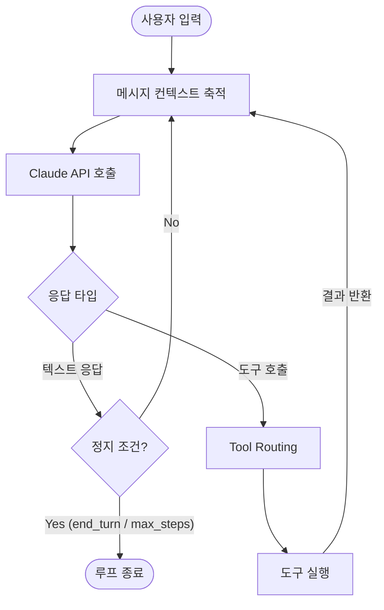

# Claude Agent Loop

Claude Agent SDK에서 agent loop가 어떻게 동작하는지 설명하는 문서 요약이다. 에이전트가 입력을 받고, 도구를 호출하고, 세션을 이어 가는 실행 핵심을 다룬다.

## Agent Loop 구조

Claude Agent SDK의 핵심은 메시지 축적(message accumulation) + 도구 호출(tool use) + 정지 조건(stop condition)이 반복되는 루프다.



## 핵심 단계별 설명

### 1. 메시지 축적 (Message Accumulation)
루프 반복마다 이전 대화 이력 전체를 컨텍스트로 유지한다. 이 누적 구조가 에이전트가 여러 스텝에 걸쳐 일관된 작업을 수행할 수 있는 기반이다.

### 2. 모델 호출 (Model Invocation)
Claude API를 호출하여 다음 행동(텍스트 생성 또는 도구 호출)을 결정한다. `max_tokens`, `tools` 파라미터가 이 단계에서 적용된다.

### 3. Tool Routing
모델이 도구 호출을 반환하면, SDK는 등록된 도구 테이블을 조회하여 해당 도구 함수를 실행한다. 도구 결과는 `tool_result` 역할로 다시 메시지 배열에 추가된다.

### 4. 정지 조건 (Stop Conditions)
루프는 다음 조건 중 하나에서 종료된다:
- 모델이 `end_turn` 신호를 보낼 때
- `max_turns` 한계에 도달했을 때
- Approval 훅이 실행을 차단할 때
- 사용자 정의 정지 조건이 충족될 때

## 도구 호출 흐름 상세

```mermaid
sequenceDiagram
    participant Loop as Agent Loop
    participant Claude as Claude API
    participant Tool as Tool Function

    Loop->>Claude: messages + tools 전달
    Claude-->>Loop: tool_use 블록 반환
    Loop->>Tool: tool_name + input으로 실행
    Tool-->>Loop: 결과값 반환
    Loop->>Loop: tool_result를 messages에 추가
    Loop->>Claude: 업데이트된 messages 재전달
```

## Approval 훅과 루프 제어

Claude Code의 훅 시스템([[claude-code-hooks-system|Hooks System]])과 결합하면 루프 중간에 사람의 승인(human-in-the-loop)을 삽입할 수 있다. `PreToolUse` 훅이 `BLOCK` 신호를 반환하면 해당 도구 호출이 취소되고, 루프는 다음 판단을 모델에게 요청한다.

## 왜 중요한가

에이전트 SDK의 실질적인 핵심은 loop다. 이 문서를 이해해야 tool use, approvals, sessions 같은 다른 개념도 하나의 실행 모델로 연결된다. 에이전트 시스템을 디버깅하거나 확장할 때는 기능 목록보다 루프의 어느 단계에서 상태가 어긋나는지를 파악하는 것이 중요하다.

## 흔한 문제 패턴

| 증상 | 원인 | 해결책 |
|---|---|---|
| 루프가 멈추지 않음 | 정지 조건 미설정 또는 모델이 end_turn을 안 보냄 | `max_turns` 상한 설정 |
| 도구 결과가 무시됨 | tool_result 메시지가 컨텍스트에서 누락 | 메시지 배열 구성 확인 |
| 같은 도구를 반복 호출 | 이전 결과를 모델이 인식 못함 | 도구 결과 포맷 및 프롬프트 점검 |
| 컨텍스트 초과 오류 | 메시지 축적이 컨텍스트 한계 초과 | 요약(summarization) 또는 truncation 전략 도입 |

## 읽기 경로

[[claude-agent-sessions|Sessions]] -> [[claude-agent-loop|Agent Loop]] -> [[claude-code-hooks-system|Hooks System]] 순서로 따라가면 입문 -> 구조 이해 -> 운영 확장으로 이어진다.

## 관련 문서

- [[claude-agent-sessions|Claude Agent Sessions]]
- [[claude-code-hooks-system|Claude Code Hooks System]]
- [[anthropic-harness-design|Anthropic Harness Design]]
