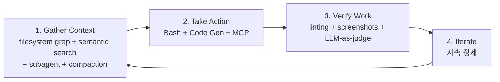

# Building Agents with the Claude Agent SDK (Anthropic Engineering 2025-09)

Thariq Shihipar(Anthropic) 외 7인이 발표한 Claude Agent SDK 도입 글. 핵심 디자인 원칙은 한 마디로:

> "**Give your agents a computer.**"

Anthropic은 Claude Code SDK를 **Claude Agent SDK**로 리네이밍. Claude Code의 agent harness가 코딩 외 다양한 에이전트 use case도 powering 가능함을 인정한 변화다.

> "Over the past several months, Claude Code has become far more than a coding tool—we've used it for deep research, video creation, and note-taking, among countless other non-coding applications."

## Agent Loop 4단계 프레임워크

### 1. Gather Context (컨텍스트 수집)
- **Agentic search**: filesystem 도구 (grep, tail)
- **Semantic search** (선택적)
- **Subagent parallelization**: 격리된 컨텍스트로 병렬 작업
- **Conversation compaction**

### 2. Take Action (행동)
- 커스텀 도구
- Bash 스크립트
- Code generation
- **MCP integrations**

### 3. Verify Work (검증)
- Rules-based feedback (linting)
- Visual feedback (screenshots)
- LLM-as-judge 평가

### 4. Iterate (반복)
테스트와 정제로 지속 개선.

## Use Case 확장

코딩 도메인 너머의 활용:

| 도메인 | 예시 |
|---|---|
| Finance agents | 포트폴리오 분석 |
| Personal assistants | 캘린더/여행 관리 |
| Customer support agents | 복잡 요청 처리 |
| Deep research agents | 정보 종합 |

## 기술 능력

- **Bash/Scripts**: 파일 작업, PDF 변환, 웹 검색
- **Code Generation**: Excel/PowerPoint/Word 생성용 Python
- **MCPs**: 사전 빌드 통합 (Slack, GitHub, Asana, Google Drive)
- **Subagents**: 격리된 컨텍스트로 병렬 작업

## 핵심 원칙

> "Evaluating agents through concrete feedback mechanisms rather than relying solely on fuzzy judgment criteria."

명확한 검증 → 도구가 잘 동작하는지 객관 측정.

## Claude Agent SDK 컴포넌트

- 커스텀 시스템 프롬프트
- Slash commands
- Hooks (deterministic 자동 실행)
- Subagents (격리된 컨텍스트)
- Tools (MCP, Bash, custom)
- [[agent-skills|Skills]] (도메인 지식 패키지)

## 패키지

- npm: `@anthropic-ai/claude-agent-sdk`
- Python: `claude-agent-sdk-python`

## 관련 문서

- [[claude-agent-sdk]] — Claude Agent SDK entity 페이지
- [[claude-agent-sdk-overview]] — SDK 개요 (기존 페이지)
- [[claude-code]] — Claude Code 본체
- [[claude-agent-loop]] — Agent loop 상세
- [[effective-agents-patterns]] — 7가지 빌딩 블록 카탈로그
- [[anthropic-harness-design]] — 후속 하네스 디자인 원칙
