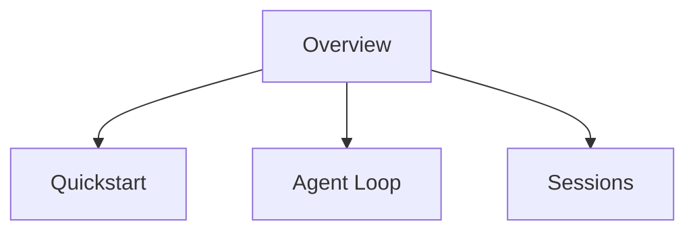

# Claude Agent SDK Overview

Claude Code Docs의 Agent SDK overview 문서 요약이다. Agent SDK를 단순 라이브러리가 아니라 세션, agent loop, input/output, approval 흐름을 포함한 개발 표면으로 설명한다.

## 핵심 내용

- Agent SDK의 전체 구조와 진입점을 소개한다.
- agent loop, session, streaming input, approval/user input 같은 핵심 개념을 연결한다.
- Claude Code 기능을 앱/서비스에 내장할 때 어떤 문서를 따라가야 하는지 안내한다.

## 읽기 순서

| 단계 | 문서 | 목적 |
|---|---|---|
| 1 | Overview | 전체 개념 지도 |
| 2 | [[claude-agent-sdk-quickstart]] | 첫 실행 경험 |
| 3 | [[claude-agent-loop]] | 런타임 구조 이해 |
| 4 | [[claude-agent-sessions]] | 세션/상태 관리 이해 |

## 왜 중요한가

entity 페이지가 “무엇인가”를 설명한다면, 이 overview는 **어떻게 입문하고 어떤 개념 지도를 따라가야 하는가**를 알려준다. 그래서 실제 도입 초기에 훨씬 실용적이다.

## 실무 적용 관점

SDK 도입 시 가장 중요한 것은 API 호출법보다도 session, approval, streaming, tool loop 같은 런타임 개념을 정확히 이해하는 것이다. 이 overview는 그 온보딩 역할을 한다.

## 원문이 다루는 흐름

원문은 대체로 `Agent SDK overview - Claude Code Docs` → `Agent SDK` → `Input and output` → `Extend with tools` → `Customize behavior` 순서로 전개된다. 따라서 `Claude Agent SDK Overview` 페이지도 세부 API 목록보다 **입문 → 구조 이해 → 운영 확장**의 흐름으로 읽는 편이 좋다.

- 따라가야 할 순서: Agent SDK overview - Claude Code Docs, Agent SDK, Input and output, Extend with tools, Customize behavior
- 위키에 남겨야 할 축: 입문 경로, 핵심 구조, 다음에 읽을 세부 문서

## source 메모

- **Agent SDK overview - Claude Code Docs** — snapshot: `raw/2026-04-10-hot-ai-topics-sources/long-running-agent-harnesses/04-code-claude-com-claude-agent-sdk-overview.md` · source: https://code.claude.com/docs/en/agent-sdk/overview · 볼 섹션: Agent SDK overview - Claude Code Docs, Agent SDK, Input and output, Extend with tools

## 관련 문서

- [[claude-agent-sdk|Claude Agent SDK]]
- [[long-running-agent-harnesses|Agent Harnesses for Long-Running Coding Sessions]]
- [[tool-contracts-for-agents|Tool Contracts & Writing Tools for Agents]]
