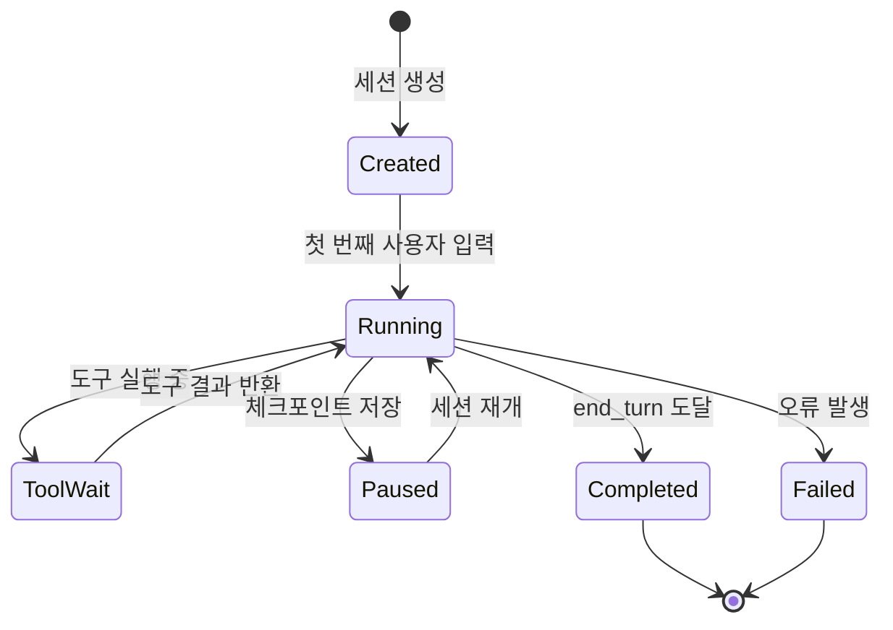
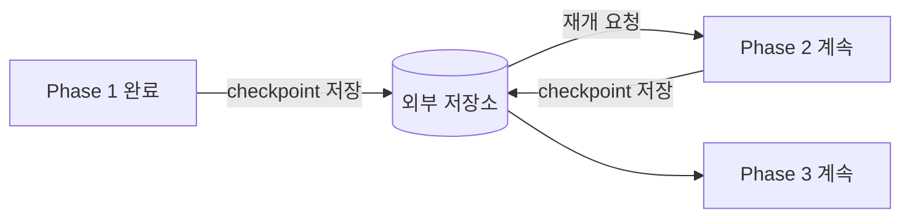

# Claude Agent Sessions

Claude Agent SDK에서 sessions 개념을 설명하는 문서 요약이다. 장기 실행 에이전트에서 세션이 어떤 상태 단위로 기능하는지를 이해하는 데 중요하다.

## 세션이란

Claude Agent SDK에서 **세션(Session)**은 에이전트 실행의 기본 단위이자 상태(state) 축적 단위다. 단발 API 호출과 달리, 세션은 여러 에이전트 루프 반복에 걸쳐 대화 이력·도구 결과·중간 산출물을 유지한다.

## 세션 구성 요소

| 구성 요소 | 설명 |
|---|---|
| `session_id` | 세션 식별자. 재개(resume) 시 사용 |
| `messages` | 누적된 대화 이력 (역할: user / assistant / tool_result) |
| `metadata` | 태스크 설명, 생성 시각, 에이전트 설정 등 부가 정보 |
| `state` | Created / Running / Paused / Completed / Failed |
| `checkpoints` | 특정 시점의 메시지 배열 스냅샷 |

## 체크포인트와 장기 실행

장기 작업(long-running task)에서 가장 중요한 패턴은 **체크포인트(checkpoint)**다.

체크포인트를 외부 저장소(DB, 파일시스템 등)에 저장하면:
- 프로세스 재시작 후에도 작업 이어서 실행 가능
- 특정 단계로 롤백 가능
- 긴 작업을 단계별로 감사(audit)하기 용이

## 세션 생명주기 설계 원칙

1. **세션 경계 명확화**: 하나의 세션이 담당하는 작업 범위를 좁게 정의한다. 너무 많은 것을 한 세션에 담으면 컨텍스트 초과·디버깅 어려움이 발생한다.
2. **외부 상태 분리**: 데이터베이스 쿼리 결과, 파일 내용 등 재현 가능한 정보는 세션 내부가 아니라 외부에 저장하고 필요 시 재주입한다.
3. **재개 전략**: 세션 재개 시 이전 컨텍스트 요약(summarization)을 먼저 삽입하여 컨텍스트 창 효율을 높인다.
4. **실패 복구**: 세션이 Failed 상태에 빠졌을 때 자동 재시작 vs. 수동 개입 시점을 미리 정의한다.

## 단발 호출 vs. 세션 기반

| 항목 | 단발 호출 (Stateless) | 세션 기반 (Stateful) |
|---|---|---|
| 상태 유지 | 없음 | 메시지 이력 누적 |
| 용도 | 짧은 Q&A, 분류 | 다단계 코딩, 장기 분석 |
| 비용 구조 | 쿼리당 독립 | 누적 컨텍스트 길이에 비례 |
| 복구 가능성 | 재시작 = 재호출 | 체크포인트로 재개 |
| 복잡도 | 낮음 | 세션 관리 로직 필요 |

## 실무 운영 관점

- **어디까지 세션을 지속할 것인가**: 에이전트가 수행하는 작업의 자연스러운 완료 단위(예: PR 하나 생성)를 세션 경계로 설정
- **무엇을 외부 상태로 뺄 것인가**: 반복 접근하는 데이터(파일 목록, 의존성 그래프 등)는 벡터 DB나 캐시로 관리
- **어떤 시점에 재개·복구할지**: 실패 탐지 → 알림 → 체크포인트 복원 흐름을 자동화

장기 실행 에이전트 문제는 결국 "세션을 어떻게 관리할 것인가"의 문제로 돌아간다.

## 관련 문서

- [[claude-agent-loop|Claude Agent Loop]]
- [[claude-code-hooks-system|Claude Code Hooks System]]
- [[anthropic-harness-design|Anthropic Harness Design]]
