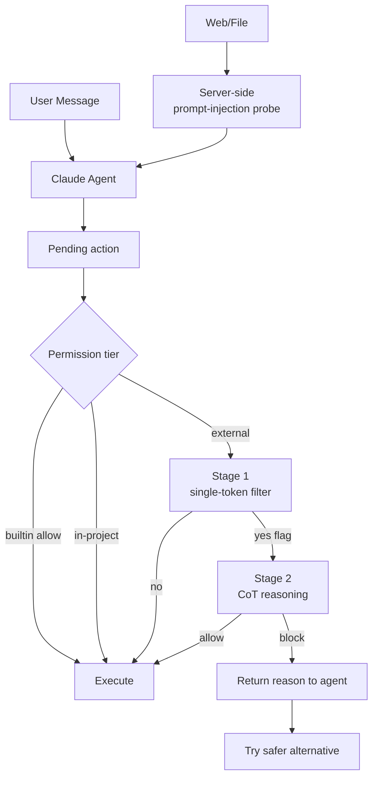

# Claude Code Auto Mode — Classifier 엔지니어링 심층

Claude Code 의 `auto` mode 는 두 layer 방어 시스템:

1. **Input layer**: server-side **prompt-injection probe** 가 tool output 을 agent
   context 진입 전에 scan
2. **Output layer**: Sonnet 4.6 기반 **transcript classifier** 가 action 실행 전 평가

classifier 는 2 stage:

- **Stage 1**: fast single-token filter (yes=block / no=allow)
- **Stage 2**: stage 1 이 flag 한 경우만 chain-of-thought reasoning

설계 핵심: **assistant text 와 tool output 을 strip** — agent 자신의 framing 이
classifier 의 판단을 오염시키는 것을 차단.

> "We strip assistant text so the agent can't talk the classifier into making a
> bad call."

mode 진입 조건과 일반 동작은 [[claude-code-permission-modes]] 참고.

## 결정 흐름



## Classification Pipeline — 3 Tier

> "Three permission tiers govern what requires classifier review:
> 1. Built-in allowlist: File reads, searches, code navigation (no state modification)
> 2. In-project operations: File writes within the project directory bypass the classifier
> 3. Transcript classifier: Shell commands, external integrations, out-of-project filesystem operations"

→ classifier overhead 는 주로 shell command 와 외부 integration 에서 발생.

## Auto Mode 진입 시 Disable 되는 Allow Rule

> "On entering auto mode, Anthropic disables previously-configured blanket
> permission rules for arbitrary code execution, including 'wildcarded script
> interpreters (python, node, ruby, and similar), and package manager run commands.'"

| Rule 종류 | 처리 |
|---|---|
| `Bash(*)` | drop |
| `Bash(python*)`, `Bash(node*)` 등 wildcard interpreter | drop |
| package manager run (`npm run *`, `pnpm *`) | drop |
| `Agent` allow rules | drop |
| 좁은 rule (`Bash(npm test)`) | carryover |

→ auto mode 종료 시 dropped rule 복원.

## Threat Model — 4 Failure Mode

> "The system addresses four failure modes:
> - Overeager behavior (unauthorized initiative)
> - Honest mistakes (misunderstood blast radius)
> - Prompt injection attacks
> - Model misalignment"

## Information Stripping 설계 결정

> "The classifier intentionally operates with limited context. 'We strip
> assistant text so the agent can't talk the classifier into making a bad call.'
> Tool outputs and assistant reasoning are excluded, forcing evaluation based
> solely on user messages and executable payloads."

> "a shorter transcript is easier to read and leaves less room for the agent's
> own framing to color the decision."

## Performance Metrics (Production Test Data)

| Metric | Real Traffic (n=10k) | Real Overeager (n=52) | Synthetic Exfil (n=1k) |
|---|---|---|---|
| Stage 1 FPR | 8.5% | 6.6% FNR | 1.8% FNR |
| Full Pipeline FPR | 0.4% | 17% FNR | 5.7% FNR |

해석:

- **FPR 0.4%** (real traffic): 1,000 호출 중 4 회만 잘못 block
- **FNR 17%** (overeager): 52 개 진짜 overeager 중 9 개를 못 잡음

> "The 17% false-negative rate on real overeager actions reflects a fundamental
> challenge: 'The classifier finds approval-shaped evidence and stops short of
> checking whether it's consent for the blast radius of the action.'"

→ 사용자 동의가 있는 action 처럼 보이지만 실제 영향 범위가 다른 경우 false-negative.

## 실제 Incident — 내부 운영 학습

> "Anthropic documented patterns from internal operations including:
> - deleting remote git branches from misinterpreted instructions,
> - uploading GitHub authentication tokens to internal clusters,
> - and attempted production database migrations.
> These shaped the classifier's block rules."

→ 이 3 종 incident 가 default block rule 의 motivation.

## Recovery Mechanism

> "when the classifier blocks an action, Claude shouldn't halt and wait for
> input; it should recover and try a safer approach."

→ block 결과는 agent 에게 사유와 함께 전달, 다른 approach 시도.

### Escalation Threshold

- 연속 3 회 block → auto mode pause, manual prompt 재개
- 누적 20 회 block → 동일하게 pause
- 허용된 action 1 건 → consecutive counter reset
- total counter 는 session 동안 누적 유지

### Non-interactive (`-p` flag)

> "In non-interactive mode with the -p flag, repeated blocks abort the session
> since there is no user to prompt."

## Subagent classifier 적용 — 3 단계

> "The classifier checks subagent work at three points:
> 1. Before a subagent starts, the delegated task description is evaluated, so a
>    dangerous-looking task is blocked at spawn time.
> 2. While the subagent runs, each of its actions goes through the classifier
>    with the same rules as the parent session, and any `permissionMode` in the
>    subagent's frontmatter is ignored.
> 3. When the subagent finishes, the classifier reviews its full action history;
>    if that return check flags a concern, a security warning is prepended to the
>    subagent's results."

→ subagent 가 자체 frontmatter 로 permission 우회 못 함, parent session 의 보호가
그대로 상속.

## Boundaries — 강제력의 한계

> "the classifier treats boundaries you state in the conversation as a block
> signal. If you tell Claude 'don't push' or 'wait until I review before
> deploying', the classifier blocks matching actions even when the default rules
> would allow them."

**중요한 한계**:

> "Boundaries are not stored as rules. The classifier re-reads them from the
> transcript on each check, so a boundary can be lost if context compaction
> removes the message that stated it. For a hard guarantee, add a deny rule
> instead."

## Cost & Latency

> "The classifier runs on a server-configured model that is independent of your
> /model selection, so switching models does not change classifier availability.
> Classifier calls count toward your token usage. Each check sends a portion of
> the transcript plus the pending action, adding a round-trip before execution.
> Reads and working-directory edits outside protected paths skip the classifier,
> so the overhead comes mainly from shell commands and network operations."

→ token billing 에 포함, latency 는 shell/network op 에서만 추가됨.

## OpenAI Codex 와 비교

| 측면 | Claude Code Auto | OpenAI Codex |
|---|---|---|
| 기본 정책 | classifier review | sandbox + approval |
| Linux sandbox | bubblewrap (off by default) | bwrap + seccomp (default on) |
| macOS sandbox | Seatbelt (off by default) | sandbox-exec (default) |
| Network default | egress 제한 (auto mode 내) | network OFF by default |
| Approval 옵션 | default/acceptEdits/plan/auto/dontAsk/bypass | on-request / untrusted / never / granular |
| Web search | classifier 검사 | cached default, live opt-in |

→ Codex 는 sandbox-first, Claude Code 는 classifier-first 전략. 두 접근 모두 layered.

## OpenTelemetry 통합 (Codex 측)

> "opt-in monitoring via OpenTelemetry (OTel) to help teams audit usage. Events
> cover conversations, API requests, approval decisions, and tool results.
> Prompts are redacted by default unless explicitly enabled."

→ Approval decision 자체가 OTel event 로 기록되어 audit trail 형성.

## Production Hardening

### 1. 다층 방어

- Sandbox (process isolation)
- Permission rules (declarative allow/deny)
- Classifier (semantic check)
- Boundaries (conversation 내 강제)
- → 어느 한 layer 도 단독으로 100% 보장 못 함

### 2. Hard guarantee 가 필요하면 Deny rule

- boundaries 는 transcript 에 있어야 작동
- compaction 으로 사라질 수 있음
- 절대 보장 = `permissions.deny` 에 등록

### 3. Production deploy 차단 패턴

```json
{
  "permissions": {
    "deny": [
      "Bash(kubectl apply *)",
      "Bash(terraform apply *)",
      "Bash(*--prod*)",
      "Bash(git push * main)"
    ]
  }
}
```

### 4. Auto mode trusted infra 등록

- false positive 누적 시 classifier block 빈도 증가 → 사용자 friction
- `autoMode.environment` 에서 trusted repo / bucket / service 등록

### 5. Escalation 로깅

- `/permissions` 의 Recently denied tab 주기적 review
- false positive pattern 발견 시 `/feedback`

## 관련 문서

- [[claude-code-permission-modes]] — 6 mode 일반 동작
- [[claude-code]] — Claude Code 허브
- [[claude-code-hooks-system]] — `PreToolUse`, `PermissionRequest` 훅
- [[anthropic-harness-design]] — harness 설계 원리
- [[agent-prompt-injection-defense]] — prompt injection 방어
- [[ai-agent-security]] — agent 보안 일반
