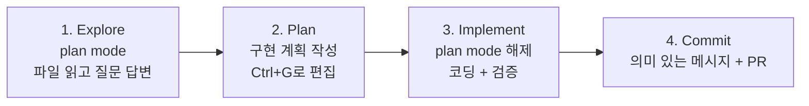

# Best Practices for Claude Code (Anthropic 공식 2025-04)

Anthropic Engineering / Claude Code 팀이 공식 라이브 문서로 관리하는 베스트 프랙티스. **Claude Code는 chatbot이 아닌 agentic coding environment** — 파일 읽기/쓰기/실행을 자율적으로 수행한다.

> "Instead of writing code yourself and asking Claude to review it, you describe what you want and Claude figures out how to build it. Claude explores, plans, and implements."

핵심 제약: **컨텍스트 윈도우가 빨리 차고, 차오를수록 성능이 저하**됨. 모든 best practice는 이 제약을 다루는 데 집중.

## 1. Verification 제공 (가장 큰 레버리지)

> "Include tests, screenshots, or expected outputs so Claude can check itself. This is the single highest-leverage thing you can do."

| 전략 | Before | After |
|---|---|---|
| Verification criteria | "implement a function that validates email addresses" | "write a validateEmail function. example test cases: user@example.com is true, invalid is false. run the tests after implementing" |
| Verify UI changes | "make the dashboard look better" | "[paste screenshot] implement this design. take a screenshot of the result and compare it to the original" |
| Address root causes | "the build is failing" | "the build fails with this error: [paste error]. fix it. address the root cause, don't suppress the error" |

## 2. Explore First, Then Plan, Then Code



### Plan 모드를 건너뛸 때
> "If you could describe the diff in one sentence, skip the plan."

오타 수정, 로그 추가, 변수명 변경 같은 작은 작업은 plan 불필요.

## 3. Specific Context in Prompts

| 전략 | Before | After |
|---|---|---|
| Scope the task | "add tests for foo.py" | "write a test for foo.py covering the edge case where the user is logged out. avoid mocks." |
| Point to sources | "why does ExecutionFactory have such a weird api?" | "look through ExecutionFactory's git history and summarize how its api came to be" |
| Reference patterns | "add a calendar widget" | "look at how existing widgets are implemented... HotDogWidget.php is a good example. follow the pattern..." |
| Describe symptom | "fix the login bug" | "users report that login fails after session timeout. check src/auth/. write a failing test that reproduces the issue, then fix it" |

### Rich Content 제공 방법
- `@filepath` — 파일 참조 (Claude가 읽음)
- 이미지 직접 붙여넣기/드래그
- URL 제공 (자주 쓰는 도메인은 `/permissions`로 allowlist)
- `cat error.log | claude` — 데이터 파이프
- "Let Claude fetch what it needs" — Bash, MCP, 파일 읽기로 자가 수집

## 4. CLAUDE.md 효과적 작성

`/init`로 starter 생성 후 정제. 모든 세션에서 로드되므로 **broadly applicable한 것만** 포함.

### 포함 vs 제외 기준

| Include | Exclude |
|---|---|
| Bash commands Claude can't guess | Anything Claude can figure out by reading code |
| Code style rules differing from defaults | Standard language conventions Claude already knows |
| Testing instructions | Detailed API documentation (link instead) |
| Repository etiquette (branch naming, PR) | Information that changes frequently |
| Architectural decisions | Long explanations or tutorials |
| Dev environment quirks | File-by-file descriptions of codebase |
| Common gotchas | Self-evident practices like "write clean code" |

> "If your CLAUDE.md is too long, Claude ignores half of it because important rules get lost in the noise."

### Import 문법
```markdown
See @README.md for project overview and @package.json for available npm commands.

# Additional Instructions
- Git workflow: @docs/git-instructions.md
- Personal overrides: @~/.claude/my-project-instructions.md
```

### 위치
- `~/.claude/CLAUDE.md` — 전역
- `./CLAUDE.md` — 프로젝트 (git 커밋)
- `./CLAUDE.local.md` — 개인용 (gitignore)
- 모노레포: `root/CLAUDE.md` + `root/foo/CLAUDE.md` 자동 병합
- 자식 디렉토리 CLAUDE.md — on-demand 로드

## 5. Permissions 관리

3가지 옵션:
- **Auto mode** — 분류 모델이 위험한 명령만 차단
- **Permission allowlists** — `/permissions`로 안전한 도구 화이트리스트
- **Sandboxing** — OS 레벨 격리

## 6. CLI 도구 사용

> "CLI tools are the most context-efficient way to interact with external services."

`gh`, `aws`, `gcloud`, `sentry-cli` 등.

## 7. MCP 서버 연결

`claude mcp add` 명령으로 외부 도구 (Notion, Figma, DB) 연결.

## 8. Hooks (Deterministic 자동화)

CLAUDE.md 지침은 advisory, **hooks는 deterministic** — 특정 시점에 자동 실행.

```bash
"Write a hook that runs eslint after every file edit"
"Write a hook that blocks writes to the migrations folder."
```

`.claude/settings.json`에서 직접 설정. 상세는 [[claude-code-hooks-system]].

## 9. Skills (도메인 지식 패키지)

`.claude/skills/SKILL.md` — 도메인 지식과 재사용 워크플로우.

```markdown
---
name: api-conventions
description: REST API design conventions for our services
---
# API Conventions
- Use kebab-case for URL paths
- Use camelCase for JSON properties
- Always include pagination for list endpoints
- Version APIs in the URL path (/v1/, /v2/)
```

`disable-model-invocation: true`로 자동 호출 비활성화 가능. 상세는 [[agent-skills]].

## 10. Custom Subagents

`.claude/agents/` 디렉토리에 특화 에이전트:

```markdown
---
name: security-reviewer
description: Reviews code for security vulnerabilities
tools: Read, Grep, Glob, Bash
model: opus
---
You are a senior security engineer...
```

서브에이전트 = **독립 컨텍스트**. "Use a subagent to review this code for security issues."

## 11. Course-Correct Early

- `Esc` — 중단, 컨텍스트 보존하며 redirect
- `Esc Esc` 또는 `/rewind` — 이전 상태로 복원
- `"Undo that"` — Claude가 변경 되돌리기
- `/clear` — 컨텍스트 리셋

> "If you've corrected Claude more than twice on the same issue in one session, the context is cluttered with failed approaches. Run /clear and start fresh."

## 12. Subagents for Investigation

```text
Use subagents to investigate how our authentication system handles token
refresh, and whether we have any existing OAuth utilities I should reuse.
```

서브에이전트가 별도 컨텍스트에서 탐색 후 요약 반환 → 메인 컨텍스트 깨끗.

## 13. Non-Interactive Mode (Headless)

```bash
# One-off queries
claude -p "Explain what this project does"

# Structured output for scripts
claude -p "List all API endpoints" --output-format json

# Streaming
claude -p "Analyze this log file" --output-format stream-json
```

CI 파이프라인, pre-commit hooks, 자동화에 사용.

## 14. Multiple Claude Sessions (Parallel)

옵션:
- **Worktrees** — 격리된 git checkouts
- **Desktop app** — 시각적 다중 세션
- **Claude Code on web** — Anthropic 클라우드 VM
- **Agent teams** — 자동 조율

### Writer/Reviewer 패턴

| Session A (Writer) | Session B (Reviewer) |
|---|---|
| `Implement a rate limiter` | |
| | `Review the rate limiter in @src/middleware/rateLimiter.ts...` |
| `Here's the review feedback: [Session B output]. Address these.` | |

리뷰어가 작성자가 작성한 코드에 편향되지 않음.

## 15. Fan Out Across Files

```bash
for file in $(cat files.txt); do
  claude -p "Migrate $file from React to Vue. Return OK or FAIL." \
    --allowedTools "Edit,Bash(git commit *)"
done
```

대규모 마이그레이션 / 분석에 활용.

## 16. Auto Mode

```bash
claude --permission-mode auto -p "fix all lint errors"
```

분류 모델이 백그라운드에서 명령을 검토, scope escalation/unknown infrastructure/hostile content 차단.

## 자주 발생하는 실패 패턴

1. **Kitchen sink session** — 한 세션에서 무관한 작업 섞기 → `/clear`
2. **Correcting over and over** — 두 번 교정 후에도 안 되면 `/clear`하고 더 나은 프롬프트
3. **Over-specified CLAUDE.md** — 너무 길면 무시됨 → 가차 없이 prune
4. **Trust-then-verify gap** — 그럴듯해 보이는 구현이 엣지 케이스 처리 못함 → 항상 검증 제공
5. **Infinite exploration** — 범위 없는 investigate → 서브에이전트로 격리

## 핵심 메시지

> 컨텍스트 관리 + 검증 가능성 + 점진적 자율성 — 이 세 축이 Claude Code 워크플로의 성패를 가른다.

## 관련 문서

- [[claude-code]] — Claude Code entity 허브
- [[claude-code-hooks-system]] — Hooks 시스템 상세
- [[claude-code-routines]] — 클라우드 자동화
- [[claude-agent-sdk]] — SDK 추상화
- [[agent-skills]] — Skill 패키징
- [[subagents]] — 서브에이전트 패턴
- [[effective-agents-patterns]] — Anthropic 7가지 패턴
- [[effective-context-engineering-anthropic]] — 컨텍스트 엔지니어링 글
