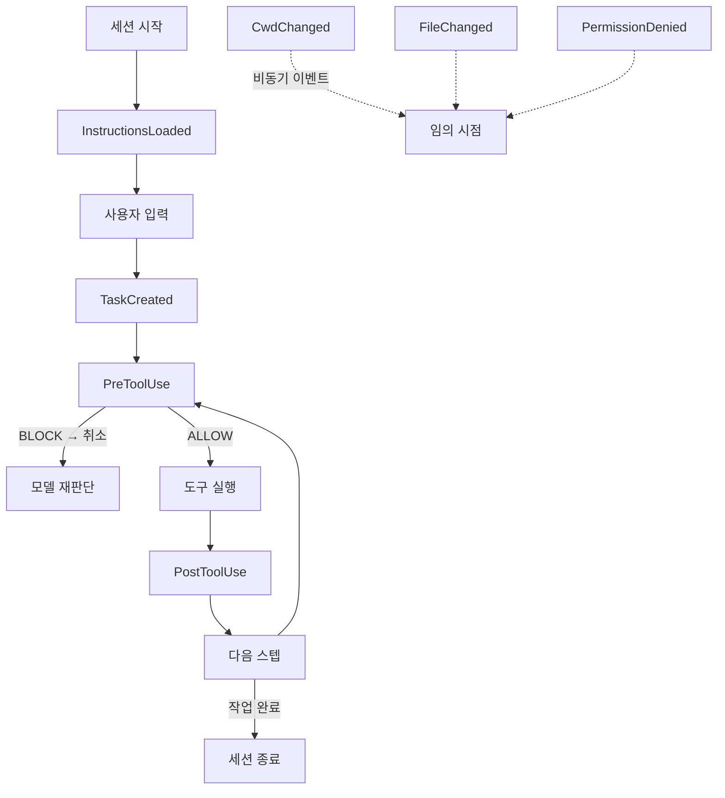

# Claude Code Hooks System

Claude Code 내부에서 라이프사이클 이벤트에 사용자 정의 스크립트를 끼워 넣는 `settings.json` 기반 확장 훅. "LLM 대신 결정론적 레일을 깐다"는 harness 철학의 표준 구현 도구다.

## 개요

Claude Code Hooks System은 에이전트 실행의 특정 시점(이벤트)에 사용자 정의 스크립트를 실행할 수 있는 확장 포인트다. `~/.claude/settings.json` 또는 프로젝트의 `.claude/settings.json`에 선언하며, 에이전트의 행동을 LLM 프롬프트가 아니라 **결정론적 코드**로 제어할 수 있다.

## 이벤트 타입



| 이벤트 | 발생 시점 | 활용 예시 |
|---|---|---|
| `PreToolUse` | 도구 실행 직전 | 위험 명령 차단, input 수정, 로깅 |
| `PostToolUse` | 도구 실행 직후 | 결과 검증, 알림, 부수효과 처리 |
| `InstructionsLoaded` | CLAUDE.md 로드 후 | 환경 변수 주입, 동적 지시 추가 |
| `TaskCreated` | 태스크 생성 시 | 태스크 트래킹, Notion 이슈 생성 |
| `CwdChanged` | 작업 디렉토리 변경 시 | 프로젝트별 설정 자동 로드 |
| `FileChanged` | 파일 수정 감지 시 | 린터 자동 실행, 변경 추적 |
| `PermissionDenied` | 권한 거부 시 | 알림, 대안 제안 |
| `WorktreeCreate` | worktree 생성 시 | 브랜치 준비, 환경 셋업 |
| `WorktreeRemove` | worktree 제거 시 | 정리 스크립트 실행 |

## settings.json 구조

```json
{
  "hooks": {
    "PreToolUse": [
      {
        "matcher": "Bash",
        "if": "input.command.startsWith('rm -rf')",
        "action": "BLOCK",
        "message": "위험한 삭제 명령은 허용되지 않습니다."
      },
      {
        "matcher": "Bash",
        "action": "RUN",
        "command": "echo '[LOG] Bash 도구 호출: {{input.command}}' >> /tmp/agent.log"
      }
    ],
    "PostToolUse": [
      {
        "matcher": "Write",
        "action": "RUN",
        "command": "npx prettier --write {{input.file_path}} 2>/dev/null || true"
      }
    ],
    "TaskCreated": [
      {
        "action": "RUN",
        "command": "~/.claude/hooks/notify-task.sh '{{task.description}}'"
      }
    ]
  }
}
```

## `if` 필드 (Permission Rule 문법)

v2.1.85 이후 `if` 필드로 훅을 조건부 실행할 수 있다. 이 필드는 JavaScript-like 표현식을 평가한다:

```json
{
  "matcher": "Bash",
  "if": "input.command.includes('sudo') || input.command.includes('chmod')",
  "action": "BLOCK"
}
```

## PreToolUse에서 Input 수정

v2.0.10부터 `PreToolUse` 훅이 도구 입력(tool input)을 수정해서 반환할 수 있다. 이를 이용해:

- 경로를 안전한 경로로 리다이렉트
- 명령어에 자동으로 안전 플래그 추가
- 재시도 루프를 결정론적으로 차단

```bash
#!/bin/bash
# PreToolUse 훅: rm 명령을 trash로 대체
INPUT=$(cat)
COMMAND=$(echo "$INPUT" | jq -r '.command')
if echo "$COMMAND" | grep -qE '^rm '; then
  NEW_CMD="${COMMAND/rm /trash }"
  echo "$INPUT" | jq --arg cmd "$NEW_CMD" '.command = $cmd'
else
  echo "$INPUT"
fi
```

## Harness 철학과의 연결

Claude Code Hooks는 [[anthropic-harness-design|Anthropic 하네스 설계]] 철학의 핵심 구현이다:

> "에이전트의 판단에 맡길 것과 결정론적 코드로 제어할 것을 분리한다"

훅이 없으면 모든 제약이 프롬프트에 의존 -> 불안정. 훅을 사용하면 위험 행동을 코드 수준에서 막을 수 있어 안전성과 예측 가능성이 향상된다.

## 실무 활용 예시

1. **Prettier 자동 포맷**: `PostToolUse(Write)` -> 파일 저장 후 자동 포맷
2. **위험 명령 차단**: `PreToolUse(Bash)` -> `rm -rf`, `force push` 등 차단
3. **Notion 이슈 자동 생성**: `TaskCreated` -> 태스크를 Notion에 자동 기록
4. **프로젝트별 환경 자동 로드**: `CwdChanged` -> 해당 프로젝트 `.env` 자동 활성화
5. **작업 완료 알림**: `PostToolUse(Bash)` -> 장시간 명령 완료 시 알림 전송

## 대표 자료

- [Claude Code Hooks Reference](https://code.claude.com/docs/en/hooks)
- [Claude Code Changelog](https://code.claude.com/docs/en/changelog)
- [Common workflows (Claude Code)](https://code.claude.com/docs/en/common-workflows)

## 관련 문서

- [[claude-agent-loop|Claude Agent Loop]]
- [[anthropic-harness-design|Anthropic Harness Design]]
- [[agent-skills|Agent Skills]]
- [[mcp-authorization|MCP Authorization]]
