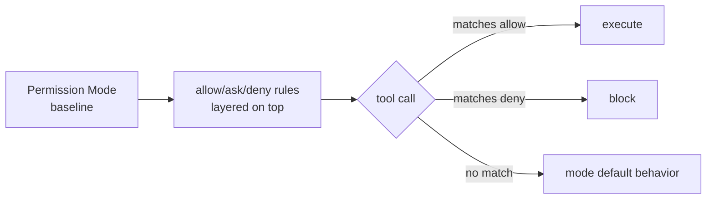

# Claude Code Permission Modes 와 Tool Allowlist/Denylist

Claude Code 가 제공하는 6 가지 permission mode 와 그 위에 layered 로 적용되는
allow/ask/deny rule 의 정확한 동작을 정리한다. **mode 는 baseline 만 결정하고
실제 결정은 rule 매칭 → mode default 순서로 evaluation** 된다.

## 6 Mode 요약

| Mode | What runs without asking | Best for |
|---|---|---|
| `default` | Reads only | Getting started, sensitive work |
| `acceptEdits` | Reads, file edits, common filesystem cmds (`mkdir`, `touch`, `rm`, `rmdir`, `mv`, `cp`, `sed`) | Iterating on code |
| `plan` | Reads only (no edits at all) | Exploring before changing |
| `auto` | Everything, with background safety classifier | Long tasks, prompt fatigue |
| `dontAsk` | Only pre-approved tools | Locked-down CI/scripts |
| `bypassPermissions` | Everything (incl. protected paths from v2.1.126) | Isolated containers/VMs only |

## 결정 흐름



## Protected Paths

모든 mode 는 다음 path 의 자동 쓰기를 거부한다 (단, `bypassPermissions` 만 허용):

- `.git`, `.vscode`, `.idea`, `.husky`, `.claude` 일부
- `.gitconfig`, `.bashrc`, `.zshrc`
- `.mcp.json`, `.claude.json`

## acceptEdits 자동 승인 범위

scope 는 **working directory 또는 `additionalDirectories` 내부**.
다음 prefix 도 자동 인정:

- env vars: `LANG=C`, `NO_COLOR=1`
- wrappers: `timeout`, `nice`, `nohup`

PowerShell tool 활성 시 `Set-Content`, `Add-Content`, `Clear-Content`, `Remove-Item`
도 자동 승인.

## plan 모드

> "Claude reads files, runs shell commands to explore, and writes a plan, but does
> not edit your source. Permission prompts still apply the same as default mode."

`/plan` prefix 또는 `--permission-mode plan` 으로 진입. 승인 시 다음 옵션:

- Approve and start in auto mode
- Approve and accept edits
- Approve and review each edit manually
- Keep planning with feedback
- Refine with Ultraplan

## auto 모드 (2026-03-24 출시, v2.1.83+)

자세한 내부 동작은 [[claude-code-auto-mode]] 참고. 자격 조건 요약:

- **Plan**: Max, Team, Enterprise, or API (Pro 불가)
- **Admin**: Team/Enterprise 는 admin 이 enable 필요
- **Model**: Sonnet 4.6, Opus 4.6, Opus 4.7 (Team/Ent/API), Max 는 Opus 4.7 only
- **Provider**: Anthropic API only (Bedrock/Vertex/Foundry 불가)

### Default Block 목록

- `curl | bash` 같은 download-and-execute
- 외부 endpoint 로 sensitive data 송신
- production deploy/migration
- cloud storage mass deletion
- IAM/repo permission 부여
- shared infrastructure 변경
- session 시작 전 존재하던 파일 irreversible 삭제
- force push, push to `main`

### Default Allow 목록

- working directory local file ops
- lock file/manifest 에 선언된 dependency install
- `.env` 읽고 매칭되는 API 로 credential 송신
- read-only HTTP requests
- session 시작 branch 또는 Claude 가 만든 branch 로 push

### Fallback 임계값

- 연속 3 회 block 또는 누적 20 회 block → auto mode pause, manual prompting 재개
- 허용된 action 1 건이면 consecutive counter reset, total counter 는 session 동안 유지

## dontAsk 모드

> "auto-denies every tool call that would otherwise prompt. Only actions matching your
> `permissions.allow` rules and read-only Bash commands can execute"

`ask` rule 은 prompt 대신 deny 됨 → CI 환경에서 fully non-interactive.

## bypassPermissions 모드

> "disables permission prompts and safety checks so tool calls execute immediately.
> As of v2.1.126 this includes writes to protected paths"

**예외 — circuit breaker**: `rm -rf /`, `rm -rf ~` 같은 filesystem root/home 삭제는
여전히 prompt. `--dangerously-skip-permissions` 와 동일. 진입 자체가 startup flag 필요.

## settings.json 설정

```json
{
  "permissions": {
    "defaultMode": "acceptEdits",
    "disableAutoMode": "disable",
    "disableBypassPermissionsMode": "disable"
  }
}
```

`disableAutoMode` / `disableBypassPermissionsMode` 는 managed settings 에서 admin 이
잠글 수 있다.

## Boundaries (대화 내 명시)

> "If you tell Claude 'don't push' or 'wait until I review before deploying', the
> classifier blocks matching actions even when the default rules would allow them."

- conversation transcript 에서 매번 re-read → context compaction 으로 message 가
  사라지면 boundary 도 사라짐
- hard guarantee 가 필요하면 **deny rule** 사용 권장

## auto 모드 진입 시 자동 drop 되는 broad allow rule

| Rule 종류 | 처리 |
|---|---|
| `Bash(*)` | drop |
| wildcard interpreter (`Bash(python*)`, `Bash(node*)`) | drop |
| package manager run (`npm run *`, `pnpm *`) | drop |
| `Agent` allow rules | drop |
| 좁은 rule (`Bash(npm test)`) | carryover |

auto mode 종료 시 dropped rule 복원.

## 실무 권장 패턴

1. **Local dev**: `default` 또는 `acceptEdits`
2. **Long autonomous task**: `auto` (Anthropic API + 자격 모델 한정)
3. **Container/VM 격리**: `bypassPermissions` (network egress 차단 환경)
4. **CI**: `dontAsk` + 명시적 allow rule 만
5. **Sensitive prod work**: `default` 강제, `disableBypassPermissionsMode`/`disableAutoMode` lock

## Production 배포 차단 패턴

```json
{
  "permissions": {
    "deny": [
      "Bash(kubectl apply *)",
      "Bash(terraform apply *)",
      "Bash(*--prod*)",
      "Bash(git push * main)"
    ]
  }
}
```

## 관련 문서

- [[claude-code-auto-mode]] — auto mode classifier 내부 구조
- [[claude-code]] — Claude Code 허브
- [[claude-code-hooks-system]] — `PreToolUse`, `PermissionRequest` 훅
- [[anthropic-harness-design]] — harness 설계 원리
- [[agent-sandbox-isolation]] — sandbox 격리 전략
