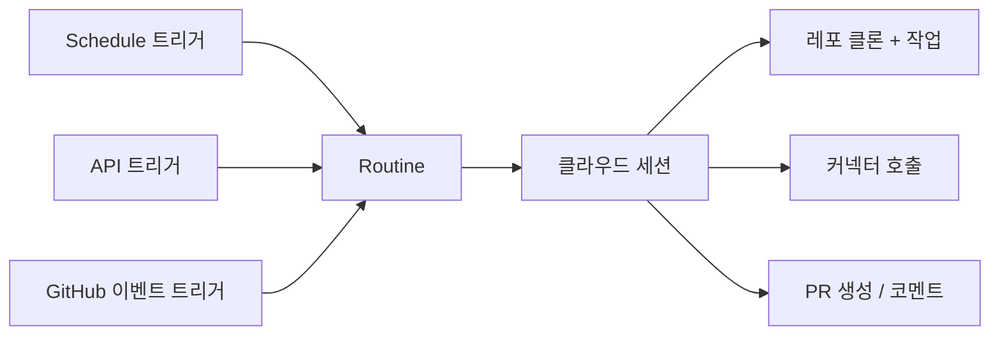

# Claude Code Routines

[[claude-code|Claude Code]]의 클라우드 기반 자동화 기능. 프롬프트 + 레포지토리 + 커넥터를 패키징하여 스케줄, API 호출, GitHub 이벤트에 반응해 자동 실행하는 시스템이다.

> Research preview 단계 (2026-04-16 기준). 동작, 제한, API 표면이 변경될 수 있음.

## 핵심 개념

Routine = **저장된 Claude Code 설정**(프롬프트 + 레포 + 커넥터)을 Anthropic 관리 클라우드 인프라에서 실행하는 단위. 노트북을 닫아도 계속 동작한다.



하나의 Routine에 여러 트리거를 조합할 수 있다.

## 트리거 유형

### Schedule (스케줄)

정기적 실행. 프리셋: hourly, daily, weekdays, weekly. 커스텀 cron은 `/schedule update`로 설정 (최소 간격 1시간). 로컬 타임존 자동 변환.

### API

HTTP POST 엔드포인트. 모니터링, CD 파이프라인, 내부 도구에서 호출. `text` 필드로 실행 컨텍스트(알림 본문, 실패 로그 등) 전달 가능.

```bash
curl -X POST https://api.anthropic.com/v1/claude_code/routines/trig_.../fire \
  -H "Authorization: Bearer sk-ant-oat01-xxxxx" \
  -H "anthropic-beta: experimental-cc-routine-2026-04-01" \
  -H "Content-Type: application/json" \
  -d '{"text": "Sentry alert SEN-4521 fired in prod."}'
```

응답으로 세션 ID와 URL을 반환하며, 브라우저에서 실시간 관찰/개입 가능.

### GitHub 이벤트

지원 이벤트:
- **Pull Request**: opened, closed, assigned, labeled, synchronized 등
- **Release**: created, published, edited, deleted

PR 필터: Author, Title, Body, Base/Head branch, Labels, Draft/Merged/Fork 상태. `matches regex` 연산자는 전체 값 매칭(부분 매칭은 `contains` 사용).

## 활용 사례

| 사례 | 트리거 | 동작 |
|------|--------|------|
| 백로그 정리 | 야간 스케줄 | 이슈 읽기 -> 라벨/담당자 지정 -> Slack 요약 |
| 알림 대응 | API (모니터링) | 스택 트레이스 분석 -> 최근 커밋 상관 -> 수정 PR |
| 코드 리뷰 | GitHub (PR opened) | 팀 체크리스트 적용 -> 인라인 코멘트 |
| 배포 검증 | API (CD 파이프라인) | 스모크 체크 -> 에러 로그 스캔 -> go/no-go |
| 문서 드리프트 | 주간 스케줄 | 변경 API 참조 문서 플래그 -> 업데이트 PR |
| SDK 포팅 | GitHub (PR merged) | 다른 언어 SDK로 변경 포팅 -> 매칭 PR |

## 실행 환경

- **레포지토리**: 실행 시 클론. 기본 `claude/` 접두사 브랜치만 푸시 허용 (해제 가능)
- **Environment**: 네트워크 접근, 환경변수, 셋업 스크립트 설정
- **커넥터**: 연결된 MCP 커넥터 (Slack, Linear, Google Drive 등)
- **권한**: 퍼미션 프롬프트 없이 완전 자율 실행. 커밋/PR은 연결된 GitHub 사용자 명의

## 생성 방법

1. **Web**: claude.ai/code/routines
2. **CLI**: `/schedule` 명령
3. **Desktop**: Schedule 페이지 > New remote task

## 가용성과 제한

Pro, Max, Team, Enterprise 플랜 대상. 계정당 일일 실행 횟수 제한. Extra usage 활성화 시 초과 실행 가능.

## 관련 문서

- [[claude-code]] -- Claude Code 엔티티
- [[how-coding-agents-work]] -- 코딩 에이전트 동작 원리
- [[claude-agent-sessions]] -- Claude 에이전트 세션 관리
