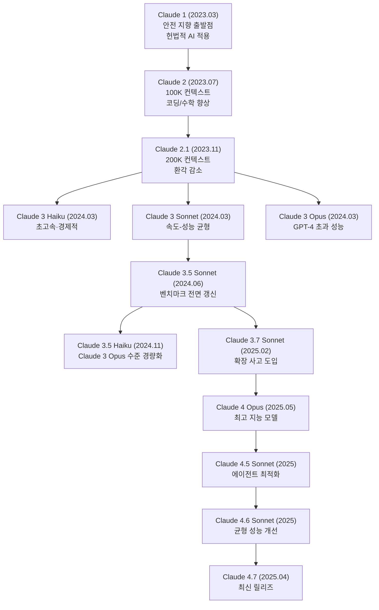
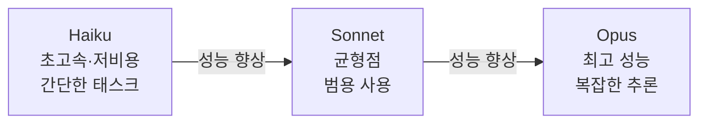
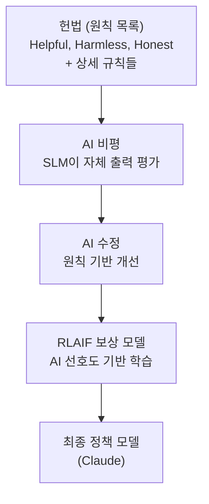
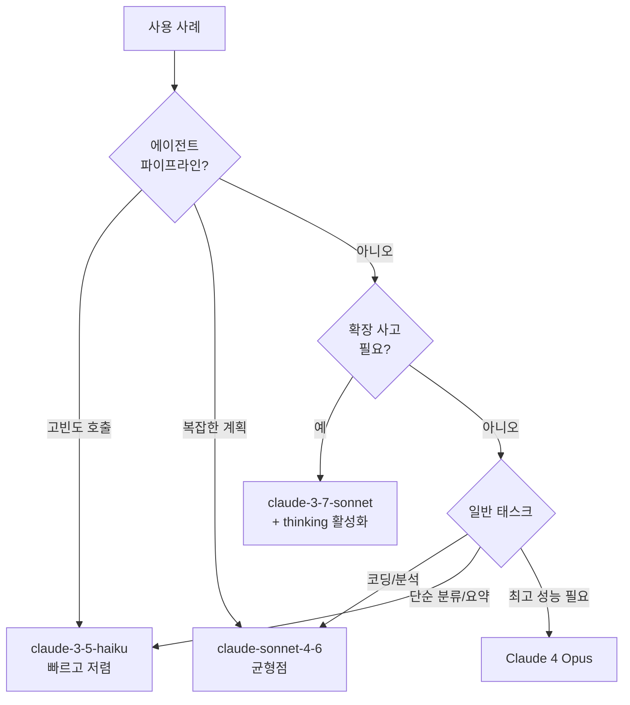

# Claude 모델 패밀리 (Claude Models)

## 개요

Claude는 Anthropic이 개발한 대형 언어 모델 시리즈다. "안전하고, 유익하며, 정직한(safe, helpful, honest)" AI를 핵심 설계 원칙으로 삼아 [[constitutional-ai-paper]]에서 제안된 헌법적 AI(Constitutional AI, CAI) 방법론을 중심으로 개발된다. 2023년 3월 Claude 1 출시 이후, 2025년 4월 현재 Claude 4.7까지 빠른 세대 교체를 거치며 코딩, 추론, 긴 컨텍스트 처리 분야에서 업계 선두를 다투고 있다.

Anthropic의 핵심 차별점은 **안전성 연구와 상용 모델 개발의 통합**이다. RSP(Responsible Scaling Policy)에 따라 모델의 잠재적 위험을 평가하고, 위험 임계치 초과 시 배포를 제한하는 구조를 운영한다.



---

## 모델 세대별 상세 프로필

### Claude 1 (2023.03)

Anthropic의 상용 서비스 첫 출시 모델. 헌법적 AI 기법으로 훈련되어 안전성과 유용성을 동시에 달성하려는 첫 실증 시도. 당시 GPT-3.5 수준이었으나, 롤플레이 거절이나 유해 콘텐츠 거부 측면에서 더 일관된 동작을 보였다.

**헌법적 AI(Constitutional AI) 핵심 개념:**
- 인간 피드백 대신 AI가 스스로 "헌법"(원칙 목록)을 기준으로 자기 출력을 평가
- AI Feedback으로 보상 모델 학습 → RLAIF(RL from AI Feedback)
- 명시적 원칙 기반이라 안전 동작의 이유 추적 가능

### Claude 2 / 2.1 (2023.07 / 2023.11)

**Claude 2**: 100K 토큰 컨텍스트 창 도입. 당시 업계 최장 컨텍스트로 법률 문서, 코드베이스 전체 처리 가능. 코딩과 수학 성능이 Claude 1 대비 크게 향상.

**Claude 2.1**: 200K 토큰으로 확장. 긴 문서에서의 환각(hallucination) 감소. Tool use (도구 사용) 기능 베타 공개. Claude.ai 프로 플랜과 API를 통해 제공.

### Claude 3 시리즈 (2024.03)

**세 가지 크기 동시 출시**로 서로 다른 속도-비용-성능 트레이드오프를 제공하는 전략.



| 모델 | 속도 | 비용 | 컨텍스트 | 주요 용도 |
|------|------|------|---------|---------|
| Claude 3 Haiku | 최고속 | 최저 | 200K | 분류, 요약, 빠른 응답 |
| Claude 3 Sonnet | 중간 | 중간 | 200K | 범용 어시스턴트 |
| Claude 3 Opus | 느림 | 높음 | 200K | 복잡한 분석, 연구 |

**Claude 3 Opus**는 출시 당시 GPT-4 Turbo를 다수 벤치마크에서 초과하며 Anthropic의 기술력을 입증했다.

### Claude 3.5 Sonnet (2024.06)

업계 전반의 벤치마크를 갱신한 모델. 특히:
- SWE-bench Verified (실제 GitHub 이슈 해결): 49% 달성
- **Computer Use** 기능 공개: 화면을 보며 마우스·키보드 제어 가능한 컴퓨터 제어 AI
- 코딩, 수학, 추론 모두 이전 세대 Opus를 초과
- API 비용은 Opus 대비 1/5 수준

Computer Use 예시 (beta):

```python
import anthropic

client = anthropic.Anthropic()

response = client.beta.messages.create(
    model="claude-3-5-sonnet-20241022",
    max_tokens=1024,
    tools=[
        {
            "type": "computer_20241022",
            "name": "computer",
            "display_width_px": 1920,
            "display_height_px": 1080,
        }
    ],
    messages=[
        {"role": "user", "content": "스크린샷을 찍어서 화면에 무엇이 있는지 알려줘"}
    ],
    betas=["computer-use-2024-10-22"],
)
```

### Claude 3.5 Haiku (2024.11)

이전 세대 Claude 3 Opus 수준의 성능을 Haiku(경량) 가격에 제공. 에이전트 파이프라인에서 고빈도 호출에 사용하기 좋은 균형점.

### Claude 3.7 Sonnet (2025.02)

**확장 사고(Extended Thinking)** 도입으로 추론 모델 기능 추가.

```python
import anthropic

client = anthropic.Anthropic()

response = client.messages.create(
    model="claude-3-7-sonnet-20250219",
    max_tokens=16000,
    thinking={
        "type": "enabled",
        "budget_tokens": 10000,  # 사고에 허용할 최대 토큰
    },
    messages=[{"role": "user", "content": "다음 알고리즘의 시간 복잡도를 분석하고 최적화하시오..."}],
)

for block in response.content:
    if block.type == "thinking":
        print(f"[내부 사고]\n{block.thinking[:200]}...")
    elif block.type == "text":
        print(f"[최종 답변]\n{block.text}")
```

- 하이브리드 모드: 추론이 필요할 때만 thinking 활성화
- `budget_tokens`로 비용-정확도 트레이드오프 조절
- SWE-bench Verified: ~55%

### Claude 4 Opus (2025.05)

**[업데이트 필요]** 2025년 5월 출시 예정. Anthropic의 최고 지능 모델 라인.

### Claude 4.5 / 4.6 / 4.7

에이전트 태스크 최적화, 도구 사용 정확도 향상, 코딩 성능 개선 등 단계적 개선을 거친 라인.

---

## API 핵심 사용 패턴

### 기본 메시지 API

```python
import anthropic

client = anthropic.Anthropic()  # ANTHROPIC_API_KEY 환경변수 사용

message = client.messages.create(
    model="claude-sonnet-4-6",
    max_tokens=1024,
    system="당신은 시니어 파이썬 엔지니어입니다. 코드 리뷰를 도와줍니다.",
    messages=[
        {"role": "user", "content": "이 코드의 문제점을 찾아주세요: def div(a, b): return a/b"}
    ],
)

print(message.content[0].text)
print(f"입력 토큰: {message.usage.input_tokens}")
print(f"출력 토큰: {message.usage.output_tokens}")
```

### 스트리밍

```python
with client.messages.stream(
    model="claude-sonnet-4-6",
    max_tokens=1024,
    messages=[{"role": "user", "content": "파이썬 비동기 프로그래밍을 설명해주세요"}],
) as stream:
    for text in stream.text_stream:
        print(text, end="", flush=True)
```

### 프롬프트 캐싱 (Prompt Caching)

긴 시스템 프롬프트나 반복 컨텍스트를 캐시하여 비용 절감:

```python
response = client.messages.create(
    model="claude-sonnet-4-6",
    max_tokens=1024,
    system=[
        {
            "type": "text",
            "text": "당신은 수천 줄의 코드베이스를 알고 있는 AI입니다...",
            "cache_control": {"type": "ephemeral"},  # 이 블록 캐시
        }
    ],
    messages=[{"role": "user", "content": "main 함수를 설명해주세요"}],
)
# 캐시 히트 시 입력 토큰 비용 90% 절감
```

### 도구 사용 (Tool Use)

```python
import json

tools = [
    {
        "name": "search_codebase",
        "description": "코드베이스에서 함수나 클래스를 검색합니다",
        "input_schema": {
            "type": "object",
            "properties": {
                "query": {"type": "string", "description": "검색어"},
                "file_type": {"type": "string", "enum": ["py", "ts", "js", "all"]},
            },
            "required": ["query"],
        },
    }
]

response = client.messages.create(
    model="claude-sonnet-4-6",
    max_tokens=1024,
    tools=tools,
    messages=[{"role": "user", "content": "프로젝트에서 authentication 관련 코드를 찾아줘"}],
)

if response.stop_reason == "tool_use":
    tool_use_block = next(b for b in response.content if b.type == "tool_use")
    print(f"도구 호출: {tool_use_block.name}")
    print(f"입력: {json.dumps(tool_use_block.input, ensure_ascii=False)}")
```

---

## 헌법적 AI와 안전 접근법

### 헌법적 AI (Constitutional AI)



핵심 개념:
- **명시적 원칙**: 안전 동작의 이유가 추적 가능
- **AI Feedback**: 인간 레이블러 대신 AI가 스스로 평가 → 확장성
- **투명성**: 모델이 따르는 원칙을 공개 가능

### RSP (Responsible Scaling Policy)

Anthropic의 안전 배포 정책:

| ASL 레벨 | 설명 | 현재 상태 |
|---------|------|---------|
| ASL-1 | 기초 안전 조치 | Claude 1-2 |
| ASL-2 | 표준 보안 조치 | Claude 3-3.7 |
| ASL-3 | 강화 보안, 접근 제한 | 임계치 접근 시 |
| ASL-4 | 극도로 위험한 능력 | 배포 보류 |

관련 상세: [[anthropic-rsp-evolution]]

---

## 모델 선택 가이드



| 모델 ID | 최적 사용 사례 | 컨텍스트 | 비용 |
|---------|-------------|---------|------|
| claude-3-haiku-20240307 | 분류, 빠른 응답 | 200K | 최저 |
| claude-3-5-haiku-20241022 | 에이전트 호출 | 200K | 낮음 |
| claude-3-5-sonnet-20241022 | 범용, Computer Use | 200K | 중간 |
| claude-3-7-sonnet-20250219 | 추론, 코딩 | 200K | 중간 |
| claude-sonnet-4-6 | 최신 균형 모델 | 200K | 중간 |

---

## Claude Code와의 연동

[[claude-code]]는 Anthropic이 개발한 CLI 기반 코딩 어시스턴트로, Claude 모델 API를 직접 활용한다. 특히:

- Claude 3.7 Sonnet Extended Thinking: 복잡한 아키텍처 설계
- Claude 3.5 Sonnet: 일반 코드 작성 및 리뷰
- claude-sonnet-4-6: 에이전트 태스크와 파일 조작

---

## 경쟁 모델과의 포지셔닝

| 항목 | Claude 3.7 Sonnet | GPT-4.1 | Gemini 2.5 Pro |
|------|------------------|---------|----------------|
| 코딩(SWE-bench) | ~55% | 54.6% | ~57% |
| 컨텍스트 | 200K | 1M | 1M |
| 추론 | Extended Thinking | o3로 분리 | Flash Thinking |
| 안전 접근법 | Constitutional AI | RLHF | 비공개 |
| 아키텍처 투명성 | RSP 공개 | 일부 공개 | 낮음 |

---

## 관련 문서

- [[claude-code]] - Claude 기반 코딩 CLI 어시스턴트
- [[gpt-models]] - OpenAI GPT 모델 패밀리 비교
- [[constitutional-ai-paper]] - 헌법적 AI 논문 상세
- [[anthropic-rsp-evolution]] - Anthropic RSP 정책 진화
- [[reasoning-llm]] - 확장 사고 추론 모델 아키텍처
- [[scaling-laws-overview]] - 모델 스케일링 법칙
