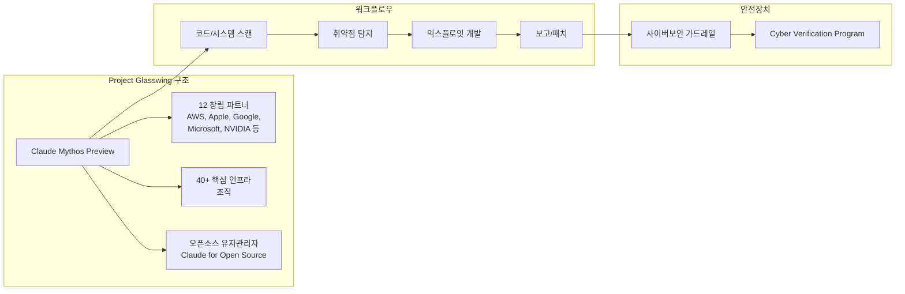

## 개요

Claude Mythos Preview는 Anthropic이 개발한 역대 최강 AI 모델이다. 자율적 취약점 연구(Autonomous Vulnerability Research) 능력이 핵심으로, 수천 개의 제로데이 취약점을 주요 시스템에서 발견했다. Project Glasswing은 이 모델을 활용한 방어적 사이버보안 협력 이니셔티브로, AWS, Apple, Google, Microsoft, NVIDIA 등 12개 창립 파트너 조직과 40여 개 추가 조직이 참여한다. 일반 공개 계획은 없으며, 검증된 조직과 연구 파트너에게만 제한 제공된다.

## 핵심 특징

- **자율적 취약점 발견**: 인간 개입 없이 취약점 식별 및 익스플로잇 개발 수행
- **역사적 취약점 탐지**: OpenBSD의 27년 된 버그, FFmpeg의 16년 된 취약점 등 자동화 도구가 놓친 결함 발견
- **리눅스 커널 공격 체인**: 다수의 커널 취약점을 연쇄 결합하여 권한 상승 시나리오 구성
- **모든 주요 OS/브라우저** 대상 결함 발견
- **엘리트 인간 보안 전문가 수준**: CrowdStrike는 "취약점 발견에서 공격까지의 시간이 수개월에서 수분으로 단축"되었다고 평가

## 벤치마크 성능

| 평가 지표 | Mythos Preview | [[claude-opus-4-6|Opus 4.6]] |
|---|---|---|
| CyberGym (취약점 재현) | 83.1% | 66.6% |
| [[swe-bench-pro|SWE-bench Pro]] | 77.8% | 53.4% |
| [[terminal-bench-2-0|Terminal-Bench 2.0]] | 82.0% | 65.4% |
| SWE-bench Verified | 93.9% | 80.8% |
| SWE-bench Multilingual | 87.3% | 77.8% |

## 아키텍처

## Simon Willison 분석 (2026-04-07)

Simon Willison은 Project Glasswing 발표를 "합리적 trade-off"로 평가했다. 핵심 분석 포인트:

### Firefox Exploit 수치: 2 vs 181

Willison이 주목한 가장 구체적인 수치는 Firefox JavaScript exploit 테스트 결과다:

- **Opus 4.6**: 수백 회 시도 중 **2회 성공**
- **Mythos**: 동일 조건에서 **181회 성공**

이 90배 이상의 차이는 단순한 성능 향상이 아니라 **질적 전환**임을 보여준다. Willison은 이 수치가 Anthropic이 일반 공개를 보류한 근거로 충분하다고 평가했다.

### Project Glasswing 파트너 구조

12개 창립 파트너(AWS, Apple, Microsoft, Google, Linux Foundation, Broadcom, Cisco, CrowdStrike, JPMorganChase, NVIDIA, Palo Alto Networks, Anthropic)가 참여하며, 40개 이상 추가 인프라 조직이 포함된다.

배정 리소스:
- **$100M**: Mythos 사용 크레딧
- **$4M**: 오픈소스 보안 조직 직접 기부 (Alpha-Omega, OpenSSF, Apache Software Foundation)

Willison의 결론: "일반 가용성 지연을 수용하는 대신, 가장 위험한 능력에 대한 safeguard를 개발할 시간을 확보하는 합리적 선택."

이 사례의 상세 분석은 [[project-glasswing-case-study]] 참조.

## 기술 상세

### 이중용도(Dual-Use) 위험

Anthropic은 "방어력을 강화하는 것과 동일한 능력이 공격자에 의해 무기화될 수 있다"고 인정하며, 미국 정부 관계자에게 Mythos가 2026년 대규모 사이버공격 가능성을 높인다고 비공개 경고했다. 이에 따라 향후 Claude Opus 모델에 사이버보안 세이프가드를 내장할 예정이다.

### 파트너 조직 상세

**12개 창립 파트너**: Amazon Web Services, Anthropic, Apple, Broadcom, Cisco, CrowdStrike, Google, JPMorganChase, Linux Foundation, Microsoft, NVIDIA, Palo Alto Networks

이들은 Mythos Preview의 취약점 발견 능력을 자사 시스템 방어에 활용하며, 발견된 취약점의 책임 있는 공개(responsible disclosure) 프로세스에 공동 참여한다. 40개 이상의 추가 조직은 핵심 소프트웨어 인프라를 구축하는 기관들로 구성된다.

### 투자 규모

Anthropic은 총 1억 400만 달러 이상을 투입한다:
- **$100M**: Claude Mythos Preview 사용 크레딧
- **$2.5M**: Alpha-Omega 및 OpenSSF(Linux Foundation) 직접 기부
- **$1.5M**: Apache Software Foundation 직접 기부

오픈소스 보안 조직에 대한 이 투자는 Glasswing 이니셔티브의 지속 가능성을 뒷받침하며, Claude for Open Source 프로그램을 통해 오픈소스 유지관리자에게도 접근 기회를 제공한다.

### 90일 목표

공개적으로 발견 사항, 패치된 취약점, 개선 권고사항을 보고할 예정이며, 다음 영역에 대한 권고를 포함한다:

- 취약점 공개 프로세스 개선
- 소프트웨어 업데이트 메커니즘 현대화
- 공급망 보안 프로토콜 강화
- 보안 개발 수명주기(SDL) 표준 수립
- 패칭 자동화 워크플로우

### 향후 안전장치 계획

Anthropic은 차기 Claude Opus 모델에 사이버보안 세이프가드를 내장할 예정이다. 이 세이프가드가 보안 전문가의 정상적 업무를 방해하는 경우를 대비하여, Cyber Verification Program을 통해 검증된 보안 연구자에게 예외 접근을 제공할 계획이다.

## 기술적 의의

### 취약점 발견에서 공격까지의 시간 단축

CrowdStrike는 Mythos Preview를 통해 "취약점 발견에서 공격까지의 시간이 수개월에서 수분으로 단축"되었다고 평가했다. 이는 방어 측면에서 패치 배포 속도가 근본적으로 재고되어야 함을 의미한다. 기존의 90일 공개 기한(responsible disclosure timeline)이 AI 속도에 맞게 재설계될 필요가 있다.

### 자율 공격 체인 구성

단일 취약점 발견을 넘어, 다수의 커널 취약점을 연쇄적으로 결합하여 권한 상승 시나리오를 자율적으로 구성하는 능력이 핵심 차별점이다. 이는 기존 자동화 도구(fuzzer, static analyzer)가 달성하지 못한 수준의 시스템적 사고를 보여준다.

## 가격 및 접근

- **가격**: 입력 $25/1M 토큰, 출력 $125/1M 토큰 (연구 프리뷰 종료 후)
- **플랫폼**: Claude API, Amazon Bedrock, Google Cloud Vertex AI, Microsoft Foundry
- **일반 공개 없음**: "Claude Mythos Preview를 일반에 공개할 계획은 없다"고 명시
- **오픈소스 접근**: Claude for Open Source 프로그램을 통해 오픈소스 유지관리자에게 신청 기반 제공

## 관련 문서

- [[project-glasswing-case-study]] - Glasswing 제한 배포 사례 상세 (Simon Willison 분석 포함)
- [[capability-gated-release]] - 이 사례에서 추출된 능력 차등 출시 개념
- [[claude-opus-4-6]] - Anthropic의 이전 세대 프론티어 모델
- [[claude-opus-4-5]] - Claude Opus 4.5 모델
- [[swe-bench-pro]] - 소프트웨어 엔지니어링 벤치마크
- [[terminal-bench-2-0]] - 터미널 작업 벤치마크
