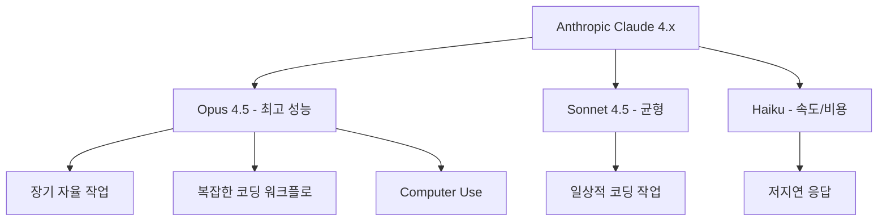

# Claude Opus 4.5

Anthropic이 공개한 high-end frontier 모델. 장기 자율 작업과 고난도 coding workflow에서 강점을 가진다.

## 개요

Claude Opus 4.5는 Claude 4 세대의 최상위 모델로, Anthropic이 "더 긴 자율 작업과 고난도 coding workflow를 위해 설계했다"고 설명한다. 단순 benchmark champion보다 **얼마나 긴 작업을 안정적으로 유지할 수 있는가**가 핵심 포지셔닝이다.

Claude 4.x 라인업에서 Opus는 최고 성능, Sonnet은 성능/비용 균형, Haiku는 속도/비용 최적화를 담당한다.

## 포지셔닝

## 주요 강점 영역

### 장기 자율 작업 (Long-Horizon Autonomy)
단발 생성이 아니라 수십~수백 스텝에 걸친 작업을 자율 수행하는 능력. [[claude-agent-loop|Agent Loop]] 구조에서 에이전트가 여러 도구를 연속 호출하며 복잡한 목표를 달성하는 워크플로에 적합하다.

### 고난도 코딩 워크플로
- **SWE-bench Verified**: 고난도 실제 소프트웨어 엔지니어링 태스크 평가
- **Computer Use**: 스크린샷을 보고 UI 조작 명령을 생성하는 능력
- 대규모 코드베이스 이해 및 수정

### 안전성 (Safety-Forward)
Anthropic의 발표에 따르면 Opus 4.5는 "A step forward on safety"를 강조한다. Constitutional AI와 RLAIF 기반 안전 정렬이 적용되어 있으며, 장기 자율 에이전트로 사용될수록 안전 경계 유지가 중요해진다.

## 모델 선택 기준

| 상황 | 권장 모델 |
|---|---|
| 복잡한 멀티스텝 에이전트 워크플로 | Opus 4.5 |
| 일상적 코딩 보조 | Sonnet 4.5 |
| 짧은 텍스트 분류/추출 | Haiku |
| 비용이 주요 제약 | Sonnet 또는 Haiku |
| 안전성이 최우선 | Opus 4.5 |

## [[claude-opus-4-6|Opus 4.6]]과의 비교

Opus 4.6은 Opus 4.5의 후속 모델(2026년 2월 출시)이다:

| 항목 | Opus 4.5 | [[claude-opus-4-6|Opus 4.6]] |
|---|---|---|
| 컨텍스트 | [교차검증 필요] | 1M 토큰 |
| METR 작업 지평선 | [교차검증 필요] | 14시간 30분 |
| 출시 시점 | [교차검증 필요] | 2026-02-05 |
| 위상 | 선대 플래그십 | 현재 플래그십 |

[교차검증 필요] Opus 4.5의 정확한 출시일, 컨텍스트 길이, 벤치마크 수치는 [공식 발표](https://www.anthropic.com/news/claude-opus-4-5)에서 확인 필요.

## Claude Developer Platform 통합

Anthropic 발표에 따르면 Opus 4.5는 Claude Developer Platform에서 다음 기능과 함께 출시됐다:

- **컴퓨터 사용(Computer Use) API**: 스크린샷 기반 UI 조작
- **코드 실행 도구**: 샌드박스 환경에서 코드 직접 실행
- **개선된 도구 사용**: 복잡한 도구 체인 운용 능력 향상

## 운영 관점

Opus 4.5는 Sonnet 계열보다 비용이 더 크지만, multi-step reasoning이나 long-horizon autonomy가 중요한 경우 다른 판단 기준이 적용된다. [[anthropic-harness-design|하네스 엔지니어링]] 관점에서 이 모델을 감싸는 평가 인프라와 [[long-horizon-agent-benchmarks|장기 에이전트 벤치마크]] 점수를 함께 봐야 도입 판단이 가능하다.

## 대표 자료

- [Introducing Claude Opus 4.5 -- Anthropic News](https://www.anthropic.com/news/claude-opus-4-5)

## 관련 문서

- [[claude-opus-4-6|Claude Opus 4.6]]
- [[claude-agent-loop|Claude Agent Loop]]
- [[long-horizon-agent-benchmarks|Long-Horizon Agent Benchmarks]]
- [[anthropic-harness-design|Anthropic Harness Design]]
