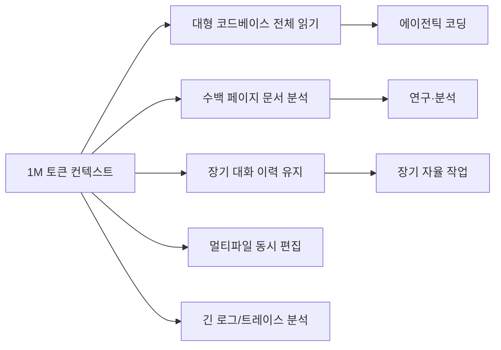
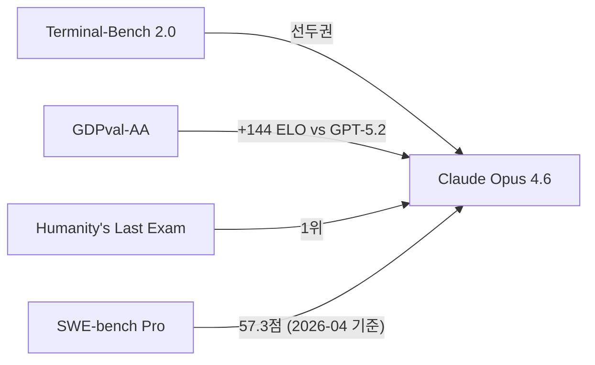

# Claude Opus 4.6

2026년 2월 Anthropic이 공개한 플래그십 모델. 1M 컨텍스트, 14.5시간 작업 지평선, 에이전틱 코딩 왕좌.

## 개요

Claude Opus 4.6은 Anthropic이 2026년 2월 5일 출시한 현재 최고 성능 플래그십 모델이다. [[claude-opus-4-5|Opus 4.5]]의 후속으로, 1M 토큰 컨텍스트와 압도적인 장기 자율 실행 능력을 앞세워 에이전틱 코딩 분야 선두를 탈환했다.

## 핵심 사양

| 항목 | 값 |
|---|---|
| 출시일 | 2026년 2월 5일 |
| 컨텍스트 길이 | 1,000,000 토큰 (1M) |
| METR 작업 지평선 | 50% 성공률 기준 14시간 30분 |
| Humanity's Last Exam | 1위 |
| GDPval-AA | GPT-5.2 대비 +144 ELO |
| Terminal-Bench 2.0 | 선두권 |

[교차검증 필요] 구체적 수치는 [공식 발표](https://www.anthropic.com/news/claude-opus-4-6) 및 [플랫폼 릴리스 노트](https://platform.claude.com/docs/en/release-notes/overview)에서 확인 필요.

## 1M 컨텍스트의 의미

1M 토큰은 약 75만 단어 또는 수천 줄짜리 코드 파일 수십 개를 단일 컨텍스트에 담을 수 있다. 이는 [[context-engineering|컨텍스트 엔지니어링]]의 중요성을 높이는 동시에, 단순히 "긴 컨텍스트 = 더 좋은 결과"가 아님을 의미한다. 컨텍스트 내 정보 배치와 구조화가 성능에 직접 영향을 준다.

## METR 작업 지평선: 14시간 30분

METR(Machine Ethics and Technical Research)의 작업 지평선(time horizon) 벤치마크는 에이전트가 **50%의 성공률을 유지하는 최대 작업 시간**을 측정한다. Opus 4.6의 14시간 30분은 프론티어 모델 중 최장 기록이다.

이 지표의 의미: 에이전트가 수 시간 동안 사람의 개입 없이 자율적으로 작업을 수행할 수 있다.

## 에이전틱 코딩 성과

[교차검증 필요] 리더보드는 실시간으로 변동하므로 최신 수치는 각 공식 리더보드에서 확인.

## [[context-engineering|컨텍스트 엔지니어링]]과의 시너지

1M 컨텍스트는 단순히 "더 많은 정보를 넣을 수 있다"는 의미가 아니다. 활용 능력이 성능을 결정한다:

- **긴 컨텍스트 중간 정보 손실**: Lost-in-the-middle 현상 - 컨텍스트 중간 정보가 앞뒤보다 덜 활용됨
- **구조화의 중요성**: 중요 정보를 컨텍스트 앞이나 뒤에 배치
- **적절한 청크화(chunking)**: 관련 정보를 묶어서 제공
- **메타 정보 포함**: "이 코드는 인증 모듈의 핵심이다"와 같은 안내 정보 포함

## 경쟁 모델 대비 위치

| 모델 | 컨텍스트 | 에이전틱 코딩 | 추론 방식 | 오픈소스 |
|---|---|---|---|---|
| Claude Opus 4.6 | 1M | 최상위 | Extended Thinking | 아니오 |
| [[qwen3-6-plus|Qwen3.6-Plus]] | 1M | 상위 | Always-on | 아니오 |
| [[glm-5-1|GLM-5.1]] | [교차검증] | 상위 (SWE 1위) | On-demand | 예 (MIT) |
| GPT-5.4 | - | 상위 | On-demand | 아니오 |

## Claude Developer Platform 활용

Opus 4.6은 다음 Developer Platform 기능과 결합 시 성능이 극대화된다:

- **Tools API**: 복잡한 도구 체인 운용 (코드 실행, 웹 검색, 파일 조작)
- **Extended Thinking**: 복잡한 문제에서 명시적 추론 단계 활성화
- **Streaming**: 긴 작업에서 중간 결과를 실시간으로 수신
- **Batching**: 다수의 독립 태스크를 병렬로 처리 (비용 절감)

## 왜 지금 중요한가

2026년 2월 5일 출시, Humanity's Last Exam 1위에 METR 기준 50% 작업 지평선이 14시간 30분으로 프론티어 중 최장기이며, Terminal-Bench 2.0과 GDPval-AA에서 GPT-5.2를 144 ELO 앞서는 에이전틱 코딩 왕좌를 탈환했다.

## 대표 자료

- [Introducing Claude Opus 4.6 -- Anthropic News](https://www.anthropic.com/news/claude-opus-4-6)
- [Claude (language model) -- Wikipedia](https://en.wikipedia.org/wiki/Claude_(language_model))
- [Claude Platform Release Notes](https://platform.claude.com/docs/en/release-notes/overview)
- [GDPval-AA Leaderboard -- Artificial Analysis](https://artificialanalysis.ai/evaluations/gdpval-aa)
- [Terminal-Bench 2.0 Leaderboard -- LLM Stats](https://llm-stats.com/benchmarks/terminal-bench-2)

## 관련 문서
- [[claude-opus-4-7|Claude Opus 4.7]] -- 2026-04-16 출시 후속 모델
- [[meta-muse-spark]] -- Meta Muse Spark
- [[claude-mythos-preview]] -- Claude Mythos Preview / Project Glasswing

- [[claude-opus-4-5|Claude Opus 4.5]]
- [[context-engineering|컨텍스트 엔지니어링]]
- [[ai-reasoning-models|AI 추론 모델]]
- [[terminal-bench-2-0|Terminal-Bench 2.0]]
- [[long-horizon-agent-benchmarks|Long-Horizon Agent Benchmarks]]
