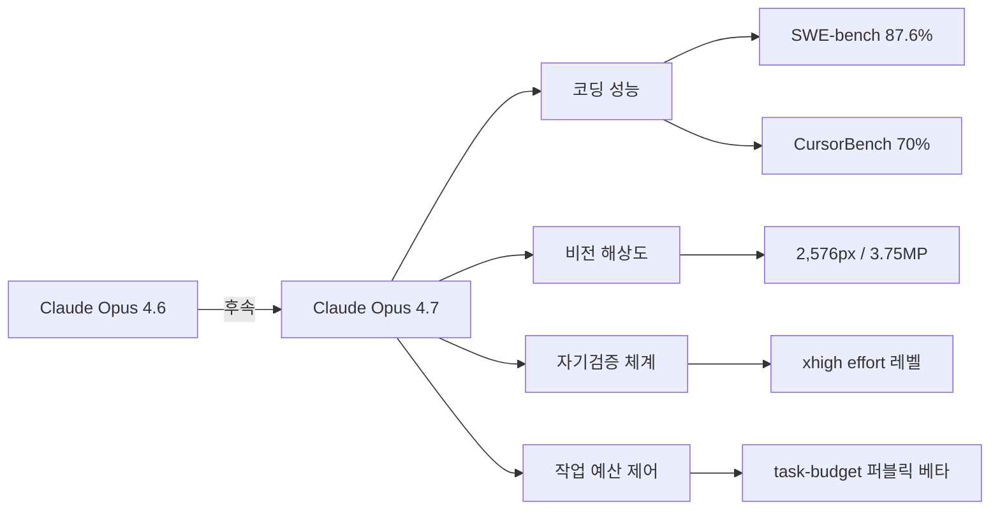

# Claude Opus 4.7 출시: 코딩·비전·자기검증 강화

Claude Opus 4.7은 2026년 4월 16일 Anthropic이 공개한 최신 플래그십 모델이다. Opus 4.6 대비 코딩 벤치마크, 비전 해상도, 자기검증 능력 전반에서 의미 있는 성능 향상을 달성했으며, 가격은 전작과 동일하게 유지됐다.

## 모델 개요



위 다이어그램은 Opus 4.7이 기존 4.6 대비 어떤 축에서 개선됐는지를 나타낸다.

## 주요 벤치마크 성능

| 벤치마크 | Opus 4.6 | Opus 4.7 | 개선폭 |
|---------|---------|---------|-------|
| SWE-bench Verified | 80.8% | 87.6% | +6.8p |
| CursorBench | 58% | 70% | +12p |
| 비전 해상도 | ~1.25MP 추정 | 3.75MP | 약 3배+ |

SWE-bench Verified는 실제 GitHub 이슈 해결 능력을 측정하는 소프트웨어 엔지니어링 벤치마크(software engineering benchmark)로, 87.6%는 2026년 4월 기준 공개 모델 중 최고 수준이다. CursorBench는 Cursor IDE 특화 코딩 벤치마크로, 개발 워크플로우에서의 실질적인 유용성을 반영한다.

## 신규 기능

### 비전 해상도 향상
이미지 입력 최대 해상도가 2,576px(3.75메가픽셀)로 상향됐다. 기존 대비 약 3배 이상 높은 해상도를 처리할 수 있어, 고해상도 스크린샷, 다이어그램, UI 목업 분석에서 정확도가 크게 향상됐다.

### xhigh effort 레벨 신설
기존 `low`, `medium`, `high` effort 레벨에 더해 `xhigh`(초고강도) 레벨이 신설됐다. [[extended-thinking]] 메커니즘을 더 많은 추론 예산으로 구동하는 방식이며, 복잡한 수학·코딩 문제에서 차별화된 성능을 보인다. [[claude-code]]에서도 `/effort xhigh` 명령으로 활성화 가능하다.

### 작업 예산(task budget) 퍼블릭 베타
에이전트 실행 중 토큰 사용·도구 호출 수를 제어하는 작업 예산(task budget) API가 퍼블릭 베타로 출시됐다. 개발자는 최대 허용 도구 호출 횟수, 최대 토큰 사용량 등을 미리 정의하고, 예산 소진 임박 시 모델이 스스로 요약·마무리 전략을 취하도록 유도할 수 있다.

```python
# task-budget 활용 예시 (퍼블릭 베타 기준)
import anthropic

client = anthropic.Anthropic()
response = client.messages.create(
    model="claude-opus-4-7-20260416",
    max_tokens=8096,
    task_budget={
        "max_tool_calls": 50,
        "token_budget_tokens": 100000,
    },
    messages=[{"role": "user", "content": "복잡한 리팩토링 작업을 수행하라"}]
)
```

> "The task budget feature allows developers to set explicit resource constraints for agent runs, enabling cost predictability without sacrificing capability." - Anthropic 출시 블로그

### implicit-need-test
모델이 사용자 요청의 명시적 지시를 넘어 암묵적 필요(implicit need)를 추론하고 대응하는 능력을 측정하는 내부 지표. 4.7에서 유의미한 향상을 보였으며, 장기 에이전트 태스크에서 불필요한 확인 질문 없이 적절히 행동하는 능력과 연결된다.

## 가격 정책

Opus 4.6과 동일한 가격을 유지한다:

| 구분 | 가격 |
|------|------|
| 입력 | $5 / MTok (100만 토큰) |
| 출력 | $25 / MTok |
| 프롬프트 캐싱(쓰기) | $6.25 / MTok |
| 프롬프트 캐싱(읽기) | $0.50 / MTok |

성능 향상에도 가격이 동결된 것은 Anthropic의 컴퓨트 비용 효율화 성과를 반영한다.

## Cursor와의 통합

CursorBench 성능이 58% → 70%로 개선됐다. Cursor IDE는 Opus 4.7을 기본 모델로 채택했으며, 코드 자동완성, 인라인 편집, 에이전트 모드 전반에서 4.7의 성능 개선이 체감된다. xhigh effort 레벨은 Cursor의 "고난이도 리팩토링" 태스크에서 특히 유효하다.

## 기존 위키와의 관계

- [[claude-models]]: Anthropic 모델 전체 계보를 다루는 허브 페이지
- [[claude-code]]: Claude Code에서 Opus 4.7 및 xhigh effort 통합 사용법
- `wiki/tooling/claude-opus-4-7.md`: 시스템 프롬프트 diff 관점에서 작성된 별도 페이지로, 본 페이지는 벤치마크·기능 스펙 관점을 보완한다

## 평가 및 전망

Opus 4.7은 코딩 에이전트 시장에서 의미 있는 도약이다. SWE-bench 87.6%는 실제 엔지니어링 작업에서 단순 보조를 넘어 자율 실행에 근접하는 수준이며, xhigh effort와 task-budget 조합은 신뢰 가능한 장기 에이전트 태스크 실행의 기반이 된다.

다만 task-budget API는 아직 퍼블릭 베타 단계이므로 인터페이스 변경 가능성이 있다. [[managed-agents-memory-beta]]와 결합하면 상태 유지형 장기 에이전트 구축의 풀스택을 구성할 수 있다.

## 관련 문서

- [[claude-models]]
- [[claude-code]]
- [[extended-thinking]]
- [[managed-agents-memory-beta]]
- [[xhigh-effort]] (미생성, 개념 페이지 생성 고려)
