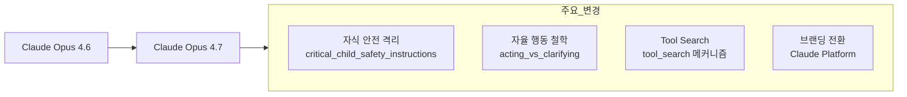
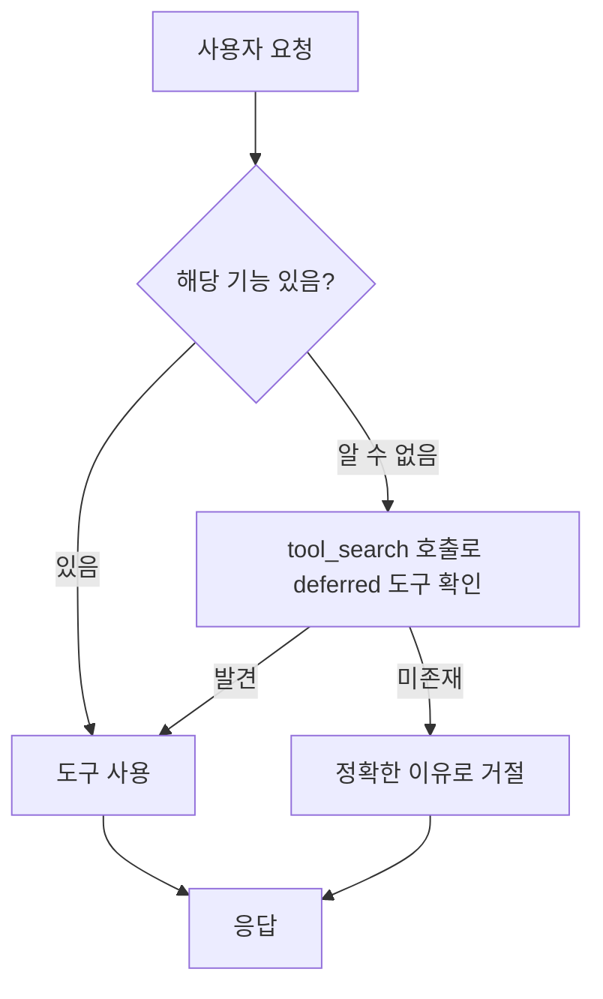

# Claude Opus 4.7

2026년 4월 16일 Anthropic이 공개한 [[claude-opus-4-6|Opus 4.6]] 후속 모델. System prompt 변경을 통해 자식 안전 강화, 자율 행동 철학 정비, tool_search 메커니즘 도입, "Claude Platform" 브랜딩 전환이 이루어졌다.

## 개요

Simon Willison이 Opus 4.6과 4.7의 공식 시스템 프롬프트를 diff 분석하여 2026년 4월 18일 공개한 내용을 기반으로 한다.

## 핵심 사양

| 항목 | 값 |
|---|---|
| 출시일 | 2026년 4월 16일 |
| 지식 컷오프 | 2026년 1월 |
| 가용 tool 수 | 22개 (4.6과 동일) |
| 브랜딩 | Claude Platform |

## 시스템 프롬프트 주요 변경

### 1. 자식 안전 강화

자식 안전 섹션을 `<critical_child_safety_instructions>` 태그로 격리하여 독립된 영역으로 분리했다.

신규 규칙:
> "Claude가 자식 안전 사유로 한 번 거부하면, 같은 대화의 모든 후속 요청을 극도로 신중히 처리해야 한다"

이는 단순한 해당 요청 거부를 넘어, 동일 대화 맥락 전체의 위험도 평가를 연속적으로 수행하도록 한다.

### 2. 자율 행동 철학: `<acting_vs_clarifying>`

신규 섹션 추가. 핵심 원칙:

> "the person typically wants Claude to make a reasonable attempt now, not to be interviewed first"

반복적으로 clarification을 요구하는 대신 합리적 판단으로 먼저 행동하는 것을 권장한다. 에이전틱 워크플로우에서 불필요한 질문 루프를 줄이는 방향이다.

또한 "Claude does not request that the user stay in the interaction" 원칙이 추가되어, 사용자가 대화 종료 신호를 주면 붙잡지 않도록 명시했다.

### 3. `tool_search` 메커니즘

"call tool_search to check whether a relevant tool is available but deferred"

deferred tool(지연 로드된 도구)이 존재하는지를 먼저 확인하도록 하여, "저는 X 기능이 없습니다" 같은 잘못된 주장을 방지한다.

### 4. 브랜딩 전환: "Claude Platform"

"developer platform" → "Claude Platform"으로 리브랜드.

신규 에이전트 소개:
- **Claude in Chrome**: 웹사이트와 자율 상호작용하는 브라우징 에이전트
- **Claude in Powerpoint**: 슬라이드 자동화 에이전트

### 5. 콘텐츠 모더레이션 정제

- **Disordered eating 가드**: "precise nutrition, diet, or exercise guidance — no specific numbers, targets, or step-by-step plans"
- **논쟁적 이슈**: yes/no 강요 대신 뉘앙스 있는 응답 허용

## 제거된 요소

| 삭제 항목 | 배경 |
|-----------|------|
| "avoid the use of emotes or actions inside asterisks" | 표현 방식 제약 완화 |
| "genuinely", "honestly" 단어 회피 지시 | 언어 자연성 회복 |
| "Donald Trump is the current president of the United States" 명시 | 2026-01 지식 컷오프 반영 |

## Tool 인벤토리

22개 tool 가용. 4.6 대비 roster 자체 변동 없음 (web_search, bash_tool, conversation_search 등 포함).

## 메타 인사이트: 시스템 프롬프트 diff의 가치

시스템 프롬프트 변경 내역 자체가 모델의 정렬 의도를 추적하는 "alignment observability" 기법이다.

- **자율성 증가** (acting_vs_clarifying) + **안전 강화** (child_safety) 동시 진행 → "capability vs safety" 균형 트렌드
- tool_search 같은 deferred-tool 인프라가 표준화되는 흐름
- 브랜딩 변화는 Anthropic의 플랫폼 포지셔닝 방향 전환을 반영

상세 분석: [[opus-4-7-system-prompt-diff|Opus 4.7 시스템 프롬프트 diff 분석]]

## 외부 평가: Pelican 벤치마크

출시 당일(2026-04-16) Simon Willison의 "자전거를 탄 펠리컨" SVG 테스트에서 로컬 구동 Qwen3.6-35B-A3B(20.9GB 양자화)에 패배했다. 자전거 프레임 기하학 오류, extended thinking 사용 후 2차 시도도 malformed. Willison은 단일 창작 태스크 결과가 일반 유용성 전체를 대변하지 않는다고 명시했으며, "21GB 양자화 모델이 Anthropic 최신 릴리스보다 전반적으로 유용하다고 생각하지 않는다"고 밝혔다. 상세: [[pelican-benchmark-qwen-opus|Pelican 벤치마크 비교]]

## 관련 문서

- [[claude-opus-4-6|Claude Opus 4.6]]
- [[claude-code|Claude Code]]
- [[claude-agent-sdk|Claude Agent SDK]]
- [[claude-sonnet-4-5|Claude Sonnet 4.5]]
- [[model-context-protocol|Model Context Protocol (MCP)]]
- [[opus-4-7-system-prompt-diff|Opus 4.7 시스템 프롬프트 diff 분석]]
- [[claude-prompts-git-timeline|Claude 시스템 프롬프트 git 타임라인]]
- [[pelican-benchmark-qwen-opus|Pelican 벤치마크: Qwen3.6 vs Opus 4.7]]
- [[pelican-benchmark|Pelican 벤치마크 (개념)]]
