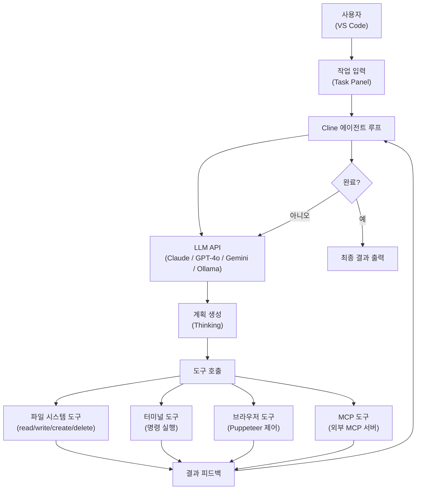
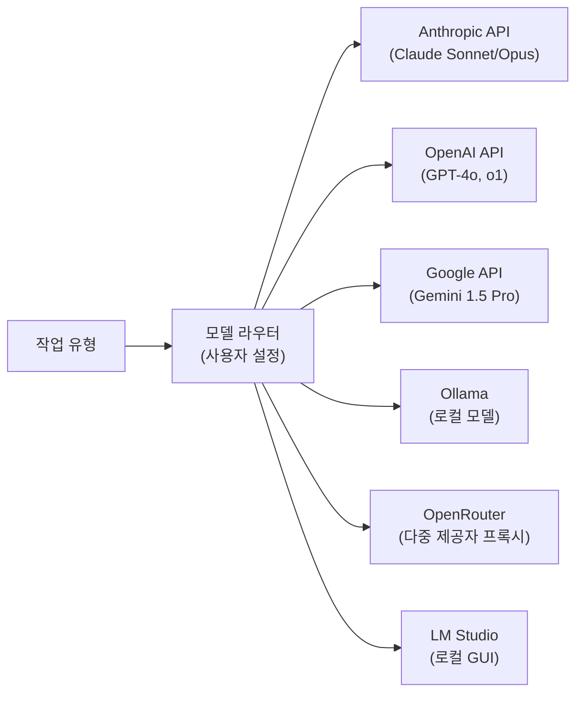
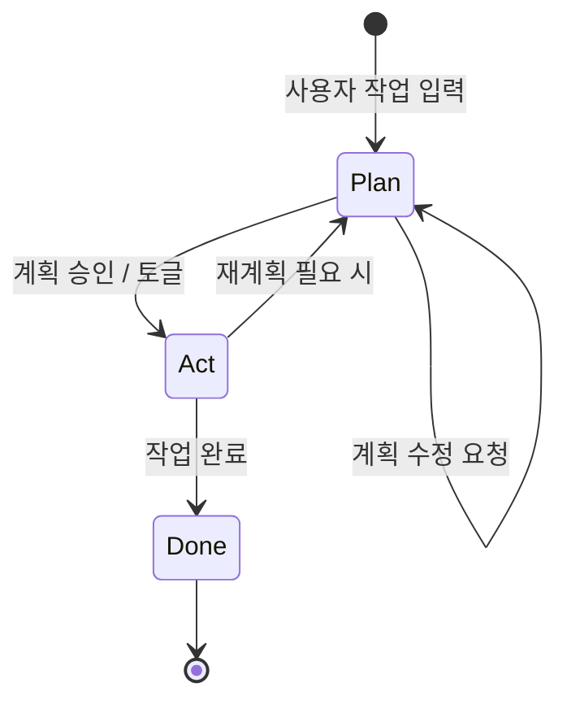

# Cline

## 정체성

| 항목 | 내용 |
|------|------|
| 이름 | Cline (구 Claude Dev) |
| 개발사 | Cline Bot Inc. (오픈소스 커뮤니티 주도) |
| 라이선스 | Apache 2.0 |
| GitHub | [cline/cline](https://github.com/cline/cline) |
| 플랫폼 | VS Code 확장 |
| 출시 | 2024년 7월 (Claude Dev), 2024년 10월 (Cline 리브랜딩) |
| 언어/스택 | TypeScript (VS Code Extension API) |
| 기본 모델 | Claude Sonnet 계열 (Anthropic API), 다중 모델 지원 |
| 가격 | 무료 (API 사용량 별도 과금) |

Cline은 **VS Code 안에서 실행되는 오픈소스 자율 코딩 에이전트**다. Claude를 기본 모델로 하되 OpenAI, Gemini, Ollama 등 어떤 LLM 백엔드도 연결할 수 있다. 단순 코드 자동완성이 아니라 터미널 명령 실행, 브라우저 제어, 파일 시스템 조작, MCP(Model Context Protocol) 도구 호출 등 **에이전트 루프(agentic loop) 전체를 IDE 내에서 실행**하는 것이 핵심 특징이다.

---

## 아키텍처 개요



Cline은 작업을 받으면 LLM에게 계획을 생성하게 하고, LLM이 요청한 도구를 순차적으로 실행하며 결과를 다시 LLM에 피드백하는 **리액티브 에이전트 루프**를 돌린다. 각 도구 실행 전 사용자 승인 단계를 거치도록 설정할 수 있어 안전성을 조절할 수 있다.

---

## 핵심 기능

### 1. 자율 파일 조작

- **읽기/쓰기/생성/삭제**: 프로젝트 내 모든 파일에 접근
- **diff 기반 편집**: 전체 파일 재작성이 아닌 최소 변경(diff)으로 파일 수정
- **컨텍스트 인식**: 파일 트리, 열린 탭, 관련 코드를 자동으로 컨텍스트에 포함

### 2. 터미널 통합

- VS Code 통합 터미널에서 직접 명령 실행
- `npm install`, `pytest`, `git` 등 빌드/테스트 명령 자동 실행
- 명령 출력(stdout/stderr)을 다음 LLM 요청의 컨텍스트로 활용
- 장기 실행 프로세스(dev server 등) 추적 가능

### 3. MCP(Model Context Protocol) 지원

Cline은 MCP의 가장 강력한 클라이언트 중 하나다. VS Code 설정에서 MCP 서버를 등록하면 Cline 에이전트가 해당 도구를 자동으로 활용한다.

```json
{
  "mcpServers": {
    "github": {
      "command": "npx",
      "args": ["-y", "@modelcontextprotocol/server-github"],
      "env": {
        "GITHUB_TOKEN": "ghp_xxx"
      }
    },
    "postgres": {
      "command": "npx",
      "args": ["-y", "@modelcontextprotocol/server-postgres"],
      "env": {
        "POSTGRES_URL": "postgresql://localhost/mydb"
      }
    }
  }
}
```

[[mcp-architecture|MCP 아키텍처]]를 통해 GitHub, 데이터베이스, Slack, Notion 등 외부 서비스를 에이전트 루프에 통합할 수 있다.

### 4. 브라우저 제어

Puppeteer 기반 브라우저 자동화 도구를 내장하고 있어:
- 웹페이지 스크린샷 캡처 및 분석
- 폼 입력, 버튼 클릭 등 DOM 상호작용
- E2E(End-to-End) 테스트 시나리오 자동 실행
- 웹 스크래핑을 통한 정보 수집

### 5. 다중 모델 라우팅



작업 성격에 따라 비용 효율적인 모델(로컬 Ollama)과 고성능 모델(Claude Opus)을 선택적으로 라우팅할 수 있다.

---

## Cline vs 경쟁 도구 비교

| 항목 | Cline | [[cursor|Cursor]] | [[continue-vscode-extension|Continue]] | [[claude-code|Claude Code]] |
|------|-------|--------|----------|-------------|
| 플랫폼 | VS Code 확장 | 독립 에디터 (VS Code 포크) | VS Code / JetBrains 확장 | CLI (터미널) |
| 라이선스 | 오픈소스 (Apache) | 독점 (유료) | 오픈소스 (Apache) | 독점 |
| MCP 지원 | 네이티브 | 제한적 | 플러그인 | 네이티브 |
| 브라우저 제어 | 내장 (Puppeteer) | 없음 | 없음 | 없음 |
| 로컬 모델 | Ollama, LM Studio 등 | 제한적 | Ollama 등 | 없음 |
| 에이전트 루프 | 완전 자율 | Agent 모드 | 부분 | 완전 자율 |
| 사용자 승인 | 단계별 승인 가능 | 자동 실행 | 수동 | 자동 실행 |

---

## Plan / Act 모드 (공식 docs 디테일)

Cline은 두 가지 작업 모드를 명시적으로 분리한다.



### Plan mode

> "In this mode, Cline can read your codebase, run searches, and discuss strategy, but cannot modify any files or execute commands."

> "It keeps the conversation focused on understanding and planning, without the distraction of implementation details."

허용 활동:

- 익숙치 않은 코드베이스 탐색
- 아키텍처 결정 토의
- 엣지 케이스 식별
- 구현 전략 작성
- 코드 리뷰

### Act mode

> "Cline retains the full context from your planning session and can now modify files, run commands, and execute your strategy."

### Context 전환 (모드 간)

> "The conversation history carries over when you switch modes. Cline remembers everything you discussed in Plan mode, so you don't need to repeat yourself."

### Per-mode 모델 (강한 추론 + 빠른 실행)

> "When enabled, switching between Plan and Act mode automatically switches to the configured model for that mode."

설정:

1. Cline Settings 열기
2. "Use different models for Plan and Act" 활성
3. 각 모드별 모델 선택

→ Plan에 강한 reasoning 모델 (예: Claude Opus, GPT-5), Act에 빠른 실행 모델 (예: Haiku, GPT-4o).

## StateManager 구현 (DeepWiki 디테일)

### Mode 타입

> Mode 타입은 `"plan"` | `"act"` 두 string literal의 union.

| 값 | 의미 |
|---|---|
| `"plan"` | "read-only exploration and planning" |
| `"act"` | "full execution mode" (file writes, shell commands, browser automation) |

### 저장 위치

- Reading: `StateManager.get().getGlobalSettingsKey("mode")`
- Writing: `StateManager.get().setGlobalState("mode", modeToSwitchTo)`

> "StateManager employs a debounced flush mechanism to persist state to disk."

### Mode 전환 RPC

> 전환은 `StateService` RPC `togglePlanActModeProto`로 발생. 호출 시 글로벌 `"mode"` 키 업데이트.

> "If a task is actively running, the Controller subsequently rebuilds the task's `ApiHandler` via `buildApiHandler` to apply mode-specific configurations."

### Webview broadcast

> 현재 모드는 `ExtensionState`의 일부로 UI에 broadcast.

> "The UI reflects the change via the updated `ExtensionState` broadcast."

### Per-mode API config

`planActSeparateModelsSetting` 활성 시 별도 provider 사용:

- `planModeApiProvider`
- `actModeApiProvider`

### UI state

- ChatTextArea: 모드 토글 색 코드 (plan = `var(--vscode-activityWarningBadge-background)`, act = `var(--vscode-focusBorder)`)
- ChatRow: `plan_mode_respond` vs `act_mode_respond` 메시지 타입 별도 렌더링

### System prompt 동적 생성

> "is dynamically generated based on the active mode"

| Mode | 노출 도구 |
|---|---|
| Plan | `READ_ONLY_TOOLS` (read_file, list_files 등) |
| Act | 전체 도구셋 |

### 응답 타입 분기

- `plan_mode_respond`
- `act_mode_respond`

→ 모델이 모드별로 적절한 progress update를 줄 수 있도록 응답 schema 자체를 분리.

## Zero-trust 아키텍처

> "Zero trust architecture - Your code never touches our servers. Cline runs entirely client-side with your API keys."

→ [[cursor]]와 대조: Cursor는 자체 서버에서 임베딩 처리. Cline은 코드를 자체 인프라로 전혀 보내지 않음.

> "Transparent by default - Watch every file read, every decision considered, every token used."

## Approval workflow

> "permission every step of the way"

> "human-in-the-loop GUI to approve every file change and terminal command"

> "You approve every change before it happens"

→ 모든 destructive action(파일 수정, 명령 실행, 브라우저 액션)에 명시적 사용자 승인 게이트. 멀티 에이전트 / 자율 실행이 본격화되어도 Cline은 **의도적으로 human-in-loop 디폴트 유지**.

## Browser tool — Computer Use 통합

> 구현: "Using Claude Sonnet's new Computer Use capability, Cline can launch a browser, click elements, type text, and scroll, capturing screenshots and console logs at each step."

[[computer-use-agent]] 능력을 활용. 헤드리스 브라우저 launch, click/type/scroll, screenshot/console log 캡처.

## 컨텍스트 수집 절차

> "examining file structure & source code ASTs, running regex searches" 후 진행.

→ AST 기반 + regex로 hybrid 컨텍스트 수집. 단순 grep 대비 구조 인식 추가.

## `@url` 기능

> "@url to fetch and convert to markdown"

URL을 markdown으로 변환해 컨텍스트에 첨부.

## 자동 MCP 서버 생성

> "add a tool that fetches Jira tickets" 같은 자연어 요청 → "Cline handles everything, from creating a new MCP server to installing it."

---

## 실무 사용 가이드

### 설치

VS Code Marketplace에서 "Cline" 검색 후 설치. 또는:

```bash
# VS Code CLI
code --install-extension saoudrizwan.claude-dev
```

### 초기 설정

1. `Cmd+Shift+P` → "Cline: Open Settings" 실행
2. API 제공자 선택 (Anthropic, OpenAI, OpenRouter 등)
3. API 키 입력
4. 기본 모델 선택 (claude-sonnet-4-5 권장)

### `.clinerules` 파일

프로젝트 루트에 `.clinerules` 파일을 두면 Cline이 시스템 프롬프트에 자동으로 포함한다:

```markdown
# 프로젝트 규칙
- Python 3.12+ 사용
- 모든 비동기 함수는 async def로 작성
- 타입 힌트 필수
- 테스트는 pytest + pytest-asyncio
- 커밋 전 ruff 포맷터 실행

# 금지 사항
- os.path 사용 금지 → pathlib.Path 사용
- print() 금지 → logger 사용
```

### 효과적인 작업 입력 패턴

```
❌ 나쁜 예: "인증 기능 만들어줘"

✓ 좋은 예: "JWT 기반 사용자 인증 기능을 구현해줘.
  - src/auth/ 디렉토리 생성
  - AuthService (비즈니스 로직), AuthRouter (라우팅) 분리
  - bcrypt 해싱, 토큰 발급/검증 포함
  - pytest 단위 테스트 포함
  - 기존 DB 스키마(models/user.py) 참고"
```

---

## 토큰 비용 관리

Cline은 에이전트 루프를 돌면서 API 요청을 여러 번 보내므로 비용이 빠르게 누적될 수 있다.


비용 절감 전략:
- **Auto-approve 비활성화**: 각 단계 확인으로 불필요한 루프 방지
- **컨텍스트 크기 제한**: 대형 파일은 청크 단위로 처리
- **로컬 모델 혼용**: 단순 작업은 Ollama의 로컬 모델 활용
- **작업 분할**: 큰 기능을 작은 단위로 나눠서 요청

---

## 한계 / 트레이드오프

| 항목 | 내용 |
|------|------|
| API 비용 | 에이전트 루프 특성상 단일 작업에 상당한 API 토큰 소모 |
| 속도 | 각 도구 호출 후 LLM 재호출 → Cursor Tab 자동완성보다 느림 |
| 맥락 한계 | 코드베이스가 매우 크면 관련 파일 선택이 부정확할 수 있음 |
| 보안 | 자율 파일 수정 및 터미널 실행 → 프로덕션 환경에서 주의 필요 |
| VS Code 의존성 | VS Code/Cursor 외 에디터 미지원 (JetBrains 없음) |
| 비결정성 | LLM 응답 특성상 같은 작업도 다른 결과가 나올 수 있음 |

---

## 생태계 연계

Cline은 AI 코딩 도구 생태계 내에서 독특한 위치를 차지한다:

- **[[claude-code|Claude Code]]**: Cline과 개념적으로 유사하나 CLI 기반. 서버/CI 환경에서 더 적합
- **[[continue-vscode-extension|Continue]]**: 같은 VS Code 확장이지만 에이전트보다 보조 도구 지향
- **[[mcp-architecture|MCP]]**: Cline이 MCP 생태계를 활용하는 대표적인 클라이언트
- **[[cursor|Cursor]]**: 에디터 자체를 교체하는 경쟁 접근법

---

## 관련 문서

- [[claude-code]] - Anthropic 공식 CLI 기반 코딩 에이전트
- [[continue-vscode-extension]] - 오픈소스 IDE AI 보조 확장
- [[mcp-architecture]] - Model Context Protocol 아키텍처
- [[mcp-protocol]] - MCP 프로토콜 표준
- [[cursor]] - Cursor AI IDE
- [[coding-agents-landscape]] - AI 코딩 도구 전체 지형도
- [[computer-use-agent]] - Browser 자동화의 기반
- [[human-in-the-loop-patterns]] - Cline의 핵심 디자인 패턴
- [[coding-harness-comparison]] - 코딩 에이전트 하네스 횡단 비교
