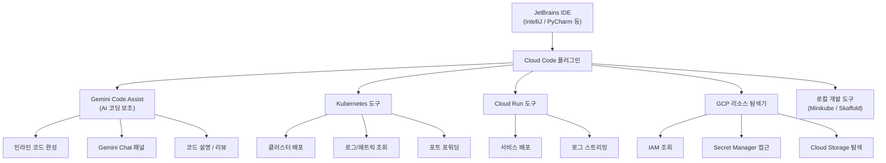
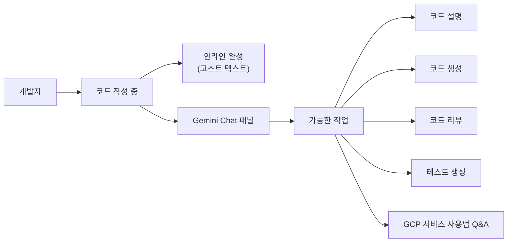
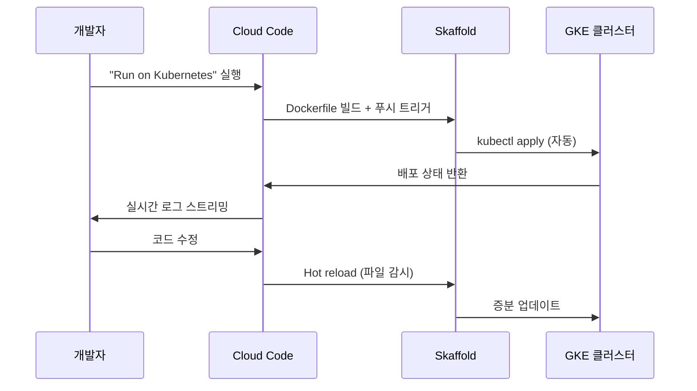
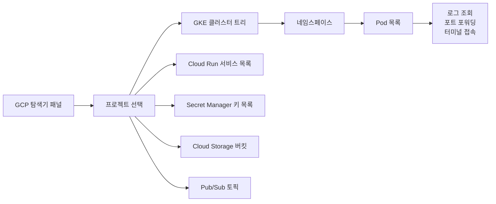
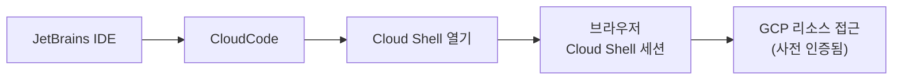
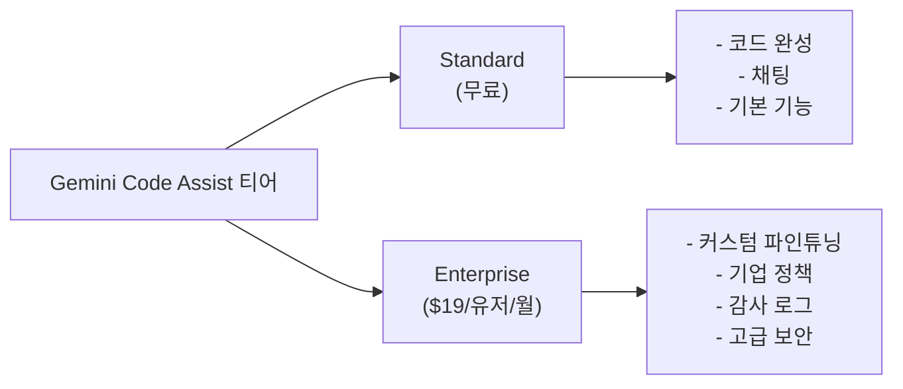
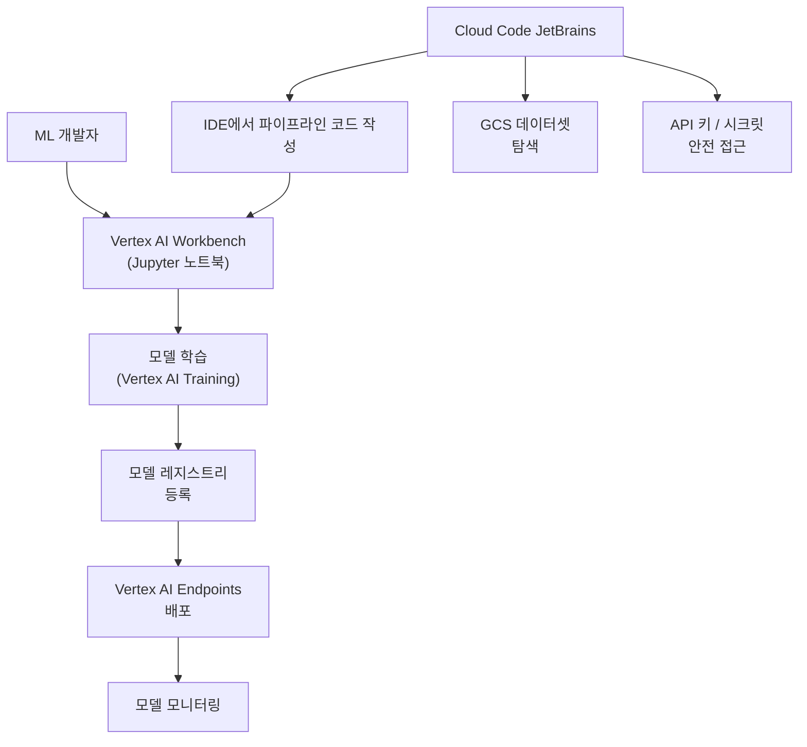

# Cloud Code for JetBrains

## 정체성

| 항목 | 내용 |
|------|------|
| 이름 | Cloud Code for JetBrains |
| 개발사 | Google |
| 라이선스 | 무료 (Google Cloud 계정 필요) |
| 플러그인 마켓 | JetBrains Marketplace |
| 웹사이트 | cloud.google.com/code/docs/intellij |
| 지원 IDE | IntelliJ IDEA, PyCharm, GoLand, WebStorm, CLion 등 JetBrains 전 제품 |
| AI 통합 | [[gemini-models|Gemini]] (Gemini Code Assist) |
| GCP 통합 | GKE, Cloud Run, Anthos, Secret Manager, Cloud Storage 등 |
| 출시 | 2019년 (Google Cloud Next) |

Cloud Code for JetBrains는 **JetBrains IDE 안에서 Google Cloud Platform(GCP) 전체를 다룰 수 있게 해주는 공식 IDE 플러그인**이다. 단순 배포 도구가 아니라 로컬 개발 환경 설정, 쿠버네티스(Kubernetes) 클러스터 관리, 서버리스 배포, AI 코드 보조까지 GCP 개발의 전체 라이프사이클을 IDE 안에서 처리할 수 있도록 설계되었다.

---

## 아키텍처 개요



Cloud Code는 Google Cloud SDK(gcloud CLI)와 Skaffold, kubectl 위에서 동작하며, 이 도구들을 GUI로 래핑하여 IDE 개발자 경험을 제공한다.

---

## 핵심 기능

### 1. Gemini Code Assist 통합

Cloud Code의 AI 기능은 [[gemini-models|Gemini]] 모델을 사용하는 **Gemini Code Assist**를 통해 제공된다:



- **GCP 특화 프롬프팅**: GKE, Cloud Run, BigQuery 등 GCP 서비스 코드를 더 잘 이해
- **API 클라이언트 생성**: `@google-cloud` 패키지 기반 코드 자동 완성
- **IAM 권한 제안**: 필요한 GCP IAM 역할을 코드 분석으로 추천

### 2. Kubernetes(GKE) 통합



- **원클릭 GKE 배포**: IDE에서 직접 GKE 클러스터에 배포
- **Skaffold 통합**: 파일 변경 감지 → 자동 재빌드/재배포 (핫 리로드)
- **인클러스터 디버깅**: 실행 중인 Pod에 디버거 연결
- **포트 포워딩**: `kubectl port-forward`를 GUI로 관리
- **로그 스트리밍**: Pod/컨테이너 로그 실시간 조회

### 3. Cloud Run 통합

서버리스 컨테이너 서비스인 Cloud Run을 IDE에서 관리:

- 새 Cloud Run 서비스 생성 마법사
- 로컬 에뮬레이터로 Cloud Run 동작 미리 테스트
- 배포 후 서비스 URL, 트래픽, 로그 조회
- 환경 변수, 시크릿 설정 GUI

### 4. GCP 리소스 탐색기

IDE 사이드 패널에서 GCP 리소스를 시각적으로 탐색:



### 5. 로컬 개발 환경 (Minikube/kind)

GCP 없이 로컬에서도 쿠버네티스 개발 가능:

- **Minikube 통합**: 로컬 K8s 클러스터 생성/관리
- **kind 지원**: Docker 기반 로컬 K8s
- 로컬 개발 → GKE 배포까지 동일한 워크플로우

### 6. Cloud Shell 통합



IDE에서 버튼 클릭으로 인증된 Cloud Shell 세션을 브라우저에서 열 수 있다.

---

## Cloud Code vs 유사 도구 비교

| 항목 | Cloud Code (JetBrains) | [[continue-vscode-extension|Continue]] | AWS Toolkit | Azure Tools |
|------|----------------------|----------|------------|------------|
| 클라우드 | GCP 전용 | 클라우드 무관 | AWS 전용 | Azure 전용 |
| AI 통합 | Gemini Code Assist | 모델 자유 선택 | Amazon Q | GitHub Copilot |
| K8s 관리 | GKE 특화 | 없음 | EKS 지원 | AKS 지원 |
| IDE | JetBrains + VS Code | VS Code + JetBrains | VS Code + JetBrains | VS Code |
| 서버리스 | Cloud Run | 없음 | Lambda | Azure Functions |
| 비용 | 무료 (GCP 사용료 별도) | 무료 (API 비용 별도) | 무료 (AWS 사용료 별도) | 무료 |

---

## 실무 사용 가이드

### 설치

1. JetBrains IDE → Settings → Plugins → Marketplace
2. "Cloud Code" 검색 → Install
3. 재시작 후 우측 사이드바 "Cloud Code" 패널 확인

### 사전 요구사항

```bash
# gcloud CLI 설치 (macOS Homebrew)
brew install --cask google-cloud-sdk

# 인증
gcloud auth login
gcloud auth application-default login

# kubectl 설치
gcloud components install kubectl

# Skaffold 설치
gcloud components install skaffold
```

### GKE 클러스터 연결

1. Cloud Code 패널 → Kubernetes 섹션
2. "Add Cluster" → GKE 선택
3. 프로젝트/리전/클러스터 선택
4. 자동으로 kubeconfig에 추가

### 첫 배포 (Cloud Run)

```yaml
# service.yaml (Cloud Run 설정)
apiVersion: serving.knative.dev/v1
kind: Service
metadata:
  name: my-app
  annotations:
    run.googleapis.com/ingress: all
spec:
  template:
    spec:
      containers:
      - image: gcr.io/PROJECT_ID/my-app:latest
        ports:
        - containerPort: 8080
        env:
        - name: PORT
          value: "8080"
```

Cloud Code에서 이 파일 우클릭 → "Deploy to Cloud Run" 선택.

---

## Gemini Code Assist 설정

Cloud Code 설치 후 Gemini 기능 활성화:

1. Settings → Tools → Gemini Code Assist
2. "Enable Gemini Code Assist" 체크
3. Google 계정으로 Cloud Code 로그인
4. 사용량 확인: Gemini Code Assist Standard (무료 티어) vs Enterprise



---

## 한계 / 트레이드오프

| 항목 | 내용 |
|------|------|
| GCP 종속 | AWS, Azure 환경에서는 가치가 거의 없음 |
| 복잡한 설정 | gcloud, kubectl, Skaffold 등 사전 설치 의존성 많음 |
| AI 모델 고정 | Gemini만 지원. Claude, GPT-4 등 다른 모델 선택 불가 |
| 성숙도 | AI 기능(Gemini Code Assist)은 Copilot 대비 완성도 낮음 |
| 속도 | 대형 GKE 클러스터 조회 시 패널 반응 느림 |
| 문서화 | 고급 기능(Skaffold 연동, 복합 K8s 설정)은 문서 부족 |
| Windows 경험 | macOS/Linux 대비 Windows에서 일부 기능 불안정 |

---

## GCP 기반 AI 개발 워크플로우

Cloud Code는 ML/AI 개발에서도 활용 가능하다:



---

## 관련 문서

- [[gemini-models]] - Google Gemini 모델 계열
- [[continue-vscode-extension]] - 모델 에그노스틱 오픈소스 IDE AI 보조
- [[cursor]] - AI 우선 코드 에디터
- [[cline-claude-coder]] - VS Code용 오픈소스 Claude 코딩 에이전트
- [[mcp-architecture]] - Model Context Protocol (외부 도구 연동 표준)
