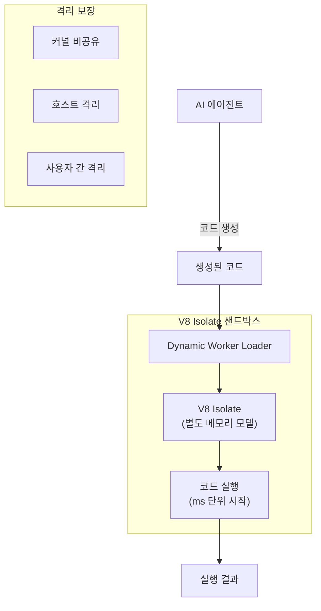

# Cloudflare Dynamic Workers

## 개요

Cloudflare가 오픈 베타로 출시한 Dynamic Worker Loader다. **V8 isolate 기반 샌드박싱**으로 AI 에이전트가 생성한 코드를 안전하게 실행한다. 컨테이너 대비 약 **100배 빠른 시작**, **100배 메모리 효율**을 제공하며, Cloudflare의 글로벌 엣지 네트워크에서 실행된다.

AI 에이전트가 생성한 코드를 안전하게 실행하는 것은 2026년 에이전틱 인프라의 핵심 과제이며, Dynamic Workers는 이를 V8 isolate로 해결한다.

## 핵심 기능

- **V8 isolate 기반**: 밀리초(ms) 단위 콜드스타트, 메가바이트(MB) 단위 메모리
- 컨테이너 대비 **약 100x 빠른 시작**
- 컨테이너 대비 **약 100x 메모리 효율**
- AI 에이전트 생성 코드의 안전한 샌드박싱
- **글로벌 엣지 네트워크**에서 실행 (저지연)

## 왜 중요한가

AI 에이전트 코드 실행의 보안 문제는 다음과 같다:

1. LLM이 생성한 코드는 **예측 불가능** -- 악의적 코드, 리소스 남용, 데이터 유출 위험
2. 기존 컨테이너는 **커널 공유** 위험이 있음
3. V8 isolate는 공유 커널 없이 **완전히 다른 메모리 모델** 사용
4. **호스트 격리**와 **사용자 간 격리** 모두 제공

위 다이어그램은 AI 에이전트가 생성한 코드가 Dynamic Worker의 V8 isolate 샌드박스에서 안전하게 실행되는 흐름을 보여준다.

## 경쟁 비교

| 기술 | 콜드스타트 | 오버헤드 | 격리 수준 | 비고 |
|------|-----------|----------|-----------|------|
| **V8 Isolates (Cloudflare)** | **ms 단위** | **MB 단위** | **커널 비공유** | **가장 경량** |
| Firecracker microVMs (AWS) | 150ms | 중간 | 커널 비공유 | Lambda 기반 |
| gVisor (Google) | 빠름 | 10-20% | 커널 추상화 | 호환성 우수 |
| Kata Containers | 느림 | 큼 | microVM + 컨테이너 UX | 엔터프라이즈 |
| WebAssembly isolates | ms 단위 | MB 단위 | 커널 비공유 | 근본적으로 다른 접근 |

## 시장 맥락

AI 에이전트의 코드 생성 및 실행이 보편화되면서 "에이전트가 만든 코드를 어디서 얼마나 안전하게 돌릴 것인가"가 인프라 핵심 질문이 되었다. Cloudflare Dynamic Workers는 기존 Workers 플랫폼의 V8 isolate 기술을 AI 에이전트 샌드박싱에 특화시킨 제품이다.

경쟁사(AWS Lambda, Google Cloud Run)가 컨테이너/microVM 기반 접근을 취하는 반면, Cloudflare는 V8 isolate의 극단적 경량성으로 차별화한다. 에이전트가 수백-수천 개의 코드 조각을 빠르게 실행해야 하는 시나리오에서 유리하다.

## 관련 문서

- [[ai-agent-guardrails]] -- AI 에이전트 안전장치 (NeMo/Guardrails AI)
- [[zero-trust-ai-agents]] -- AI 에이전트를 위한 제로 트러스트 아키텍처
