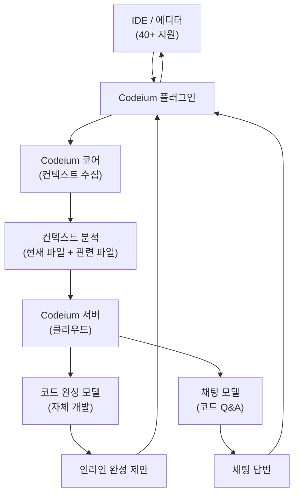
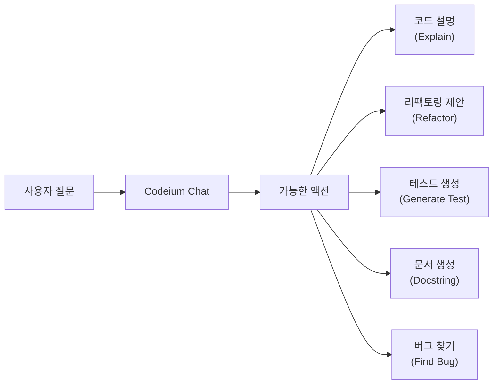
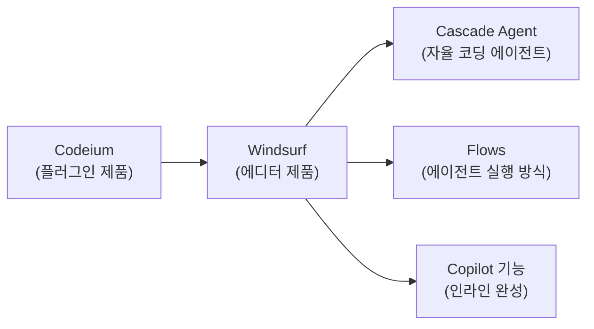
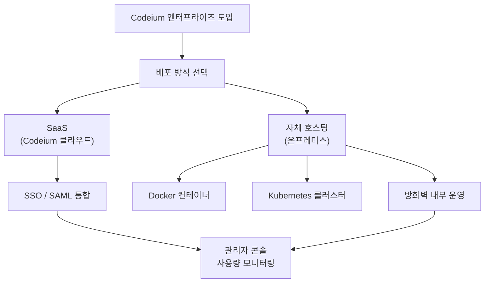

# Codeium

## 정체성

| 항목 | 내용 |
|------|------|
| 이름 | Codeium |
| 개발사 | Codeium (2024년 Windsurf로 제품 브랜드 확장) |
| 창업 | 2021년 |
| 본사 | 미국 캘리포니아 마운틴뷰 |
| 라이선스 | 독점 (개인 완전 무료, 기업 유료) |
| 웹사이트 | codeium.com |
| 가격 | 개인 무료 / Teams $12/유저/월 / Enterprise 맞춤 |
| 지원 IDE | VS Code, JetBrains, Vim, Emacs, Jupyter, Colab 등 40+ |
| 지원 언어 | 70개 이상 |
| 모회사 제품 | [[windsurf|Windsurf]] AI 에디터 (2024년 출시) |

Codeium은 **개인 개발자에게 완전 무료로 AI 코드 완성을 제공**하는 도구다. 2021년 설립 이후 [[github-copilot|GitHub Copilot]]의 유료 모델에 맞서 "AI 코딩은 무료여야 한다"는 철학으로 빠르게 성장했다. 2024년에는 Windsurf라는 AI 에디터를 출시하여 Cursor와 경쟁하는 등 단순 자동완성 플러그인을 넘어 **AI 코딩 플랫폼**으로 진화했다.

---

## 아키텍처 개요



Codeium은 **자체 개발 모델**을 사용한다. OpenAI나 Anthropic의 API를 래핑하는 방식이 아니라, 코드 완성에 특화된 자체 LLM을 학습하고 운영한다. 이것이 개인 무료를 지속 가능하게 하는 핵심 요인이다.

---

## 핵심 기능

### 1. 인라인 코드 완성

Codeium의 기본 기능. 타이핑하는 동안 실시간으로 다음 코드를 제안한다:

- **단일 라인 완성**: 현재 줄의 나머지 부분 예측
- **다중 라인 완성**: 여러 줄에 걸친 코드 블록 제안
- **함수 전체 생성**: 주석이나 함수 시그니처로부터 구현 생성

```python
# 예시: 함수 주석 작성 후 Codeium이 구현 제안
def merge_sorted_arrays(arr1: list, arr2: list) -> list:
    """두 정렬된 배열을 병합하여 정렬된 결과 반환"""
    # Codeium 제안:
    result = []
    i, j = 0, 0
    while i < len(arr1) and j < len(arr2):
        if arr1[i] <= arr2[j]:
            result.append(arr1[i])
            i += 1
        else:
            result.append(arr2[j])
            j += 1
    result.extend(arr1[i:])
    result.extend(arr2[j:])
    return result
```

### 2. Codeium Chat

VS Code 사이드바 또는 JetBrains 플러그인 패널에서 제공하는 AI 채팅:



- `@codebase` 태그로 전체 프로젝트 맥락 참조
- 선택 영역 드래그 후 우클릭 → Chat에 추가
- 답변 코드 바로 파일에 적용(Apply) 가능

### 3. 40+ IDE 지원

Codeium의 경쟁 우위 중 하나는 **가장 광범위한 IDE 지원**이다:

| 카테고리 | 지원 IDE |
|----------|---------|
| 주요 에디터 | VS Code, Cursor, Windsurf |
| JetBrains | IntelliJ, PyCharm, WebStorm, GoLand, CLion, Rider 등 전체 |
| 텍스트 에디터 | Vim, Neovim, Emacs, Sublime Text |
| 노트북 | Jupyter Notebook, JupyterLab, Google Colab |
| 클라우드 IDE | Replit, CodeSandbox, Gitpod |
| 기타 | Android Studio, Xcode (제한적) |

### 4. 70+ 언어 지원

| 카테고리 | 언어 |
|----------|------|
| 주류 | Python, JavaScript, TypeScript, Java, C++, Go, Rust, C# |
| 웹 | HTML, CSS, SCSS, PHP, Ruby |
| 데이터 | SQL, R, Julia |
| 인프라 | Bash, Shell, PowerShell, HCL (Terraform), YAML |
| 기타 | Kotlin, Swift, Scala, Lua, Haskell 등 |

### 5. 개인 맞춤화 (Personalization)

Codeium Pro부터 제공되는 기능:

- **코드베이스 인식**: 현재 프로젝트 전체를 컨텍스트에 포함
- **자동 메모리**: 선호하는 코딩 패턴을 학습하여 더 적절한 제안
- **커스텀 규칙**: 프로젝트별 코딩 스타일 지침 제공

---

## Windsurf: 모회사의 에디터 제품

2024년 Codeium은 VS Code 포크 기반 AI 에디터인 [[windsurf|Windsurf]]를 출시했다. Cursor와 동일한 시장을 겨냥하며 "Flows"라는 독자적 에이전트 실행 방식을 내세웠다.



Codeium 플러그인과 Windsurf 에디터는 별개 제품이지만 같은 AI 인프라를 공유한다.

---

## Codeium vs 경쟁 도구 비교

| 항목 | Codeium | [[github-copilot|GitHub Copilot]] | [[tabnine-completion|Tabnine]] | [[supermaven-fast-completion|Supermaven]] |
|------|---------|----------------|---------|-----------|
| 개인 무료 | 완전 무료 | 없음 (학생 제외) | 제한적 무료 | 무료 플랜 |
| IDE 지원 | 40+ | 주요 IDE | 15+ | VS Code 중심 |
| 언어 지원 | 70+ | 주요 언어 | 80+ | 주요 언어 |
| 로컬 모델 | 없음 | 없음 | 있음 (차별점) | 없음 |
| 자체 모델 | 있음 | Codex/GPT-4 | 있음 | Babble 모델 |
| 에디터 제품 | Windsurf | VS Code (Microsoft) | 없음 | 없음 |
| 엔터프라이즈 | Teams/Enterprise | Enterprise | Enterprise | 약함 |
| 컨텍스트 길이 | 보통 | 큼 | 중간 | 1M (매우 큼) |

---

## 실무 사용 가이드

### VS Code 설치

```bash
# VS Code 마켓플레이스에서 "Codeium" 검색
# 또는 CLI:
code --install-extension Codeium.codeium
```

### JetBrains 설치

JetBrains Marketplace에서 "Codeium" 검색 후 설치. Settings → Codeium → Sign In으로 인증.

### 키바인딩 (VS Code)

| 단축키 | 기능 |
|--------|------|
| `Tab` | 제안 수락 |
| `Esc` | 제안 취소 |
| `Ctrl+→` | 단어 단위로 수락 |
| `Alt+[` / `Alt+]` | 이전/다음 제안 탐색 |
| `Ctrl+Shift+/` | Codeium Chat 열기 |

### 프로젝트 컨텍스트 최적화

```json
// .codeiumignore (gitignore 형식으로 제외할 파일 지정)
*.lock
node_modules/
dist/
.env
*.min.js
```

---

## 엔터프라이즈 도입



엔터프라이즈 기능:
- **온프레미스 배포**: 코드가 외부로 나가지 않는 자체 호스팅
- **SSO 통합**: Okta, Azure AD 등 기업 인증 연동
- **사용량 정책**: 특정 레포지토리, 파일 유형별 AI 허용/차단
- **감사 로그**: 팀원별 사용 현황 추적

---

## 한계 / 트레이드오프

| 항목 | 내용 |
|------|------|
| 클라우드 의존 | 로컬 모델 옵션 없음. 코드가 Codeium 서버로 전송됨 |
| 자체 모델 품질 | GPT-4/Claude 기반 경쟁 도구 대비 고난이도 추론 약함 |
| 에이전트 기능 | Cursor/Cline 대비 자율 에이전트 기능 부족 |
| 컨텍스트 길이 | Supermaven(1M) 대비 컨텍스트 창 제한 |
| 무료 지속 가능성 | 투자 기반 무료 모델의 장기 지속성 불확실 |
| 프라이버시 | 무료 플랜은 코드가 모델 학습에 사용될 수 있음 (약관 확인 필요) |

---

## 무료 전략의 배경

Codeium이 개인에게 완전 무료를 유지하는 배경:

1. **자체 모델**: 외부 API 비용 없이 자체 인프라로 운영
2. **규모의 경제**: 많은 개인 사용자 → 엔터프라이즈 고객 발굴 채널
3. **데이터 플라이휠**: 사용자 피드백으로 모델 지속 개선 (개인 무료 플랜은 데이터 수집 동의)
4. **시장 점유율**: 개발자가 익숙해지면 직장에서도 Codeium Enterprise 요청

---

## 관련 문서

- [[tabnine-completion]] - 엔터프라이즈/로컬 모델 AI 코드 완성
- [[github-copilot]] - GitHub/Microsoft AI 코드 완성
- [[supermaven-fast-completion]] - 초고속 1M 컨텍스트 코드 완성
- [[windsurf]] - Codeium의 AI 에디터 제품
- [[cursor]] - VS Code 포크 기반 AI 에디터
- [[continue-vscode-extension]] - 오픈소스 모델 에그노스틱 보조
