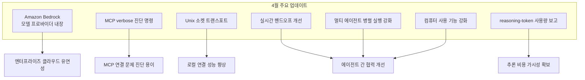
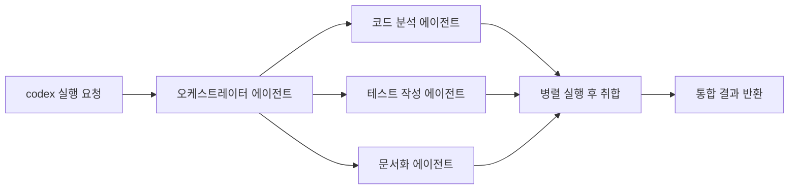

# Codex CLI 2026년 4월 업데이트 요약

## 원본 소스

- **OpenAI 공식 변경 로그**: https://developers.openai.com/codex/changelog
- **분석 보고서**: bighatgroup.com/blog/openai-codex-enterprise-ai-automation-april-2026/
- **수집일**: 2026-04-27

---

## 업데이트 개요

[[codex-cli]] 는 OpenAI의 터미널 기반 에이전틱 코딩 도구로, 2026년 4월에 엔터프라이즈 환경과 멀티 에이전트 워크플로우를 크게 강화하는 업데이트를 받았다. Amazon Bedrock 모델 프로바이더 지원, MCP 진단 도구, 컴퓨터 사용(Computer Use) 기능 강화가 핵심이다.



---

## 주요 변경 사항별 상세

### Amazon Bedrock 모델 프로바이더 내장 지원

기존 Codex CLI는 OpenAI API만 지원했으나, 이번 업데이트로 **Amazon Bedrock에 호스팅된 모델**을 직접 사용할 수 있게 됐다:

```
# 사용 예시 (참고용)
codex --provider bedrock --model anthropic.claude-opus-4-7-v1 "이 코드를 리팩토링해줘"
```

- AWS 자격 증명(credentials)을 통한 인증
- Bedrock에서 지원하는 Claude, Llama, Mistral 등 다양한 모델 선택 가능
- 기업 환경에서 AWS VPC 내부 네트워크만 사용하는 보안 요구사항 충족

이 기능은 [[claude-code]] 와의 교차 사용 시나리오를 만들어낸다. 동일한 Bedrock 엔드포인트를 Codex CLI와 Claude Code 양쪽에서 접근하는 구성이 가능해졌다.

### `/mcp verbose` 진단 명령

MCP(Model Context Protocol) 연결 문제를 실시간으로 진단하는 새로운 명령어:

- MCP 서버와의 통신 로그를 상세히 출력
- 연결 실패 원인 파악 (타임아웃, 권한, 프로토콜 오류 등)
- 4월 MCP 보안 사건([[claude-code-mcp-security-reckoning]]) 이후 보안 설정 확인에도 활용 가능

```
# 예시 (참고용)
codex /mcp verbose --server my-server
```

### Unix 소켓 트랜스포트 지원

HTTP/SSE, STDIO에 이어 **Unix 도메인 소켓(Unix domain socket)** 이 MCP 트랜스포트로 추가됐다:

- 로컬 프로세스 간 통신에 HTTP보다 낮은 오버헤드
- `/tmp/codex.sock` 같은 경로로 MCP 서버와 연결
- 컨테이너 내부 또는 동일 호스트의 에이전트 간 고속 통신에 적합

### 실시간 핸드오프(Handoff) 개선

멀티 에이전트 환경에서 에이전트 간 작업 이전(handoff)이 더 매끄러워졌다:

- 핸드오프 시 컨텍스트 보존 개선 (이전 에이전트의 작업 상태 유지)
- 핸드오프 완료 알림 및 상태 동기화
- [[openai-workspace-agents]] 의 오케스트레이션 패턴과 연동

### `codex exec --json`: reasoning-token 사용량 보고

추론(reasoning) 중에 소비되는 reasoning 토큰을 JSON 형식으로 보고하는 기능:

```json
{
  "output_tokens": 1250,
  "reasoning_tokens": 3840,
  "total_tokens": 5090,
  "cost_estimate_usd": 0.0382
}
```

이는 에이전트 운영의 비용 투명성을 크게 높인다. 특히 o1/o3 시리즈 모델처럼 내부 추론 체인을 많이 사용하는 모델의 실제 비용을 파악하는 데 필수적이다.

---

## 멀티 에이전트 병렬 실행 강화

Codex CLI는 이번 업데이트에서 복수의 에이전트가 동시에 작업하는 시나리오를 더 잘 지원하게 됐다:



이 패턴은 [[multi-agent-orchestration]] 에서 다루는 병렬 서브에이전트 패턴의 직접적 구현이다.

---

## 컴퓨터 사용(Computer Use) 기능 강화

Codex CLI의 컴퓨터 사용 기능이 강화됐다:

- GUI 애플리케이션 자동화 (터미널 밖에서도 작동)
- 브라우저 제어를 통한 웹 스크래핑 및 양식 작성 자동화
- 화면 인식(스크린샷 분석) → 클릭/입력 → 결과 확인 사이클

이 기능은 [[claude-code]] 의 bash 명령 실행과 달리 GUI 환경까지 자동화 범위를 확장한다.

---

## [[claude-code]] 와의 비교

두 도구 모두 터미널 기반 AI 코딩 에이전트이지만 2026년 4월 기준 차이가 있다:

| 비교 항목 | Codex CLI | Claude Code |
|-----------|-----------|-------------|
| 기반 모델 | GPT-5.5 (Bedrock 통해 다양한 모델) | Claude Opus 4.7 (기본) |
| MCP 진단 | `/mcp verbose` 명령 | 자체 디버깅 도구 |
| 컴퓨터 사용 | 지원 (GUI 자동화) | 제한적 (주로 터미널) |
| reasoning 비용 투명성 | `--json` 플래그로 토큰 단위 보고 | 기본 토큰 사용량 |
| 멀티 에이전트 | 내장 병렬 실행 지원 | 서브에이전트 패턴 |
| 플랫폼 통합 | Workspace Agents와 연동 | Claude Max/Team 구독 |

---

## 구조적 트리

이번 4월 업데이트에서 Codex CLI의 기능 구조:

```mermaid
flowchart TD
    CodexCLI[Codex CLI 2026년 4월]
    CodexCLI --> 모델지원[모델 프로바이더]
    CodexCLI --> MCP통합[MCP 통합]
    CodexCLI --> 에이전트[에이전트 기능]
    CodexCLI --> 관찰가능성[관찰 가능성]

    모델지원 --> OpenAI[OpenAI API\ngpt-5-5]
    모델지원 --> Bedrock[Amazon Bedrock\nClaude, Llama 등]

    MCP통합 --> verbose[/mcp verbose 진단]
    MCP통합 --> UnixSocket[Unix 소켓 트랜스포트]
    MCP통합 --> SSE[HTTP/SSE 트랜스포트]

    에이전트 --> 병렬[멀티 에이전트 병렬]
    에이전트 --> Handoff[실시간 핸드오프]
    에이전트 --> ComputerUse[컴퓨터 사용]

    관찰가능성 --> ReasoningToken[reasoning-token 보고]
    관찰가능성 --> JSON[--json 출력 모드]
```

---

## 관련 문서

- [[codex-cli]] - Codex CLI 전체 개요
- [[claude-code]] - Anthropic Claude Code (유사 도구)
- [[mcp]] - Model Context Protocol
- [[claude-code-mcp-security-reckoning]] - MCP 보안 사건 (같은 시기)
- [[openai-workspace-agents]] - Workspace Agents (상위 플랫폼)
- [[multi-agent-orchestration]] - 멀티 에이전트 오케스트레이션
