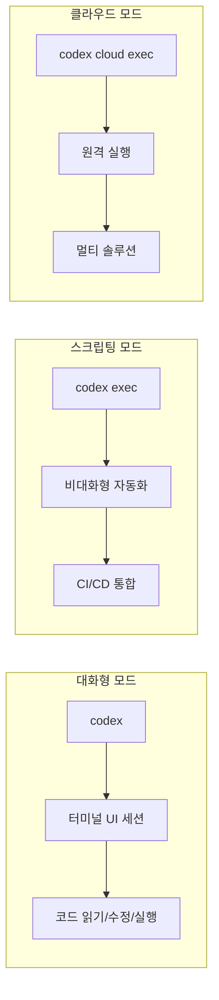

## 개요

Codex CLI는 OpenAI가 개발한 Rust 기반 터미널 코딩 에이전트다. 로컬 파일 시스템에서 코드를 읽고, 수정하고, 실행할 수 있으며, MCP(Model Context Protocol) 통합을 지원한다. GPT-5.4, GPT-5.3-Codex 등 OpenAI의 최신 모델을 지원하며, 오픈소스로 공개되어 있다.

대화형 터미널 UI, 이미지 입력, 웹 검색, 코드 리뷰 자동화, 스크립팅 모드 등을 제공하여 개발자의 터미널 워크플로에 직접 통합되는 에이전트를 지향한다. [[how-coding-agents-work|코딩 에이전트 동작 원리]] 관점에서 Rust 기반 구현과 네이티브 computer use 통합이 특징이며, [[git-worktree-isolation|Git Worktree 격리]]를 활용한 병렬 태스크 실행으로 대규모 작업을 분산 처리할 수 있다.

## 핵심 특징

### 대화형 터미널 UI

`codex` 명령어로 터미널 내 전체화면 대화형 세션을 실행한다. 인라인 프롬프트도 지원한다: `codex "Explain this codebase to me"`. TUI에서 코드 변경 사항을 실시간으로 확인하고 승인할 수 있으며, 드래프트 히스토리를 화살표 키로 탐색, `/clear`로 대화 초기화, `/copy`로 출력 복사, `@`로 퍼지 파일 검색, Ctrl+G로 외부 에디터 열기 등의 인터랙션을 지원한다.

### 모델 제어

`/model` 커맨드로 실행 중 모델을 전환할 수 있다:
- **GPT-5.4**: 기본 모델. 프론티어 코딩 성능과 강화된 추론, 네이티브 컴퓨터 사용(computer use) 지원
- **GPT-5.3-Codex-Spark**: 코딩 특화 최적화. ChatGPT Pro 구독자 대상 리서치 프리뷰

### 멀티모달 입력

`-i screenshot.png` 또는 `--image img1.png,img2.jpg` 플래그로 스크린샷, 디자인 명세서 등 이미지를 첨부할 수 있다. UI 구현 시 디자인 파일에서 직접 코드를 생성하는 데 활용된다.

### MCP 통합

`config.toml`에 STDIO 또는 HTTP 서버를 설정하면 Codex가 자동으로 MCP 서버를 실행하고 내장 도구와 함께 노출한다. 데이터베이스, API 문서, 모니터링 도구 등을 에이전트의 작업 환경에 통합할 수 있다.

### 스크립팅 모드

`codex exec "fix the CI failure"` 명령어로 비대화형 자동화 워크플로를 구성한다. 결과를 stdout으로 파이핑하여 CI/CD 파이프라인이나 셸 스크립트에서 프로그래밍 방식으로 에이전트를 호출할 수 있다.

### 클라우드 실행

`codex cloud exec --env ENV_ID "task"` 명령어로 Codex 클라우드 태스크를 터미널에서 직접 실행한다. `--attempts` 플래그(1-4)로 멀티 솔루션 생성이 가능하다.

### 세션 이어가기

`codex resume`으로 이전 세션을 컨텍스트 보존 상태로 재개한다. `--all`(현재 디렉토리 외 세션 포함), `--last`(최근 세션), 특정 세션 ID 지정을 지원한다.

## 기술 상세

### 기술 사양

| 항목 | 내용 |
|------|------|
| 언어 | Rust |
| 지원 모델 | GPT-5.4, GPT-5.3-Codex |
| 플랫폼 | macOS, Linux (Windows는 WSL2) |
| 라이선스 | 오픈소스 (github.com/openai/codex) |
| 액세스 | ChatGPT Plus/Pro/Business/Edu/Enterprise |
| MCP | 지원 |

### 승인 모드(Approval Modes)

| 모드 | 동작 | 사용 시나리오 |
|------|------|-------------|
| **Auto** (기본) | 작업 디렉토리 내 읽기/수정/실행 자율, 네트워크 접근 시 승인 요청 | 일반 개발 |
| **Read-only** | 코드 탐색만 가능, 수정 불가 | 코드 리뷰/컨설팅 |
| **Full Access** | 머신 및 네트워크 무제한 접근 | 신뢰할 수 있는 자동화 |

### 실행 모드

### 주요 기능 요약

- **코드 리뷰**: `/review` 명령어로 베이스 브랜치 대비 변경사항, 미커밋 변경, 특정 커밋에 대한 자동 검토. 커스텀 리뷰 지침 설정 가능
- **웹 검색**: 기본적으로 캐시된 결과 사용, `--search`로 라이브 검색 전환. `config.toml`에서 `web_search = "live"` 설정 가능
- **이미지 입력**: 스크린샷 기반 UI 구현
- **파일 시스템 접근**: 디렉토리 탐색, 파일 생성/수정/삭제
- **서브에이전트**: 병렬 태스크 실행을 위한 에이전트 역할 설정. 토큰 소비 증가로 명시적 요청 시에만 호출
- **원격 TUI**: `codex --remote ws://host:port`로 원격 앱 서버에 연결. 캐퍼빌리티 토큰/서명된 베어러 토큰 지원
- **로컬 셸 실행**: `!ls` 같은 `!` 접두사로 승인 범위 내 셸 명령 직접 실행
- **기능 플래그**: `codex features list|enable|disable <feature>`로 실험적 기능 영구 관리

### 터미널 코딩 에이전트 비교

| 도구 | 기반 모델 | 언어 | MCP | 멀티모달 |
|------|----------|------|-----|---------|
| Codex CLI | GPT-5.x | Rust | O | O |
| [[claude-code]] | Claude 4.x | TypeScript | O | O |
| [[junie-cli]] | LLM-agnostic | - | O | - |
| [[copilot-fleet]] | GPT 기반 | - | - | - |

## 관련 문서

- [[claude-code]] - Anthropic 터미널 코딩 에이전트
- [[junie-cli]] - JetBrains LLM-agnostic 코딩 에이전트
- [[copilot-fleet]] - GitHub Copilot 병렬 에이전트
- [[model-context-protocol]] - MCP 프로토콜
