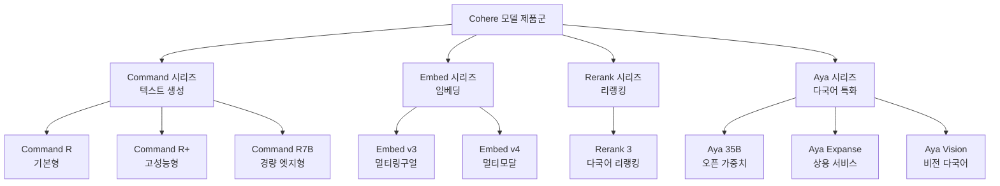
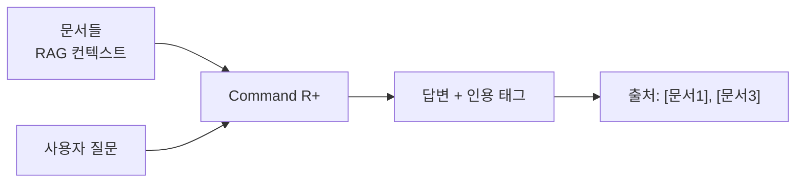
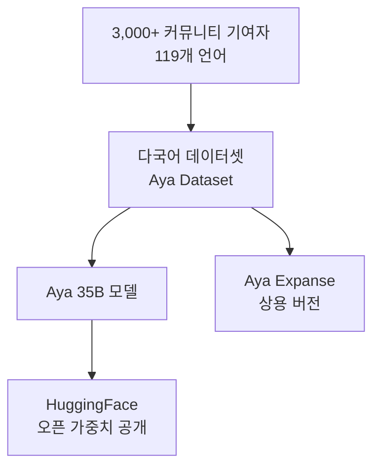
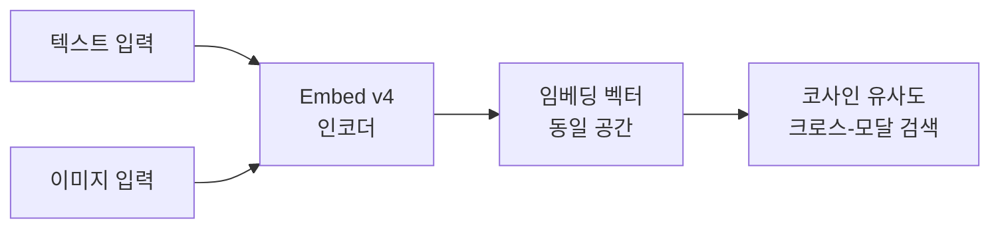
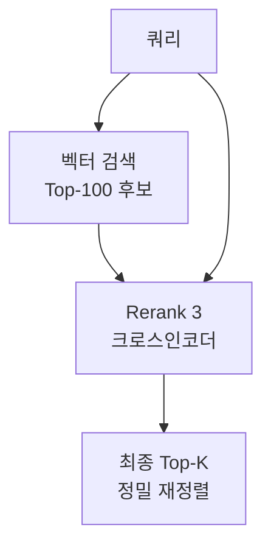
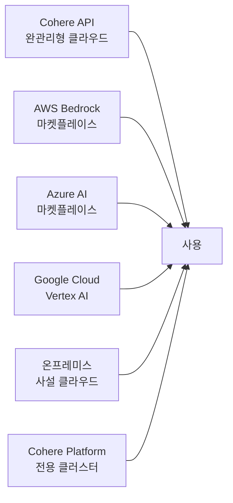

# Cohere 모델 패밀리

Cohere는 엔터프라이즈 AI 솔루션에 특화된 캐나다 기반 AI 회사로, 토론토 대학 및 구글 브레인 출신 연구자들이 2019년에 설립했다. [[meta-llama]]나 OpenAI와 달리 **기업 배포, 다국어 지원, RAG 최적화**를 핵심 차별점으로 내세운다.

## 제품 포트폴리오 구조



## Command R 시리즈

### Command R

엔터프라이즈 RAG 워크로드에 최적화된 기본 모델. 128K 컨텍스트를 지원하며 인용(citation) 기능이 내장되어 있다. RAG 파이프라인에서 검색된 문서 출처를 응답에 자동 태깅한다.

핵심 기능:
- **인용 생성(Grounded Generation)**: 응답 생성 시 근거 문서를 자동으로 인용 태깅
- **도구 사용(Tool Use)**: 멀티스텝 에이전트 파이프라인 지원
- **128K 컨텍스트**: 긴 문서 처리에 적합

### Command R+

Command R의 고성능 버전. 더 강력한 추론 능력과 다국어 지원이 강화됐다. 2024년 3월 출시 당시 GPT-4 Turbo와 비교 가능한 수준의 성능을 주장했다.



**인용 기능 예시**:

Command R+는 단순히 답변만 생성하는 것이 아니라, 어떤 문서의 어느 부분에서 정보를 가져왔는지를 구조화된 형식으로 반환한다. 할루시네이션 탐지와 감사(audit)가 필요한 금융·법률·의료 분야에서 핵심 기능이다.

### Command R7B (경량)

7B 파라미터의 경량 버전. 온프레미스 배포나 엣지 환경에서 Command R의 핵심 기능을 사용할 수 있도록 설계됐다. [[meta-llama]] Llama 3.1 8B와 비슷한 크기 포지션이다.

## Aya 시리즈: 다국어 특화 모델

Aya는 Cohere의 [[multilingual-models]] 연구 프로젝트에서 시작된 다국어 AI 모델 패밀리다. 특히 저자원 언어(low-resource language)에 대한 지원을 강조한다.

### Aya 개발 배경

2023년 Cohere는 "Aya Initiative"라는 커뮤니티 프로젝트를 시작했다. 전 세계 3,000명 이상의 연구자·번역가·언어 전문가가 119개 언어에 대한 데이터를 자발적으로 기여했다. 이 데이터로 학습된 모델이 Aya다.



### Aya Expanse

오픈소스 Aya 35B를 기반으로 상용 배포를 위해 최적화된 버전. 다음을 개선:

- 지시 따르기(instruction following) 성능 향상
- 응답 품질 필터링
- 안전성(safety) 강화

### Aya Vision

텍스트와 이미지를 동시에 처리하는 멀티모달 버전. 특히 다국어 이미지 이해(이미지 내 비영어 텍스트 인식, 문화적 맥락 이해)에 초점을 맞춘다.

### 지원 언어 현황

Aya 패밀리는 100개 이상의 언어를 지원하며, 특히 다음 분야에서 경쟁 모델 대비 강점을 주장한다:

| 언어 그룹 | 예시 | 경쟁 모델 대비 |
|-----------|------|---------------|
| 아프리카 언어 | 스와힐리어, 요루바어 | GPT-4 수준 혹은 초과 [교차검증 필요] |
| 남아시아 언어 | 힌디어, 벵갈어, 우르두어 | 강점 |
| 동남아시아 언어 | 태국어, 인도네시아어, 베트남어 | 강점 |
| 유럽 소수 언어 | 카탈루냐어, 바스크어 | 일반 모델 대비 개선 |

## Embed v3 / v4: 임베딩 모델

### Embed v3

Cohere의 3세대 임베딩 모델. 검색 증강 생성(RAG) 파이프라인의 검색 단계를 위해 설계됐다.

주요 특징:
- 1,024차원 임베딩 벡터
- `input_type` 파라미터: `search_query`, `search_document`, `classification`, `clustering`을 구분해 최적화된 임베딩 생성
- 100개 이상 언어 지원

`input_type` 구분이 핵심 차별점이다. 쿼리 임베딩과 문서 임베딩을 동일한 공간에 두되 서로 다른 방향으로 최적화해, asymmetric search(비대칭 검색)에서 성능이 높다.

### [[cohere-embed-v4]]

Embed v4는 텍스트를 넘어 이미지와 텍스트를 동일한 임베딩 공간에 인코딩하는 멀티모달 임베딩 모델이다. 텍스트 쿼리로 이미지를 검색하거나, 이미지와 텍스트가 혼합된 문서를 하나의 벡터로 표현할 수 있다.



## Rerank 3

Cohere Rerank는 벡터 검색 결과를 재정렬하는 크로스인코더(cross-encoder) 모델이다.



RAG 파이프라인에서 벡터 검색은 근사 최근접 이웃(ANN)이므로 의미론적으로 완벽하지 않다. Rerank는 상위 100개 결과를 쿼리와 쌍으로 평가해 최종 순위를 정밀하게 조정한다.

지원 언어: 100개 이상. 다국어 문서 풀에서 다국어 쿼리로 검색할 때도 단일 Rerank 모델로 처리 가능하다.

## 배포 옵션

Cohere의 차별점 중 하나는 다양한 배포 방식을 지원한다는 점이다:



특히 **Private Deployment(전용 배포)** 옵션은 모델 가중치를 고객 클라우드나 온프레미스 환경에 배포해 데이터가 Cohere 서버에 나가지 않는 구조를 제공한다. 금융·의료·정부 등 규제 산업 고객을 대상으로 한다.

## [[meta-llama]]와의 비교 포지셔닝

| 항목 | Cohere | Meta Llama |
|------|--------|------------|
| 라이선스 | 상업적 (API 기반) | 오픈 가중치 (일부 제한) |
| 다국어 | 업계 최고 수준 강점 | 영어 중심, 다국어는 보통 |
| RAG 인용 | 내장 기능 | 별도 구현 필요 |
| 온프레미스 | 전용 배포 계약 필요 | 자유롭게 가능 |
| 에코시스템 | 자체 SDK 중심 | 오픈소스 생태계 방대 |

## SDK 사용 예시

```python
import cohere

co = cohere.ClientV2(api_key="your-api-key")

# Command R+ 기본 사용
response = co.chat(
    model="command-r-plus",
    messages=[{"role": "user", "content": "양자 컴퓨팅이란 무엇인가?"}],
)

# RAG 인용 생성
response = co.chat(
    model="command-r-plus",
    messages=[{"role": "user", "content": "이 문서들을 바탕으로 요약해줘"}],
    documents=[
        {"data": {"title": "제목1", "text": "내용1..."}},
        {"data": {"title": "제목2", "text": "내용2..."}},
    ],
)
# response.message.citations 에 인용 정보 포함

# 임베딩
emb = co.embed(
    texts=["문서 내용"],
    model="embed-multilingual-v3.0",
    input_type="search_document",
    embedding_types=["float"],
)

# 리랭킹
results = co.rerank(
    model="rerank-multilingual-v3.0",
    query="검색 쿼리",
    documents=["문서1", "문서2", "문서3"],
    top_n=3,
)
```

## 실무 활용 포인트

- **엔터프라이즈 RAG**: Command R+ + Embed v3 + Rerank 3 조합이 Cohere의 핵심 판매 포인트. 인용 기능으로 결과 감사 가능
- **다국어 챗봇**: Aya Expanse는 비영어 고객 대면 서비스에 경쟁력 있음
- **멀티모달 검색**: Embed v4로 텍스트-이미지 통합 검색 파이프라인 구축 가능
- **규제 산업 배포**: 전용 배포 옵션으로 데이터 거버넌스 충족

## 관련 문서

- [[cohere-embed-v4]] - 멀티모달 임베딩 모델 상세
- [[meta-llama]] - 오픈 가중치 LLM의 대표 대안
- [[multilingual-models]] - 다국어 AI 모델 일반 개념
