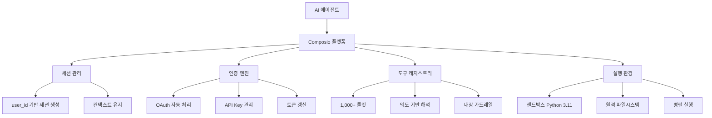

## 개요

Composio는 AI 에이전트가 1,000+ 외부 애플리케이션과 원클릭으로 연동할 수 있도록 해주는 개발자 플랫폼이다. Just-in-time 도구 호출, 위임된 인증(delegated auth), 샌드박스 실행 환경, 병렬 실행을 핵심 기능으로 제공한다. OAuth 토큰 수명주기를 완전 자동 관리하며, MCP 네이티브 통합을 지원하여 별도 SDK 없이도 MCP 호환 클라이언트에서 바로 사용할 수 있다. SOC2 및 ISO 27001:2022 인증을 획득한 엔터프라이즈급 플랫폼이다. [[orchestrator-worker-pattern|오케스트레이터-워커 패턴]]의 도구 연동 레이어를 담당하며, [[multi-agent-orchestration|멀티에이전트 오케스트레이션]] 시스템에서 외부 서비스 통합의 복잡성을 추상화하는 역할을 한다.

## 핵심 특징

- **1,000+ 사전 빌드 커넥터**: GitHub, Gmail, Slack, Notion 등 주요 서비스 즉시 연동
- **OAuth 완전 자동 처리**: 토큰 갱신, 수명주기 관리, 세분화된 권한 스코핑 자동화
- **MCP 네이티브**: `session.mcp.url`과 `session.mcp.headers`로 MCP 호환 클라이언트에서 바로 사용
- **의도 기반 도구 해석**: 설정이 아닌 의도(intent)로 도구를 해석하여 정확한 실행
- **샌드박스 실행 환경**: 원격 Python 3.11 환경에서 격리 실행, 임시(ephemeral) 인스턴스
- **양방향 트리거**: 외부 이벤트를 트리거로 에이전트에 실시간 알림
- **컨텍스트 인식 세션**: 상태, 파일, 진행 상황을 유지하는 세션 관리

## 기술 상세

### 통합 아키텍처



### 두 가지 통합 모드

| 모드 | 방식 | 특징 |
|---|---|---|
| Native Tools | `composio_<provider>` SDK 패키지 사용 | 프레임워크별 최적화 |
| MCP | `session.mcp.url` + `session.mcp.headers` | SDK 불필요, MCP 호환 |

### Native Tools 통합 예시

```python
from composio import Composio

composio = Composio()
session = composio.create(user_id="user-123")

# 도구 목록 가져오기
tools = session.tools(toolkits=["github", "gmail"])

# 에이전트에 도구 전달
agent = create_agent(tools=tools)
```

### MCP 통합 예시

```python
# MCP 클라이언트(Claude Desktop, Cursor 등)에서 직접 사용
session = composio.create(user_id="user-123")

mcp_url = session.mcp.url
mcp_headers = session.mcp.headers
# -> MCP 호환 클라이언트에 URL과 헤더만 전달하면 연동 완료
```

### 지원 AI 프레임워크

Claude Agent SDK, Anthropic, OpenAI (Agents/standard), Google Gemini, Vercel AI SDK, LangChain, LangGraph, [[crewai]], LlamaIndex, Mastra 등 주요 프레임워크를 모두 지원한다.

### 세션 관리

세션은 항상 `composio.create(user_id)` 패턴으로 생성해야 한다. 수동 auth config 생성 대신 이 패턴을 사용함으로써 사용자 스코프 세션 격리가 보장된다. 세션은 상태, 파일, 진행 상황을 유지하며, 양방향 트리거로 외부 이벤트를 에이전트에 실시간 전달할 수 있다.

### 제품 라인업

- **Composio For You**: Claude Code, Cursor 등 MCP 클라이언트용 개인 통합
- **Developer Platform**: 5줄 코드로 시작하는 커스텀 에이전트 개발 SDK
- **Enterprise**: 팀 제어, Bring-Your-Own-Cloud, 커스텀 배포, 화이트 라벨링

### 보안 및 컴플라이언스

- SOC2 및 ISO 27001:2022 인증
- 세분화된 데이터 접근 제어
- Bring-Your-Own-Cloud 배포 옵션
- 화이트 라벨링 지원 (브랜딩된 인증 화면)

### 의도 기반 도구 해석

Composio의 핵심 차별점 중 하나는 의도 기반(intent-based) 도구 해석이다. 에이전트가 "GitHub에서 이슈를 만들어줘"라고 요청하면, 설정 파일이나 명시적 도구 지정 없이 의도를 해석하여 올바른 API를 호출한다. 이는 에이전트가 1,000개 이상의 도구 중 적절한 것을 자동으로 선택할 수 있게 해주며, 도구 수가 많아질수록 설정 복잡도가 폭증하는 문제를 해결한다.

### 경쟁 도구와의 비교

| 항목 | Composio | [[model-context-protocol-mcp]] 직접 구현 | 커스텀 API 래퍼 |
|------|----------|--------------------------------------|---------------|
| 초기 설정 | 5줄 코드 | MCP 서버 구현 필요 | API별 개별 구현 |
| 인증 관리 | 완전 자동 | 직접 구현 | 직접 구현 |
| 커넥터 수 | 1,000+ | 커뮤니티 의존 | 필요한 만큼 |
| 보안 인증 | SOC2, ISO 27001 | 없음 | 직접 확보 |
| 비용 | 유료 (무료 티어 있음) | 무료 | 개발 비용만 |

### CLI 도구

터미널 기반 툴킷 관리, 도구 실행, 타입 안전 코드 생성을 지원하는 CLI가 제공된다. 개발 과정에서 도구 목록 확인, 인증 설정, 코드 스캐폴딩을 커맨드라인으로 수행할 수 있다.

## 관련 문서

- [[model-context-protocol-mcp]] - 도구 통합 프로토콜
- [[crewai]] - 역할 기반 멀티에이전트 오케스트레이션
- [[hermes-agent]] - 자기 개선 에이전트
- [[a2a-protocol]] - 에이전트 간 통신 프로토콜
