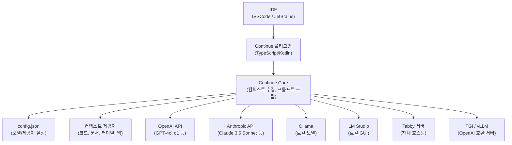

# Continue

## 정체성

| 항목 | 내용 |
|------|------|
| 이름 | Continue |
| 개발사 | Continue Dev, Inc. |
| 라이선스 | Apache 2.0 |
| GitHub | [continuedev/continue](https://github.com/continuedev/continue) |
| 웹사이트 | continue.dev |
| 출시 | 2023년 (베타), 2024년 (정식) |
| 언어/스택 | TypeScript (VSCode 확장), Kotlin (JetBrains 플러그인) |
| 지원 IDE | VSCode, JetBrains (IntelliJ, PyCharm, GoLand 등) |
| Stars | ~20k+ (2024 기준) |

Continue는 **모델 제공자에 구애받지 않는(model-agnostic) 오픈소스 IDE AI 코딩 보조 확장**이다. Cursor가 새 에디터를 강제하는 것과 달리 Continue는 기존 VSCode/JetBrains 환경에 **플러그인으로 설치**되며, OpenAI·Anthropic·Ollama·LM Studio 등 어떤 LLM 백엔드도 연결할 수 있다. 클라우드 API와 로컬 모델을 자유롭게 혼합 사용할 수 있어 프라이버시와 비용을 세밀하게 조절할 수 있다.

---

## 아키텍처 개요



---

## 핵심 기능

### 1. 채팅 (Chat)

IDE 사이드바 패널에서 코드와 대화:

- 열린 파일, 선택 영역, 디렉토리를 컨텍스트로 자동 포함
- `@` 멘션으로 특정 파일/폴더/문서 참조
- 답변 코드를 바로 파일에 적용(Apply) 가능

```
채팅 예시:
> @auth.py 이 파일의 인증 로직을 OAuth 2.0으로 리팩토링해줘

> @src/utils/ 이 디렉토리의 유틸 함수들을 정리해서 문서화 해줘
```

### 2. 자동 완성 (Autocomplete)

Tab 키로 인라인 코드 완성. FIM(Fill-in-the-Middle) 지원 모델 사용 시 최적:

```python
# 커서 위치에서 Tab 누르면:
def validate_email(email: str) -> bool:
    |  # → re.match(r'^[\w.+-]+@[\w-]+\.[a-z]{2,}$', email) is not None 완성
```

자동 완성에는 Ollama의 로컬 소형 모델(Qwen2.5-Coder:1.5b, StarCoder2:3b 등)을 사용하고, 채팅에는 GPT-4o 같은 대형 클라우드 모델을 사용하는 **분리 구성**이 일반적.

### 3. 컨텍스트 제공자 (Context Providers)

`@` 멘션으로 다양한 컨텍스트를 프롬프트에 삽입:

| 제공자 | 문법 | 설명 |
|--------|------|------|
| 파일 | `@auth.py` | 특정 파일 전체 |
| 폴더 | `@src/utils/` | 폴더 내 파일 목록 |
| 코드베이스 | `@codebase` | 전체 코드베이스 검색 |
| 문서 | `@docs` | 외부 문서 URL |
| Git 변경사항 | `@diff` | 현재 작업 중인 변경사항 |
| 터미널 출력 | `@terminal` | 최근 터미널 출력 |
| GitHub Issue | `@github` | GitHub 이슈 내용 |
| 웹 검색 | `@search` | 실시간 웹 검색 |

### 4. 슬래시 명령어 (Slash Commands)

채팅 입력에서 `/`로 시작하는 명령어:

| 명령어 | 기능 |
|--------|------|
| `/edit` | 선택 코드 직접 편집 |
| `/comment` | 코드에 주석 추가 |
| `/tests` | 테스트 코드 생성 |
| `/share` | 대화 내용 공유 링크 생성 |
| `/cmd` | 쉘 명령어 제안 (터미널 통합) |

---

## 설정 (config.json)

Continue의 모든 설정은 `~/.continue/config.json` 파일로 관리된다.

### 기본 구성 예시

```json
{
  "models": [
    {
      "title": "GPT-4o (채팅)",
      "provider": "openai",
      "model": "gpt-4o",
      "apiKey": "sk-..."
    },
    {
      "title": "Claude 3.5 Sonnet",
      "provider": "anthropic",
      "model": "claude-3-5-sonnet-20241022",
      "apiKey": "sk-ant-..."
    },
    {
      "title": "Ollama Llama3.1 (로컬)",
      "provider": "ollama",
      "model": "llama3.1:8b"
    }
  ],
  "tabAutocompleteModel": {
    "title": "Qwen2.5-Coder 1.5B (자동완성)",
    "provider": "ollama",
    "model": "qwen2.5-coder:1.5b"
  },
  "contextProviders": [
    {"name": "code"},
    {"name": "diff"},
    {"name": "terminal"},
    {"name": "docs"},
    {
      "name": "folder",
      "params": {"nRetrievedFiles": 10}
    }
  ],
  "slashCommands": [
    {"name": "edit", "description": "선택 코드 편집"},
    {"name": "tests", "description": "테스트 생성"},
    {"name": "comment", "description": "주석 추가"}
  ]
}
```

### 로컬 전용 구성 (프라이버시 최우선)

```json
{
  "models": [
    {
      "title": "Ollama Qwen2.5 14B",
      "provider": "ollama",
      "model": "qwen2.5:14b"
    }
  ],
  "tabAutocompleteModel": {
    "title": "Ollama Qwen2.5-Coder 1.5B",
    "provider": "ollama",
    "model": "qwen2.5-coder:1.5b"
  }
}
```

모든 처리가 로컬에서 이루어져 코드가 외부로 전송되지 않음.

---

## Cursor vs Continue 비교

| 특성 | Cursor | Continue |
|------|--------|----------|
| 에디터 방식 | 독립 에디터 (VSCode fork) | 기존 IDE 플러그인 |
| 모델 고정성 | Cursor 자체 API (Claude/GPT/Cursor 모델) | 완전 자유 (어떤 모델도 가능) |
| 자체 모델 | Cursor-small 등 자체 모델 | 없음 (외부 모델 연결) |
| 에이전트 기능 | Agent 모드 (자율 파일 편집) | 기본 채팅+완성 (에이전트는 제한적) |
| Diff 미리보기 | 우수 | 좋음 |
| 멀티파일 편집 | 강력 | 제한적 |
| 로컬 모델 지원 | 일부 (Ollama 연결 가능) | 완전 지원 |
| 비용 | $20~$40/월 (Pro 기준) | 모델 비용만 (확장 자체 무료) |
| 프라이버시 | 코드 전송 (Cursor 서버) | 모델 제공자에 따라 결정 |
| JetBrains 지원 | 없음 | 있음 |
| 라이선스 | 독점 | Apache 2.0 |

**Continue 선택 시**: 기존 VSCode/JetBrains 환경 유지, 모델 자유 선택, JetBrains 필요, 예산 최소화

**Cursor 선택 시**: 최신 AI 에이전트 기능, 강력한 멀티파일 편집, 편리한 설정

---

## 워크플로우 패턴

### 패턴 1: 채팅 + 로컬 자동완성

```
채팅 모델: Claude 3.5 Sonnet (고품질 설계/리팩토링)
자동완성 모델: Qwen2.5-Coder:1.5b via Ollama (빠른 로컬 완성)
→ 클라우드 비용 최소화 + 빠른 완성
```

### 패턴 2: 완전 로컬 (보안 환경)

```
채팅 모델: Ollama Qwen2.5:14b
자동완성 모델: Ollama Qwen2.5-Coder:1.5b
→ 인터넷 연결 없이 동작, 코드 외부 전송 없음
```

### 패턴 3: Tabby 서버 통합

```
자체 호스팅 Tabby 서버 → Continue 자동완성 백엔드로 연결
채팅: Claude API
→ 팀 공유 코딩 서버 + 최고 품질 채팅
```

---

## 실무 설치

```bash
# VSCode 마켓플레이스
code --install-extension Continue.continue

# JetBrains 플러그인 마켓플레이스에서 "Continue" 검색 후 설치
```

설치 후 사이드바에 Continue 아이콘 클릭 → 초기 설정 마법사로 첫 번째 모델 연결.

---

## 한계 / 트레이드오프

### 에이전트 기능 제한

Cursor Agent처럼 LLM이 자율적으로 여러 파일을 수정하고 터미널을 실행하는 풀 에이전트 모드는 Continue에서 제한적. 대부분의 작업은 사용자의 명시적 지시 필요.

### 자동완성 지연

Ollama 로컬 소형 모델을 사용하는 자동완성은 GPU 없는 환경에서 응답이 느릴 수 있음. 클라우드 API를 사용하면 레이턴시 증가.

### 코드베이스 검색 품질

`@codebase` 컨텍스트는 임베딩 기반 검색을 수행하지만, 대규모 코드베이스에서는 인덱싱 시간과 메모리 사용량이 상당함.

---

## config.yaml 스키마 (2026 reference)

`config.json`은 deprecated. 2026년 기준 모든 설정은 단일 `config.yaml`에서 관리.

### Top-level fields

| 필드 | 역할 |
|---|---|
| `name` | 프로젝트/구성 식별자 |
| `version` | 구성 버전 |
| `schema` | 스키마 버전 (예: `v1`) |
| `models` | 모델 목록 (per-role) |
| `context` | 컨텍스트 provider 목록 |
| `rules` | 시스템 메시지에 concatenate되는 규칙 |
| `prompts` | 슬래시 커맨드 |
| `docs` | 문서 인덱싱 |
| `mcpServers` | MCP 서버 |
| `data` | 데이터 소스 |

## Model roles 시스템 (Continue의 정체성)

> "The `roles` array specifies capabilities: `chat`, `autocomplete`, `embed`, `rerank`, `edit`, `apply`, `summarize`."

### 디폴트

`[chat, edit, apply, summarize]`

### 의미

한 모델을 여러 role에 동시에 쓰거나, role별 다른 모델을 선택 가능. 예시 라우팅:

| Role | 모델 선택 예시 | 이유 |
|---|---|---|
| `chat` | GPT-5, Claude Opus | 강한 reasoning |
| `autocomplete` | Codestral, Qwen2.5-Coder:1.5b (Ollama) | 빠른 응답, FIM 학습 |
| `embed` | VoyageAI | 임베딩 품질 |
| `rerank` | Cohere reranker | 검색 정확도 |
| `edit`, `apply` | Claude Sonnet | 코드 변경 정확도 |

### 추가 옵션

- `capabilities` — autodetection override (`tool_use`, `image_input`)
- `promptTemplates` — role별 커스텀 템플릿
- `chatOptions` — chat / agent / plan 모드별 system message override
- `autocompleteOptions` — debounce delay, token limit, 템플릿

## Context Providers

### 형식

```yaml
context:
  - provider: file
  - provider: codebase
  - provider: terminal
```

| Provider | 설명 |
|---|---|
| `file` | 사용자가 첨부한 파일 |
| `code` | 선택 코드 블록 |
| `codebase` | 전체 codebase 검색 |
| `currentFile` | 활성 에디터 파일 |
| `terminal` | 터미널 출력 |
| `problems` | 에디터 진단/에러 |
| `web` | 웹 검색 |
| `search` | 정의된 검색 |
| `diff` | git diff |
| `folder` | 폴더 트리 |
| `open` | 열린 파일들 |
| `repo-map` | repo 구조 |
| `http` | 사용자 정의 URL |

(공식 docs 일부 페이지 404 발생 — 일부 항목 [교차검증 필요])

## Rules 시스템

> "Rules concatenate into system messages across Agent, Chat, and Edit requests."

### 참조 방식

```yaml
rules:
  - uses: sanity/sanity-opinionated  # Hub 참조
  - uses: file://user/Desktop/rules.md  # 로컬 파일
```

→ 팀 단위 코딩 표준을 hub에서 공유, 개인 보강은 로컬 파일로.

## Prompts (Slash commands)

### Invocation

> "Prompts invoke with `/` commands."

### 정의

> "Configuration references prompts via hub paths or local files, with required metadata including `name`, `description`, and `prompt` content."

### MCP prompts 자동 통합

> "Continue supports MCP 'prompts' by creating slash commands."

→ MCP 서버에서 prompt를 export하면 자동으로 `/{prompt-name}` 슬래시 커맨드로 노출.

### 구 방식 deprecation

> "The slashCommands array is deprecated. For creating custom slash commands, use prompt files instead."

## MCP servers

```yaml
mcpServers:
  - name: github
    command: npx
    args: ["-y", "@modelcontextprotocol/server-github"]
    env:
      GITHUB_TOKEN: ghp_xxx
    cwd: /path
```

→ [[claude-code]]의 `.mcp.json` 형식과 거의 동일. provider 호환성 보장.

## Hub vs Local

### 진입점

- VS Code: Cmd/Ctrl+L (sidebar) → Agent selector
- JetBrains: Cmd/Ctrl+J → Agent selector

### Configuration locations

| Level | 경로 |
|---|---|
| User-level (macOS/Linux) | `~/.continue/config.yaml` |
| User-level (Windows) | `%USERPROFILE%\.continue\config.yaml` |
| Workspace-level | `.continuerc.json` (프로젝트 루트) |
| Programmatic | `~/.continue/config.ts` (`modifyConfig` export) |

### Merge behavior

- `merge` (default) — `.continuerc.json`이 user config 위에 적용
- `overwrite` — 모든 top-level property를 overwrite

## CLI (`cn`)

> Continue CLI: `cn`

- 헤드리스 모드로 agent 실행
- CI / 자동화 통합
- 동일 config.yaml 재사용

## Agent 정의

> "Continue Agents are defined using the config.yaml specification. Agents are composed of models, rules, and tools (MCP servers)."

→ "Agent" = 모델 선택 + rule 셋 + MCP 도구 셋 의 한 묶음. **config.yaml 하나가 곧 한 agent의 정의**.

## 모드 (Chat / Agent / Plan)

`chatOptions`에서 system message를 모드별로 override 가능. Agent와 Plan은 명시적으로 분리되어 있음 ([[cline-claude-coder|Cline]]의 plan/act와 비슷한 결).

## 비교 — Continue vs 다른 도구

| 항목 | Continue.dev | Cline | Aider | Cursor |
|---|---|---|---|---|
| 정체성 | Configurability | Plan/Act + zero-trust | terminal git-native | 자체 모델 + IDE |
| 단일 config | yaml 하나 | settings GUI | CLI flag + yaml | 비공개 |
| Hub 공유 | Continue Hub | 없음 | 없음 | 없음 |
| Multi-role | 명시적 (chat/embed/rerank/edit/apply 분리) | provider 1개 | 1-2 model | 모델 자체 통합 |
| MCP prompts → slash | 자동 | 수동 | 미지원 | 미지원 |
| 오픈소스 | Apache 2.0 | Apache 2.0 | Apache 2.0 | 비공개 |

## 관련 문서

- [[tabby-self-hosted-coding]] - 자체 호스팅 코딩 서버 (Continue 백엔드로 활용 가능)
- [[cursor|cursor-editor]] - Continue의 경쟁 클라우드 AI 에디터
- [[code-completion]] - 코드 완성 기법 일반 개념
- [[ollama]] - Continue의 로컬 모델 백엔드
- [[text-generation-inference-tgi]] - OpenAI 호환 서버 (Continue와 연결 가능)
- [[claude-code]] - 터미널 기반 AI 코딩 어시스턴트 (대안적 접근)
- [[cline-claude-coder]] - Plan/Act 분리의 다른 구현
- [[mcp-protocol]] - MCP 표준
- [[coding-harness-comparison]] - 코딩 에이전트 하네스 횡단 비교
