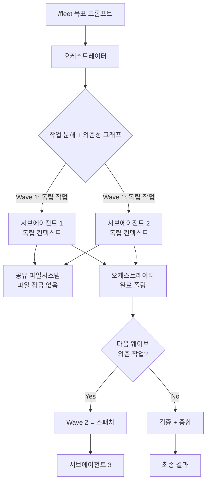

## 개요

`/fleet`은 GitHub Copilot CLI의 슬래시 커맨드로, 오케스트레이터가 태스크를 독립 단위로 분할하고 여러 서브에이전트를 동시에 실행하는 병렬 멀티에이전트 기능이다. 2026년 2월 GA(General Availability)로 출시되었다.

단일 에이전트의 순차 작업 한계를 넘어, 독립적인 작업을 식별하고 동시에 처리함으로써 대규모 코드베이스에서의 작업 속도를 크게 향상시킨다. 오케스트레이터는 "프로젝트 리더가 팀에게 작업을 할당하고, 진행 상황을 점검하고, 최종 산출물을 조립하는 것"처럼 동작한다. [[git-worktree-isolation|Git Worktree 격리]] 없이 공유 파일시스템을 사용하므로 충돌 위험이 있으며, [[how-coding-agents-work|코딩 에이전트 동작 원리]] 상 컨텍스트 격리와 파일시스템 격리 간의 트레이드오프를 이해하고 운영해야 한다.

## 핵심 특징

### 오케스트레이터 5단계 동작

1. **작업 분해**: 사용자 목표를 독립적인 업무 항목으로 세분화
2. **의존성 매핑**: 병렬 실행 가능 항목과 순차 실행 필요 항목을 의존성 그래프로 구분
3. **에이전트 디스패치**: 독립적 항목을 백그라운드 서브에이전트로 동시 전송
4. **폴링 및 시퀀싱**: 완료 모니터링 후 의존 작업의 다음 웨이브를 디스패치
5. **검증 및 종합**: 산출물 검증 및 최종 결과물 생성

### 서브에이전트 격리 모델

- 각 서브에이전트는 **독립적인 컨텍스트 윈도우**를 보유하여, 전체 작업의 복잡성에 압도되지 않고 집중 작업 가능
- **공유 파일시스템 접근 가능**하나 파일 잠금(locking) 기능 없음 -- 두 에이전트가 같은 파일에 쓰면 마지막 에이전트의 결과가 적용됨
- 에이전트 간 직접 통신 불가 -- 오케스트레이터만 조정 역할 수행
- **서브에이전트는 오케스트레이터의 대화 히스토리를 볼 수 없음** -- 프롬프트에 모든 필요 컨텍스트를 명시적으로 포함해야 함

### 실행 방법

```
/fleet <목표 프롬프트>
```

의존성 명시 예시:
```
/fleet "Item 1: API 엔드포인트 구현, Item 2 (depends on 1): 클라이언트 SDK, Item 3 and Item 4 (depends on 2): 테스트 + 문서"
```

## 기술 상세

### 실행 아키텍처



### 커스텀 에이전트 지원

`.github/agents/` 디렉토리에 커스텀 에이전트를 정의하면, `/fleet`에서 `@CUSTOM-AGENT-NAME` 구문으로 특정 서브에이전트를 지정할 수 있다. 에이전트별로 모델 패밀리와 도구 권한을 별도 설정 가능하다.

### 프리미엄 요청 소비

각 서브에이전트의 LLM 상호작용이 개별적으로 프리미엄 요청을 소비한다. 따라서 `/fleet` 실행 시 순차 실행 대비 더 많은 프리미엄 요청이 소모될 수 있으며, 속도-비용 트레이드오프를 고려해야 한다.

### 진행 상황 모니터링

- 초기 분해 계획을 검토하여 병렬화 확인
- `/tasks` 커맨드로 실시간 백그라운드 활동 확인
- 각 트랙의 상태 업데이트 참조

### 효과적인 사용 사례

| 사례 | 설명 | 병렬화 효과 |
|------|------|------------|
| 다중 파일 리팩토링 | 독립된 파일들의 동일 패턴 리팩토링 병렬 수행 | 높음 |
| 다중 컴포넌트 문서화 | 여러 모듈의 API 문서를 동시에 생성 | 높음 |
| 멀티트랙 기능 구현 | 프론트엔드/백엔드/테스트를 동시 진행 | 중간 (파일 충돌 주의) |
| 대규모 마이그레이션 | 다수 파일의 API 버전 업그레이드 병렬 처리 | 높음 |

### 주의사항 및 한계

- **동일 파일 동시 수정 금지**: 서브에이전트 간 파일 잠금이 없으므로, 같은 파일을 수정하는 작업은 반드시 순차 실행으로 설정
- **컨텍스트 격리**: 서브에이전트가 이전 대화를 볼 수 없으므로, 프롬프트에 충분한 컨텍스트 포함 필수
- **단일 파일 작업에는 비효율적**: 순차 실행이 더 효과적인 경우 오버헤드만 증가
- **최대 동시 에이전트 수**: 공식 문서에 명시되지 않음

### 경쟁 도구 비교

| 도구 | 병렬 방식 | 격리 수준 | 오케스트레이션 | 파일 충돌 방지 |
|------|----------|----------|--------------|--------------|
| Copilot /fleet | 서브에이전트 디스패치 | 컨텍스트 윈도우 격리 | 내장 오케스트레이터 | 없음 (수동 분리) |
| [[augment-intent]] | git worktree 격리 | 파일시스템 격리 | Coordinator-Implementor-Verifier | worktree 분리 |
| [[claude-code]] (팀 모드) | 서브에이전트 위임 | 프로세스 격리 | 메인 에이전트 조율 | 프로세스 격리 |

## 관련 문서

- [[augment-intent]] - Augment Code 에이전트 오케스트레이션
- [[orchestrator-worker-pattern]] - 오케스트레이터-워커 패턴
- [[subagents]] - 서브에이전트 패턴
- [[claude-code]] - Claude Code 에이전트
