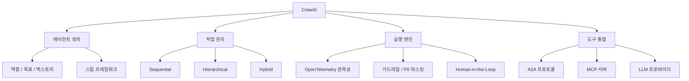

## 개요

CrewAI는 역할 기반 멀티에이전트 오케스트레이션 프레임워크로, 2026년 현재 GitHub 46K+ 스타를 기록하고 있다. 각 에이전트에 명확한 역할(Role)을 부여하고, 크루(Crew) 단위로 작업을 관리하는 것이 핵심 설계 철학이다. v1.10에서 A2A 프로토콜 지원, Gemini GenAI 업그레이드, MCP 도구 로딩 개선이 추가되어 엔터프라이즈 환경에서의 활용도가 크게 향상되었다. [[orchestrator-worker-pattern|오케스트레이터-워커 패턴]]의 역할 기반 변형으로, [[multi-agent-orchestration|멀티에이전트 오케스트레이션]] 스펙트럼에서 가장 빠른 PoC 진입점을 제공한다.

## 핵심 특징

- **역할 기반 에이전트 설계**: 에이전트별 역할(Role), 목표(Goal), 백스토리(Backstory)를 정의하여 전문성 있는 작업 수행. 인간 팀의 직관적 비유로 에이전트 시스템을 구성
- **다중 실행 패턴**: Sequential(순차), Hierarchical(계층 -- Manager 에이전트가 위임), Consensual(합의 -- 투표 기반 의사결정) 실행 모드 지원
- **모델 비의존성**: OpenAI, Anthropic, OpenRouter, DeepSeek, Ollama, vLLM, Cerebras, Dashscope 등 다수 LLM 프로바이더 네이티브 지원. 로컬/클라우드 모델 혼합 사용 가능
- **CrewAI Studio**: 비기술 이해관계자도 사용 가능한 비주얼 드래그 앤 드롭 에이전트 설계 에디터
- **A2A 프로토콜 지원**: v1.10부터 [[a2a-protocol]] 네이티브 통합으로 외부 에이전트 시스템과 상호 운용
- **MCP 도구 로딩**: [[model-context-protocol-mcp]] 서버와의 도구 통합 개선
- **엔터프라이즈 플랫폼 (AMP)**: Slack, Gmail, Salesforce 트리거 연동, RBAC 지원, 배포 관리

## 기술 상세

### 아키텍처



### LLM 프로바이더 지원

OpenRouter, DeepSeek, Ollama, vLLM, Cerebras, Dashscope 등 다수의 LLM 프로바이더를 네이티브 지원한다. 로컬 모델과 클라우드 모델을 혼합 사용할 수 있다.

### 메모리 및 안전성

- **Qdrant Edge 메모리 백엔드** (v1.12): 계층적 메모리 격리로 에이전트 간 컨텍스트 분리 및 데이터 구획화
- **가드레일**: 환각 탐지(hallucination detection), PII 마스킹, Human-in-the-Loop 기능 내장
- **에이전트 스킬 프레임워크** (v1.12): 네이티브 에이전트 스킬 지원으로 모듈러 행동 조합
- **OpenTelemetry 관측성**: 트레이싱, 환각 점수, 에이전트 행동 모니터링 내장

### 코드 예시

```python
from crewai import Agent, Task, Crew

researcher = Agent(
    role="Senior Researcher",
    goal="Find the latest AI trends",
    backstory="Expert in AI with 10 years of experience",
    llm="openrouter/anthropic/claude-opus-4-6"
)

writer = Agent(
    role="Technical Writer",
    goal="Write clear technical reports",
    backstory="Former journalist specializing in tech"
)

research_task = Task(
    description="Research the latest developments in AI agents",
    agent=researcher,
    expected_output="A comprehensive report"
)

write_task = Task(
    description="Write a summary based on the research",
    agent=writer,
    expected_output="A 500-word article"
)

crew = Crew(
    agents=[researcher, writer],
    tasks=[research_task, write_task],
    process="sequential"  # or "hierarchical"
)

result = crew.kickoff()
```

### 프로덕션 준비도 & 한계

**강점**:
- 20줄 미만 Python으로 동작하는 멀티에이전트 시스템 구축 가능
- CrewAI Studio로 비기술 이해관계자도 접근 가능
- 빠른 프로토타이핑과 PoC 개발에 최적

**한계**:
- 장기 실행 워크플로에 대한 내장 체크포인팅 부족
- 에이전트 간 직접 통신 제한 (태스크 출력을 통한 간접 통신)
- 추상화 수준이 높아 복잡한 실패 시 디버깅 어려움
- 프로덕션급 상태 관리와 조건부 라우팅이 필요한 팀은 LangGraph로 마이그레이션하는 경우 있음

### 경쟁 프레임워크 비교

| 항목 | CrewAI | [[ag2]] | [[microsoft-agent-framework]] | LangGraph |
|---|---|---|---|---|
| 설계 철학 | 역할 기반 | 대화 기반 | 그래프 기반 | 상태 그래프 |
| 실행 패턴 | Sequential/Hierarchical/Consensual | 그룹챗/스웜 | 워크플로우 그래프 | 유향 비순환 그래프 |
| 비주얼 에디터 | CrewAI Studio | - | - | LangGraph Studio |
| A2A 지원 | v1.10+ | - | - | - |
| 체크포인팅 | 제한적 | - | 내장 | 내장 |
| 프로덕션 적합도 | PoC/중규모 | 실험적 | 엔터프라이즈 | 프로덕션급 |

### 가격 (호스팅 플랫폼)

| 티어 | 가격 | 실행 횟수 | 주요 기능 |
|---|---|---|---|
| Free | 무료 | 50회/월 | 기본 기능 |
| Professional | $25/월 | 100회/월 | 고급 기능 |
| Enterprise | 협의 | 30,000회/월 | K8s/VPC 셀프호스팅, SOC2, SSO, PII 마스킹 |

## 활용 시나리오

### 리서치 + 리포팅 크루

가장 일반적인 패턴. Researcher 에이전트가 웹 검색/문서 분석 후, Writer 에이전트가 결과를 구조화된 리포트로 작성. Editor 에이전트가 최종 검토하는 3단계 크루 구성.

### 고객 지원 자동화

Classifier 에이전트가 문의 유형 분류 -> 전문 에이전트(환불/기술지원/일반) 라우팅 -> QA 에이전트가 응답 품질 검증. Hierarchical 모드에서 Manager 에이전트가 전체 조율.

### 코드 리뷰 크루

Analyzer 에이전트가 코드 변경 분석 -> Security 에이전트가 보안 취약점 스캔 -> Reviewer 에이전트가 종합 리뷰 작성. MCP 도구로 GitHub API 연동.

## 관련 문서

- [[ag2]] - AutoGen 재브랜딩 프레임워크
- [[microsoft-agent-framework]] - Semantic Kernel + AutoGen 통합
- [[a2a-protocol]] - 에이전트 간 통신 프로토콜
- [[composio]] - 외부 도구 통합 플랫폼
- [[orchestrator-worker-pattern]] - 오케스트레이터-워커 패턴
