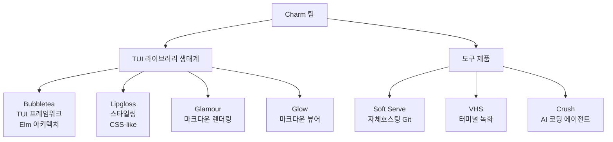
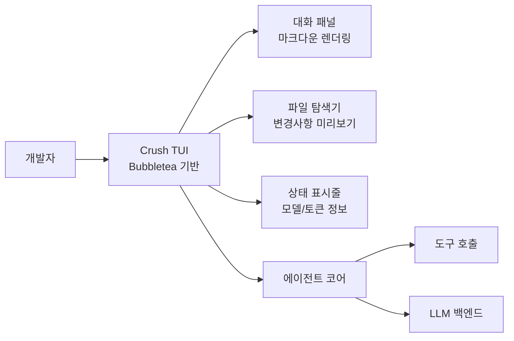
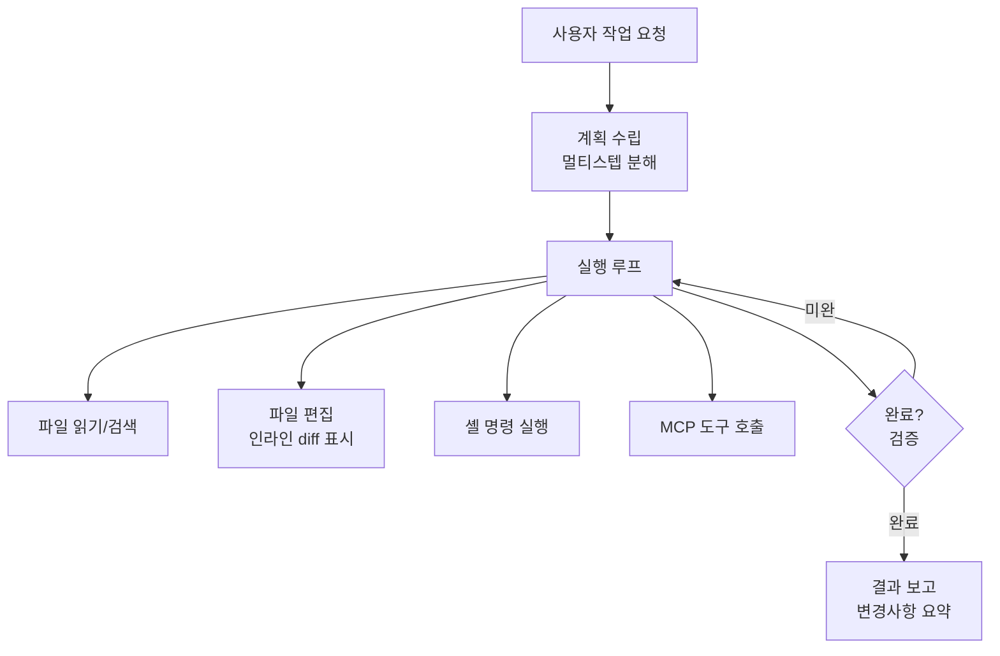
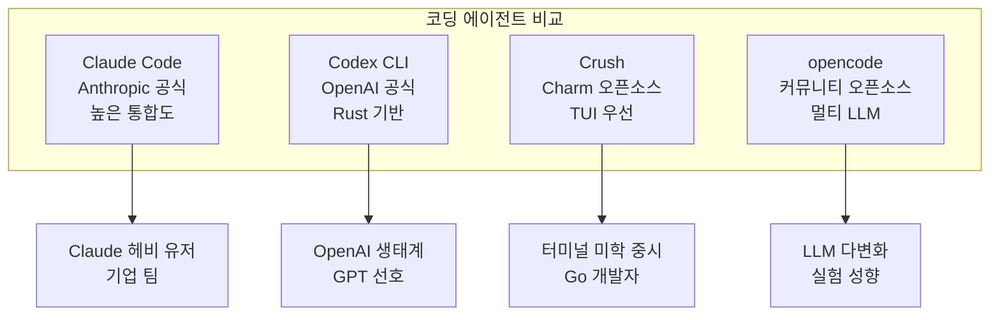

# Crush

## 정체성

| 항목 | 내용 |
|------|------|
| 프로젝트명 | Crush |
| 제작사 | Charm (터미널 UI 라이브러리 전문 팀) |
| 유형 | 터미널 코딩 에이전트 (TUI 기반) |
| 라이선스 | MIT |
| 언어 | Go |
| GitHub | github.com/charmbracelet/crush |
| 관련 Charm 라이브러리 | Bubbletea, Lipgloss, Glamour |

Crush는 **Charm** 팀이 만든 터미널 UI(TUI) 기반 AI 코딩 에이전트다. Charm은 `bubbletea`, `lipgloss`, `glow` 등 아름다운 터미널 UI를 위한 Go 라이브러리로 유명한 팀으로, Crush는 이 TUI 철학을 AI 코딩 에이전트에 적용한 결과물이다.

Claude Code나 Codex CLI가 기능 중심이라면, Crush는 **터미널에서의 사용자 경험(UX)**을 강조한다. Go 기반으로 빠르고 크로스플랫폼이며, MCP(Model Context Protocol)를 지원해 확장 가능하다.

[교차검증 필요] Crush의 현재 개발 상태와 최신 기능은 공식 GitHub 저장소에서 확인하라.

## Charm 팀 배경

Charm은 터미널 개발자 경험을 아름답게 만드는 것을 미션으로 하는 팀이다.



Charm 생태계의 도구들은 모두 Go로 작성되어 있으며, 단일 바이너리로 배포된다. Crush는 이 생태계의 AI 에이전트 방향 확장이다.

## 핵심 특징

### 1. TUI 퍼스트 경험

Crush는 터미널에서도 시각적으로 아름다운 인터페이스를 제공한다. Bubbletea 프레임워크를 기반으로:

- 컬러 하이라이팅된 코드 블록
- 파일 트리 시각화
- 진행 상태 인디케이터
- 키보드 단축키 네비게이션



### 2. MCP 지원

Crush는 MCP(Model Context Protocol)를 네이티브로 지원한다. 이를 통해:

- MCP 서버를 통한 외부 도구 연결
- 데이터베이스, API, 파일시스템 등 컨텍스트 확장
- 커스텀 MCP 서버 플러그인

```yaml
# ~/.config/crush/config.yaml
mcp:
  servers:
    - name: filesystem
      command: npx
      args: ["@modelcontextprotocol/server-filesystem", "/projects"]
    - name: github
      command: npx
      args: ["@modelcontextprotocol/server-github"]
      env:
        GITHUB_TOKEN: ${GITHUB_TOKEN}
    - name: postgres
      command: npx
      args: ["@modelcontextprotocol/server-postgres", "${DATABASE_URL}"]
```

### 3. 다중 모델 선택

Crush는 여러 LLM 프로바이더를 지원하며, 태스크에 따라 모델을 선택할 수 있다.

```yaml
models:
  default: claude-sonnet-4-5
  fast: claude-haiku-4-5
  powerful: claude-opus-4-6

providers:
  anthropic:
    api_key: ${ANTHROPIC_API_KEY}
  openai:
    api_key: ${OPENAI_API_KEY}
  ollama:
    base_url: http://localhost:11434
```

## 설치 및 시작

### 설치

```bash
# macOS Homebrew
brew install charmbracelet/tap/crush

# Go 직접 설치
go install github.com/charmbracelet/crush@latest

# 바이너리 직접 다운로드 (GitHub Releases)
curl -sfL https://raw.githubusercontent.com/charmbracelet/crush/main/install.sh | sh
```

[교차검증 필요] 정확한 설치 명령은 공식 README에서 확인하라.

### 기본 실행

```bash
# 현재 디렉토리에서 시작
crush

# 특정 작업으로 시작
crush "이 프로젝트에 단위 테스트를 추가해줘"

# 특정 모델 사용
crush --model claude-opus-4-6

# 설정 파일 지정
crush --config ~/my-crush-config.yaml
```

### 키보드 단축키

Crush TUI에서 사용 가능한 주요 키보드 단축키:

| 단축키 | 동작 |
|--------|------|
| `Ctrl+Enter` | 메시지 전송 |
| `Ctrl+C` | 종료 |
| `Tab` | 패널 간 이동 |
| `Ctrl+K` | 명령 팔레트 열기 |
| `Ctrl+Z` | 마지막 변경 취소 |

[교차검증 필요] 실제 단축키는 버전에 따라 다를 수 있다.

## 에이전트 기능

Crush는 일반적인 코딩 에이전트 기능을 갖추고 있다:



### 파일 편집 흐름

Crush는 파일 편집 시 변경사항을 명확하게 표시한다:

1. 변경할 파일 특정 (`view_file`, `search_code`)
2. 변경 계획 LLM 생성
3. `edit_file` 도구로 diff 적용
4. TUI에서 before/after 인라인 표시
5. 사용자 확인 또는 자동 적용

## Claude Code 및 Codex CLI와 비교



| 항목 | Crush | Claude Code | Codex CLI |
|------|-------|------------|-----------|
| UI 품질 | 높음 (TUI 전문) | 보통 | 보통 |
| 라이선스 | MIT | 독점 | MIT |
| 언어 | Go | TypeScript | Rust |
| MCP 지원 | 있음 | 있음 | 있음 |
| 멀티 LLM | 있음 | 제한 | 제한 |
| 기업 지원 | Charm (소규모) | Anthropic | OpenAI |

## Charm 팀의 오픈소스 철학

Charm은 "인간 친화적인 터미널 도구"를 만드는 것을 미션으로 한다. 모든 주요 라이브러리와 도구를 MIT/MIT-0 라이선스로 오픈소스 배포한다. Crush도 이 철학의 연장선으로, 소스 코드 전체가 공개되어 있으며 커뮤니티 기여를 환영한다.

## 한계 및 트레이드오프

### 현재 제약

- **초기 단계**: Claude Code 대비 생태계와 플러그인이 적음
- **기업 기능 부족**: 팀 공유, 감사 로그, SSO 없음
- **문서 품질**: Charm 특유의 간결한 문서 스타일로 심화 설명 부족
- **모델 최적화**: Claude Code처럼 특정 모델에 깊이 최적화되지 않음

### 권장 사용 시나리오

- 터미널 미학(TUI 경험)을 중시하는 개발자
- Go 생태계 프로젝트에서 작업하는 경우
- MCP를 활용한 커스텀 컨텍스트 확장이 필요한 경우
- Charm의 다른 도구(Glow, Soft Serve 등)와 통합된 워크플로우

## 관련 문서

- [[claude-code]] -- Anthropic 공식 Claude 코딩 에이전트
- [[opencode-cli]] -- 멀티 LLM 오픈소스 코딩 에이전트
- [[codex-cli]] -- OpenAI 공식 Rust 기반 터미널 에이전트
- [[cline-claude-coder]] -- VS Code 확장 기반 Claude 코딩 에이전트
- [[model-context-protocol-mcp]] -- MCP 프로토콜 개요
- [[coding-agents-landscape]] -- 코딩 에이전트 전체 지형도
