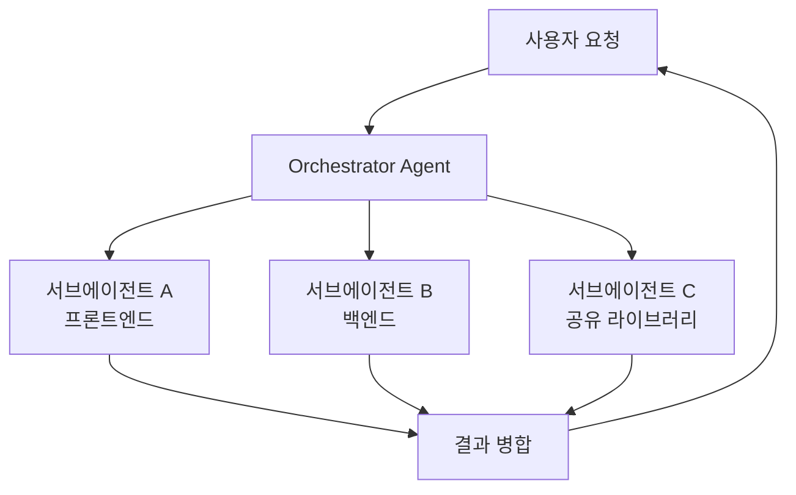
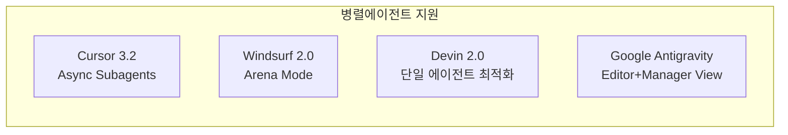

# Cursor 3.2 릴리즈 - 비동기 서브에이전트 & 멀티루트 워크스페이스

## 개요

2026년 4월 24일 출시된 Cursor 3.2는 AI 코딩 어시스턴트 시장에서 에이전트 병렬화(agent parallelization)와 크로스-레포(cross-repo) 작업 지원을 한 단계 끌어올린 대형 업데이트다. 비동기 서브에이전트(Async Subagents), 멀티루트 워크스페이스(Multi-Root Workspaces), 인터랙티브 캔버스(Interactive Canvas), `/debug` CLI 커맨드 네 가지가 핵심 신기능이다.

[[cursor]] 엔티티 페이지에서 Cursor 전반적인 히스토리와 경쟁 구도를 참고하라.

## 배경 - 왜 이 업데이트가 중요한가

2026년 초반 AI 코딩 도구 경쟁은 단순 자동완성(autocomplete)에서 **자율 에이전트(autonomous agent)** 단계로 빠르게 이동했다. [[windsurf-2-0-release]]가 에이전트 커맨드 센터를 선보이고, [[devin-2-0-release]]가 엔드투엔드 PR 생성 성능을 높이는 상황에서 Cursor도 에이전트 오케스트레이션(agent orchestration) 쪽으로 무게중심을 이동시켰다.

Cursor가 2026년 4월 [[spacex-cursor-acquisition-option]]에서 다루는 것처럼 600억 달러 인수 옵션 보도와 20억 달러 펀딩 라운드 시기에 맞춰 3.2를 출시한 점도 주목할 만하다. 기술적 기반 강화와 기업가치 증명이 동시에 이루어진 릴리즈다.

## 4대 신기능

### 1. 비동기 서브에이전트 (Async Subagents)

Agent Window 내 타일 분할(tile split) 뷰를 통해 복수의 에이전트를 동시에 시각화·관리할 수 있다. 각 서브에이전트는 독립적으로 실행되며 비동기로 결과를 오케스트레이터에 반환한다. 이전 버전에서는 하나의 에이전트 작업이 완료될 때까지 다음 작업을 시작할 수 없었지만, 3.2부터는 여러 서브태스크가 병렬로 진행된다.

**실무 적용 예시:**
- 같은 PR에서 프론트엔드 컴포넌트 수정 + 백엔드 API 엔드포인트 추가를 동시 진행
- 테스트 작성 에이전트와 코드 구현 에이전트를 병렬 실행
- 여러 마이크로서비스를 동시에 리팩토링

### 2. 멀티루트 워크스페이스 (Multi-Root Workspaces)

한 세션에서 서로 다른 Git 레포지토리 여러 개를 동시에 열고 편집할 수 있는 기능이다. VS Code의 멀티루트 워크스페이스 개념을 에이전트 작업 흐름과 통합한 것으로, 모노레포(monorepo)가 아닌 폴리레포(polyrepo) 환경에서도 크로스-레포 변경을 지원한다.

| 시나리오 | 이전 버전 | Cursor 3.2 |
|----------|-----------|------------|
| 프론트엔드 + 백엔드 레포 동시 편집 | 탭 전환 필수 | 단일 워크스페이스 |
| 공유 라이브러리 수정 후 참조 레포 업데이트 | 수동 전환 | 에이전트가 자동 처리 |
| 크로스-레포 PR 생성 | 불가 | 단일 세션에서 가능 |

### 3. 인터랙티브 캔버스 (Interactive Canvas)

코드와 다이어그램·플로우차트를 인라인으로 시각화하는 캔버스 뷰를 제공한다. Mermaid 다이어그램을 편집하거나, 데이터 흐름을 시각적으로 조작하고 그 변경사항이 즉시 코드에 반영된다. 특히 아키텍처 설계 → 코드 생성 사이클을 하나의 인터페이스에서 완결할 수 있다.

### 4. `/debug` CLI 커맨드

터미널에서 `/debug <오류 메시지 또는 파일 경로>`를 실행하면 Cursor 에이전트가 자동으로 스택 트레이스를 분석하고 수정 후보를 제시한다. 이전에는 IDE 창을 열어 Chat 패널에서 오류를 붙여넣어야 했지만, 이제 터미널 워크플로우에서 이탈 없이 디버깅이 가능하다.

## 경쟁 구도 비교 (2026년 4월 기준)

- **Cursor 3.2**: 개발자 중심 IDE에 에이전트 병렬화 추가. 기존 VS Code 생태계 호환 유지
- **Windsurf 2.0**: 에이전트 커맨드 센터로 태스크 관리 강화. [[windsurf-2-0-release]] 참조
- **Devin 2.0**: 단일 에이전트이지만 엔드투엔드 자율성 높음. [[devin-2-0-release]] 참조
- **Google Antigravity**: 멀티모델 지원에 초점. [[google-antigravity-ide]] 참조

## 평가 및 제한

**강점:**
- 기존 VS Code 확장 생태계와의 완전한 호환성 유지
- 크로스-레포 작업에서 경쟁사 대비 선도적 위치
- `/debug` CLI로 터미널 개발자 친화성 향상

**제한 사항:**
- 비동기 서브에이전트가 충돌하는 파일을 동시 수정 시 병합 전략 불명확
- 멀티루트 워크스페이스에서 컨텍스트 윈도우 사용량 급증 가능성
- 인터랙티브 캔버스는 2026년 4월 기준 베타 상태

## SWE-Bench 성능

[[swe-bench-pro-contamination]]에서 논의하듯, Cursor가 내부적으로 사용하는 Claude/GPT 모델의 SWE-Bench Verified 점수와 실제 실무 성능 간의 괴리 문제는 여전히 존재한다. Cursor 3.2 자체의 공식 벤치마크 수치는 아직 발표되지 않았다.

## 왜 중요한가

Cursor 3.2는 단순한 기능 추가를 넘어 **"AI 코딩 에이전트 = 단일 도우미"에서 "AI 코딩 에이전트 = 오케스트레이션 플랫폼"으로의 패러다임 전환**을 가장 명확하게 구현한 릴리즈다. 비동기 서브에이전트와 멀티루트 워크스페이스의 결합은 대규모 엔터프라이즈 모노레포 및 마이크로서비스 환경에서의 AI 활용 가능성을 크게 확장한다.

## 관련 문서

- [[cursor]] - Cursor 제품 전체 엔티티 허브
- [[windsurf-2-0-release]] - 경쟁사 Windsurf 2.0 비교
- [[devin-2-0-release]] - 자율 코딩 에이전트 Devin 2.0
- [[google-antigravity-ide]] - Google의 에이전트 퍼스트 IDE
- [[swe-bench-pro-contamination]] - 코딩 에이전트 벤치마크 신뢰성 문제
- [[spacex-cursor-acquisition-option]] - Cursor 기업가치 및 M&A 동향
