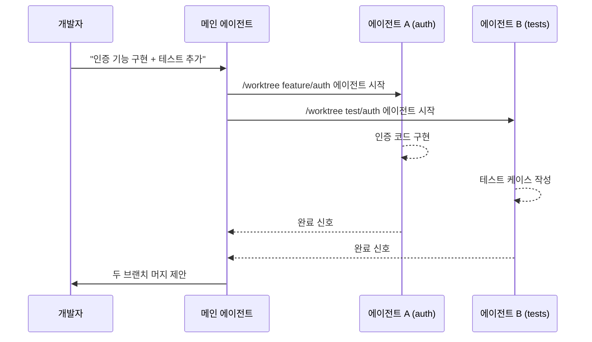

# Cursor Cloud Agents & Parallel Worktree Agents

로컬·worktree·클라우드 VM·원격 SSH 환경에서 다수의 [[coding-agent|코딩 에이전트]]를 병렬 실행하는 Cursor의 에이전트 우선 UI.

## 개요

Cursor 3.0(2026년 4월 2일)은 단일 에이전트 실행에서 **병렬 멀티 에이전트 실행**으로 패러다임을 전환한 주요 릴리스다. 핵심은 두 가지다:

1. **로컬 Worktree 에이전트**: `/worktree` 명령으로 동일 리포지토리의 독립 브랜치를 체크아웃하여 에이전트를 병렬 실행. 파일 충돌 없이 기능 A와 기능 B를 동시에 작업 가능.
2. **Cloud Agent (Self-hosted)**: 회사 네트워크 안에 위치한 클라우드 VM에서 에이전트를 실행. 사내 툴·데이터베이스·VPN 자원에 직접 접근하면서 보안 경계 내 유지.

## Cursor 3.0 주요 기능

```mermaid
flowchart TD
    Cursor3[Cursor 3.0] --> AgentsWindow[Agents Window]
    Cursor3 --> DesignMode[Design Mode]
    Cursor3 --> WorktreeCmd[/worktree 명령]
    Cursor3 --> BestOfN[/best-of-n 명령]
    Cursor3 --> AwaitTool[Await 도구]
    Cursor3 --> CloudAgent[Cloud Agent Self-hosted]

    WorktreeCmd --> ParallelA[에이전트 A - 기능 X 브랜치]
    WorktreeCmd --> ParallelB[에이전트 B - 기능 Y 브랜치]
    WorktreeCmd --> ParallelC[에이전트 C - 버그픽스 브랜치]
    BestOfN --> |"N개 병렬 시도 후 최선 선택"| MergeResult[결과 병합]
```

## 핵심 기능 상세

### Agents Window
여러 에이전트의 실행 상태를 단일 UI에서 모니터링하는 패널. 각 에이전트의 현재 단계, 도구 호출, 출력을 실시간으로 확인할 수 있다.

### /worktree 명령
하나의 리포지토리에서 독립된 git worktree를 생성하고, 각 worktree에 에이전트를 할당한다. [[git-worktree-isolation|Git Worktree 격리 패턴]]의 공식 UI 구현이다.

```
# 예시 사용법 (개념)
/worktree feature/auth    # 인증 기능 에이전트 시작
/worktree fix/cache-bug   # 버그픽스 에이전트 병렬 시작
```

### /best-of-n 명령
동일 태스크를 N개 에이전트가 병렬 시도한 후, 평가 기준에 따라 최선의 결과를 선택한다. 고난도 구현에서 품질을 높이는 앙상블(ensemble) 전략.

### Await 도구
한 에이전트가 다른 에이전트의 완료를 기다리는 동기화 도구. 의존성 있는 작업(예: 스키마 변경 -> API 구현 -> UI 구현)을 순서 보장하며 병렬화.

### Cloud Agent (Self-hosted)
2026년 3월 25일 출시. 회사 인프라 내 VM에서 에이전트를 실행하므로:
- 사내 API, DB, 파일 서버에 직접 접근 가능
- 소스코드가 Cursor 서버로 전송되지 않아 보안 요구사항 충족
- 원격 개발자도 동일 환경에서 에이전트 실행 가능

## 워크플로 예시



## 경쟁 도구 비교

| 항목 | Cursor 3.0 | Claude Code | GitHub Copilot Workspace |
|---|---|---|---|
| 병렬 에이전트 | 공식 지원 (/worktree, /best-of-n) | 서브에이전트로 지원 | 제한적 |
| Cloud 실행 | Self-hosted VM | 로컬 중심 | GitHub Actions 연동 |
| UI | Agents Window | 터미널 기반 | 웹 기반 |
| 컨텍스트 | 전체 코드베이스 인덱싱 | CLAUDE.md 기반 | 이슈/PR 기반 |

## 왜 지금 중요한가

2026년 4월 2일 Cursor 3.0이 Agents Window·Design Mode·`/worktree`·`/best-of-n` 명령·Await 툴을 정식 출시했고, 3월 25일에는 self-hosted cloud agent까지 등장하면서 "에이전트 병렬 실행"이 본격적 프로덕션 워크플로가 됐다.

## 대표 레퍼런스

- [Cursor 3.0 Changelog](https://cursor.com/changelog/3-0)
- [Cursor Changelog](https://cursor.com/changelog)
- [Cursor Cloud Agents Blog](https://cursor.com/blog/cloud-agents)
- [Cursor Product Page -- Agent](https://cursor.com/product)
- [Cursor Homepage](https://cursor.com)

## 관련 문서

- [[git-worktree-isolation|Git Worktree Isolation for Parallel Coding Agents]]
- [[subagents|Subagents & Multi-Agent Orchestration]]
- [[orchestrator-worker-pattern|Orchestrator-Worker 패턴]]
