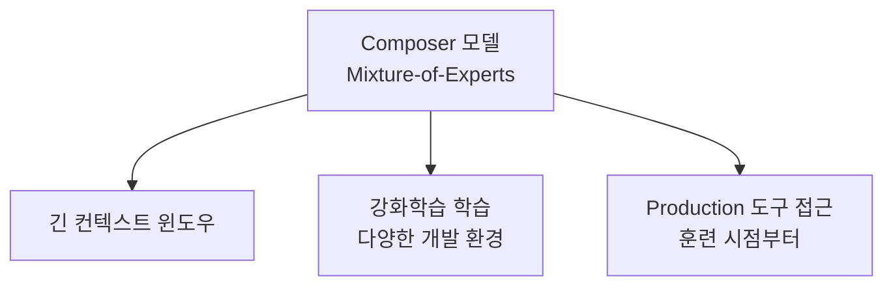
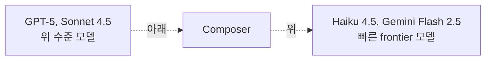

# Cursor Composer (Frontier Coding Model with RL)

Cursor가 Cursor 2.0과 함께 2025년 10월 29일 공개한 **자체 코딩 에이전트 모델**. 핵심 주장:

> "Composer achieves frontier coding results with generation speed four times faster than similar models."

기존 클로즈드 SOTA 대비 **4배 빠른 생성 속도**, 30초 미만 인터랙션을 목표로 한다.

## 아키텍처

- **Mixture-of-Experts (MoE)** 언어 모델
- 긴 컨텍스트 윈도우 지원
- **강화학습(RL)**으로 다양한 개발 환경에서 특화 훈련

## 트레이닝 인프라

자체 트레이닝 시스템 (PyTorch + Ray) — 대규모 비동기 강화학습:

- **Native low-precision training**: "MXFP8 MoE kernels with expert parallelism and hybrid sharded data parallelism"
- **Scale**: "thousands of NVIDIA GPUs with minimal communication cost"
- **RL 환경**: 수십만 개의 동시 샌드박스 코딩 환경

## 트레이닝 시 도구 접근

훈련 중 모델은 **production search/edit 도구**를 직접 사용해 어려운 문제를 효율적으로 해결하도록 학습한다:
- 파일 읽기/편집
- 터미널 명령어 실행
- 코드베이스 전반 시맨틱 검색

훈련을 통해 학습되는 자율 능력:
- 복잡한 검색
- 린터 에러 수정
- 단위 테스트 작성·실행

## Cursor Bench (내부 벤치마크)

- 실제 Cursor 엔지니어/연구자의 에이전트 요청
- 손으로 큐레이션된 최적 솔루션
- 평가: **정확성** + **기존 코드 추상화 준수도**

## 성능 포지셔닝

- 빠른 frontier 모델(Haiku 4.5, Gemini Flash 2.5)보다는 위
- GPT-5, Sonnet 4.5에 비해서는 아래

## Cursor 2.0 통합

Cursor 2.0의 핵심 신기능:
- **Composer 모델** (이 페이지)
- **Multi-Agent Interface** — UI가 파일 브라우징보다 에이전트 우선으로 재설계
  - 다수 에이전트 병행 운영 (git worktrees 또는 원격 머신)
  - 충돌 회피
  - 핵심 발견: "동일 문제에 병렬 모델 실행 후 우수 출력 선택이 복잡 작업에서 결과를 크게 개선"
- **Code Review** — 에이전트 생성 변경 검토 효율화
- **Browser Testing** — 네이티브 브라우저 도구로 구현 테스트

## 후속: Composer 2

후속 공개 시 **Kimi K2.5 base에서 continued pretraining 후 RL** 적용. Composer 1.5에서는 [[cursor-online-rl|real-time RL]]로 5시간마다 새 체크포인트 배포.

## 메모

- Composer 발표일: 2025년 10월 29일 (Cursor 2.0 동시 공개)
- Multi-agent 워크플로우는 Cursor 2.0의 "agent-first architecture"로의 전환점
- 학습 도구 = production 도구라는 일치성이 핵심 차별

## 관련 문서

- [[cursor]] — Cursor IDE entity
- [[cursor-online-rl]] — 5시간 체크포인트 사이클 (real-time RL)
- [[cursor-3-2-release]] — Cursor 3.2 (후속 릴리스)
- [[mixture-of-experts]] — MoE 아키텍처
- [[long-horizon-rl-training-for-agents]] — 멀티턴 RL 학습
- [[swe-bench-ecosystem-2026]] — 코딩 벤치마크 생태계
