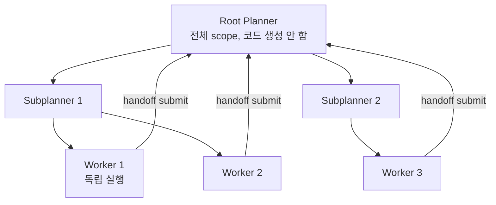

# Cursor AI IDE

Anysphere가 개발한 AI 우선(AI-first) 코드 에디터. VS Code를 포크하여 빌드되었으며, 다중 파일 인식 에이전트 모드(Composer/Agent)를 핵심 기능으로 제공한다. 단순한 코드 자동완성을 넘어 **코드베이스 전체를 컨텍스트로 삼아 자율적으로 파일을 생성·수정·실행하는 에이전트 IDE**를 지향한다.

## 개요

| 항목 | 내용 |
|---|---|
| 이름 | Cursor |
| 개발사 | Anysphere |
| 기반 | VS Code 포크 |
| 유료 플랜 | Pro ($20/월), Business ($40/유저/월) |
| 지원 모델 | Claude (Anthropic), GPT-4o (OpenAI), Gemini, 커스텀 |
| 최신 버전 | 3.x (2026년 4월 기준) |

## 주요 기능 개요

```mermaid
flowchart TD
    Cursor[Cursor IDE] --> Tab[Tab 자동완성\n다음 편집 예측]
    Cursor --> Chat[Chat\n인라인 코드 질문]
    Cursor --> Composer[Agent 모드\n다중 파일 자율 편집]
    Cursor --> Worktree[/worktree\n병렬 에이전트]
    Cursor --> CloudAgent[Cloud Agent\nVM 기반 원격 에이전트]

    Composer --> FileOp[파일 생성/수정/삭제]
    Composer --> Terminal[터미널 명령 실행]
    Composer --> Linter[린트/빌드 오류 자동 수정]
```

## Composer / Agent 모드

Cursor의 핵심 차별점. `Cmd+I`(macOS)로 Agent 모드를 열면 [[coding-agent|코딩 에이전트]]가 활성화된다.

- **코드베이스 전체 인식**: 대형 리포지토리에서도 관련 파일을 자동으로 컨텍스트에 포함
- **다중 파일 편집**: 단일 요청으로 여러 파일을 동시에 생성·수정
- **터미널 실행**: 빌드, 테스트, 패키지 설치 명령을 직접 실행하고 결과를 피드백으로 활용
- **자동 오류 수정**: 린터, 타입 오류, 빌드 실패를 에이전트가 자동으로 수정 시도

```
User: "User 인증 기능을 JWT 기반으로 구현해줘.
       - src/auth/ 디렉토리에 생성
       - 미들웨어, 컨트롤러, 서비스 레이어 분리
       - Jest 테스트 포함"

Agent:
  1. src/auth/auth.service.ts 생성
  2. src/auth/auth.controller.ts 생성
  3. src/auth/auth.middleware.ts 생성
  4. src/auth/__tests__/auth.service.test.ts 생성
  5. npm test 실행 → 실패 시 자동 수정
```

## @기호 컨텍스트 시스템

Cursor는 `@` 기호로 다양한 컨텍스트를 명시적으로 참조한다.

| 컨텍스트 | 설명 |
|---|---|
| `@파일명` | 특정 파일 참조 |
| `@폴더명` | 폴더 전체 참조 |
| `@코드베이스` | 전체 리포지토리 시맨틱 검색 |
| `@웹` | 실시간 웹 검색 결과 |
| `@문서` | 커스텀 문서 임베딩 |
| `@Git` | Git 히스토리, diff 참조 |
| `@터미널` | 마지막 터미널 출력 |

## Cursor Rules (.cursorrules)

프로젝트별 에이전트 행동 규칙을 정의하는 파일. [[claude-code|Claude Code]]의 `CLAUDE.md`와 유사한 역할이다.

```markdown
# .cursorrules 예시
- TypeScript strict mode 사용
- 함수형 컴포넌트 + hooks 패턴
- 모든 비동기 작업은 error boundary 포함
- 테스트 파일은 __tests__ 디렉토리에 위치
- 커밋 메시지는 conventional commits 형식
```

Cursor 0.45 이후 `.cursorrules`는 `.cursor/rules/*.mdc` 형식으로 마이그레이션 중이다.

## Cursor 3.0: 병렬 에이전트

Cursor 3.0(2026년 4월)에서 추가된 병렬 멀티에이전트 기능이다. 상세 내용은 [[cursor-cloud-agents-and-parallel-worktree-agents|Cursor Cloud Agents & Parallel Worktree Agents]] 참조.

```mermaid
flowchart LR
    User --> Cursor3[Cursor 3.0]
    Cursor3 --> Worktree1[Worktree 에이전트 1\n기능 A 브랜치]
    Cursor3 --> Worktree2[Worktree 에이전트 2\n기능 B 브랜치]
    Cursor3 --> CloudVM[Cloud Agent\n회사 네트워크 VM]
    Cursor3 --> BestOfN[/best-of-n\n동일 작업 병렬 실행\n최선 결과 선택]
```

## VS Code 대비 추가 기능

| 기능 | VS Code | Cursor |
|---|---|---|
| AI 자동완성 | GitHub Copilot(별도) | 내장 Tab |
| 에이전트 편집 | 없음 | Composer/Agent |
| 코드베이스 검색 | 텍스트 검색 | 시맨틱 + 텍스트 |
| 멀티파일 에이전트 | 없음 | 기본 기능 |
| 병렬 워크트리 에이전트 | 없음 | Cursor 3.0 |
| 확장 호환성 | VS Code 확장 전체 | VS Code 확장 대부분 |

## Cursor vs Claude Code

[[claude-code|Claude Code]]는 터미널 기반 CLI 에이전트인 반면, Cursor는 GUI 기반 에디터다.

- **Cursor**: 비주얼 편집, 실시간 인라인 diff, 파일 트리 탐색 선호하는 개발자
- **Claude Code**: 터미널 중심 워크플로우, 스크립트 자동화, 서버 환경
- **혼합 사용**: Cursor로 대화형 개발 + Claude Code로 배치 작업

## 실무 관점

Cursor는 **GUI 환경에서 코드베이스 전체를 에이전트가 인식하며 개발**하는 경험을 제공한다. VS Code 생태계와 호환되므로 기존 확장과 설정을 그대로 사용할 수 있다. 에이전트 모드는 반복적인 보일러플레이트 생성, 리팩토링, 버그 수정에서 생산성을 크게 높인다. 다만 에이전트가 예상치 못한 파일을 수정하거나 터미널 명령을 실행할 수 있으므로, 민감한 프로덕션 환경에서는 에이전트 실행 전 변경사항을 항상 검토해야 한다.

## 자체 모델 — Composer

Cursor는 2026년 봄 자체 frontier 모델 **Composer**를 공개했다.

### 아키텍처

> "Composer is a mixture-of-experts (MoE) language model supporting long-context generation and understanding."

[[mixture-of-experts]] 아키텍처에 RL을 결합. 코딩 태스크에 직접 최적화.

### 학습 인프라

- **MXFP8 MoE 커널** + expert parallelism + hybrid sharded data parallelism으로 저정밀 훈련 가속
- PyTorch + Ray 기반 비동기 RL을 수천 NVIDIA GPU에서 실행
- VM scheduler 재작성: "support the bursty nature and scale of training runs"
- "running hundreds of thousands of concurrent sandboxed coding environments" - RL 훈련 환경 규모

### 결과

- 유사 지능 모델 대비 **4배 빠름**
- "without requiring post-training quantization" - 저정밀 학습으로 quantization 불필요
- RL이 "efficient choices in tool use and to maximize parallelism whenever possible"을 직접 보상

## Agent harness — 모델별 튜닝

Cursor 엔지니어링 블로그(continually-improving-agent-harness)에서 정의:

> 하네스는 "the foundational infrastructure connecting language models to coding tasks. It encompasses system prompts, tool descriptions, context management, and execution frameworks that enable agents to build software effectively."

### 새 모델 채택 프로세스

> "spend weeks customizing our harness to a model's strengths and quirks until the same model inside our specially tuned harness is noticeably faster, smarter, and more efficient."

### 모델별 도구 포맷 분기

> "OpenAI's models are trained to edit files using a patch-based format, while Anthropic's models are trained on string replacement"

→ 모델 패밀리별로 선호 포맷을 별도 제공.

### Reliability sprint

> "all tool calls to at least 2 or often 3 9s of reliability" — 99.9% / 99.99% 안정성. 자동 분류 + 이상치 탐지로 unexpected error를 자릿수 단위로 감소.

## CursorBench — 자체 평가

> "public benchmarks alongside our own eval suite, CursorBench, which gives us a fast, standardized read on quality and lets us compare across time."

A/B 메트릭: latency, token efficiency, tool call count.

## Sandbox 시스템

플랫폼별 구현:

| OS | 메커니즘 |
|---|---|
| **macOS** | Seatbelt (`sandbox-exec`, 2007년 Apple 도입, Chrome도 사용) |
| **Linux** | Landlock + seccomp 조합 (workspace를 overlay filesystem으로 매핑) |
| **Windows** | WSL2 안에 Linux sandbox 실행 (네이티브 primitive 부족) |

> "Seccomp blocks unsafe syscalls, while Landlock enforces filesystem restrictions, letting us make ignored files completely inaccessible to the sandboxed process."

### 정책

- 워크스페이스 설정 + `.cursorignore`로부터 런타임 동적 생성
- 보호 대상: `.vscode`, `.git/config`, `.cursorignore` 등
- 인터넷 접근은 대부분 approval 필요

### 결과

> "Sandboxed agents stop 40% less often than unsandboxed ones, saving users hours of manual review and approval."

> "We now see a third of requests on supported platforms running with the sandbox" — NVIDIA 등 엔터프라이즈 고객 포함.

## Self-driving codebases — 계층 멀티 에이전트

[[parent-child-spawn-pattern]] 형태의 계층 구조:



### 핵심 발견 (vs naive long-horizon agent)

Claude Opus 4.5 단일 long-horizon 실패:

> "The model lost track of what it was doing, frequently stopped to proclaim success despite being far from it, and got stuck on complex implementation details."

→ 단일 에이전트 long reasoning 대신 role 특화 + 계층 planning. Workers는 "unaware of the larger system".

### Context freshness mechanisms

- Frequent scratchpad rewrites (append 대신 rewrite)
- Automatic summarization at context limits
- Self-reflection reminders in system prompts
- 가정에 대한 challenging 장려

### Anti-fragility

> "As we scale the number of agents running simultaneously, we also increase the probability of failure. Our system needs to withstand individual agents failing, allowing others to recover."

→ "small but stable rate of errors" 허용이 직렬 quality-checking보다 빠른 수렴.

### Integrator role 폐기

> "an integrator role for quality control" 시도 → "it created more bottlenecks than it solved."

단순함이 신뢰성. **Judge agent**로 cycle 끝에서 progress 평가.

### 실험 스케일

- ~1,000 commits/hour, 일주일 동안 thousands of agents가 web browser 프로젝트 자율 개발
- 단일 큰 Linux VM이 분산 시스템보다 효과적 (동시 컴파일의 disk I/O가 bottleneck)

## Codex 모델 적응 (codex-model-harness)

OpenAI Codex 모델에 Cursor가 발견한 핵심 lesson:

### Tool 이름을 shell 컨벤션에 맞춤

> "made the names and definitions of tools in Cursor closer to their shell equivalents like `rg` (ripgrep)."

> "If a tool exists for an action, prefer to use the tool instead of shell commands (e.g. read_file over `cat`)."

### Reasoning trace 보존이 핵심

> Reasoning trace 제거 시 "30% performance drop" on CursorBench.

→ Codex 모델은 reasoning trace를 다음 turn 컨텍스트로 받아야 일관성 유지.

### Linter on edit

> "After substantive edits, use the read_lints tool to check recently edited files for linter errors"

→ [[swe-agent|SWE-agent]] ACI lesson을 명시적 도구로 노출.

## Dynamic context discovery

핵심 발견: **정적 풀 컨텍스트 대신 lazy-load**.

### 메커니즘

- 정적 컨텍스트 최소화. MCP 도구는 "only receive a small bit of static context, including names of the tools."
- MCP 서버 100개 연결되어도 모든 도구 schema를 prompt에 넣지 않음. 이름만 노출, agent가 필요시 schema fetch
- 긴 응답을 truncate하지 않고 accessible 파일로 변환
- MCP 도구를 "one folder per server"로 논리 그룹핑

### 결과

> MCP tool runs에서 "reduced total agent tokens by 46.9%"

품질도 향상 — "confusing or contradictory information" 제거.

## Indexing & 검색

### 임베딩 파이프라인

- 코드 청크 + 파일명 모두 obfuscation/암호화 후 서버 전송
- 서버: 복호화 → 임베딩 생성 (OpenAI 또는 자체 모델) → Turbopuffer 벡터 DB
- "the server does not store any source code" — 임베딩만 저장, 매칭 후 클라이언트에서 파일 fetch

### Merkle tree sync

> "Every 3 minutes, Cursor does an index sync" - 변경 파일만 재인덱싱.

## 인프라 스케일

- **Inference**: AWS + Azure에서 수만 NVIDIA H100 ("Azure GPUs are solely for inference")
- **Anyrun** - Rust 작성 orchestrator, 백그라운드 에이전트 launch 담당
- **Throughput**: "1M transactions per second", "100x growth in users and load in 12 months"
- **DB 마이그레이션**: Yugabyte → PostgreSQL (스케일 한계)
- **Monolithic 백엔드** (팀 속도 우선)

## Long-horizon scaling — 모델별 차이

> "Model choice matters for extremely long-running tasks."

- GPT-5.2가 extended work에 우월
- "Opus 4.5 tends to stop earlier and take shortcuts when convenient."

→ 단일 모델이 모든 시나리오에 최적이지 않음. 하네스가 모델별 행동 차이를 capability map에 기록.

## Priompt — Prompt compilation

> Priompt (open-sourced at github.com/anysphere/priompt) compiles prompts as JSX components where each element has a priority score. When the total context exceeds the model's token budget, lower-priority elements get dropped via binary search.

## 관련 문서

- [[coding-agent|코딩 에이전트]]
- [[claude-code|Claude Code]]
- [[cursor-cloud-agents-and-parallel-worktree-agents|Cursor Cloud Agents & Parallel Worktree Agents]]
- [[cursor-3-2-release|Cursor 3.2 릴리스]]
- [[cursor-composer-model|Cursor Composer (Frontier RL Model)]] — 자체 코딩 모델
- [[cursor-online-rl|Real-Time Online RL]] — Composer 1.5의 5시간 사이클
- [[vibe-coding-platforms|Vibe Coding 플랫폼]]
- [[mixture-of-experts|MoE 아키텍처]]
- [[parent-child-spawn-pattern|Planner-Worker 패턴]]
- [[swe-agent|SWE-agent ACI]]
- [[mcp-protocol|MCP]]
- [[coding-harness-comparison|코딩 에이전트 하네스 횡단 비교]]
