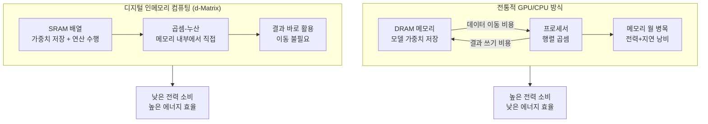
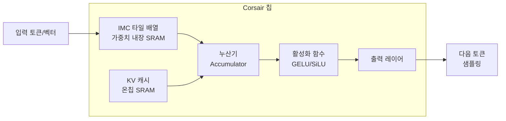

# d-Matrix Corsair

## 정체성

| 항목 | 내용 |
|------|------|
| 회사 | d-Matrix (미국 캘리포니아 산타클라라, 2019년 창립) |
| 제품명 | Corsair (코세어) |
| 제품 유형 | 추론 전용 AI 가속기 칩 (ASIC) |
| 핵심 기술 | 디지털 인메모리 컴퓨팅 (Digital In-Memory Computing) |
| 투자자 | Microsoft, Playground Global 등 |
| 라이선스 | 독점 하드웨어 |
| 주요 대상 | 데이터센터 AI 추론 최적화 |

d-Matrix는 "추론 전용(inference-only)" AI 가속기를 개발하는 반도체 스타트업이다. NVIDIA GPU는 학습과 추론 모두에 사용되는 범용 가속기인 반면, d-Matrix의 Corsair는 처음부터 LLM 추론 워크로드만을 위해 설계된 ASIC이다. 핵심 차별화 기술은 **디지털 인메모리 컴퓨팅(Digital In-Memory Computing, DIMC)**으로, 데이터를 메모리로 이동시키는 대신 메모리 안에서 직접 계산을 수행한다.

## 핵심 기술: 디지털 인메모리 컴퓨팅

전통적인 폰 노이만(von Neumann) 아키텍처에서는 메모리와 프로세서가 분리되어 있어, 데이터를 메모리에서 프로세서로 이동시키는 비용이 전체 전력과 시간의 상당 부분을 차지한다. 이를 "메모리 월(memory wall)" 문제라고 부른다.



위 다이어그램은 DIMC가 메모리-프로세서 간 데이터 이동을 제거함으로써 LLM 추론에서 에너지 효율을 어떻게 개선하는지를 보여준다.

### 왜 LLM 추론에 특히 효과적인가

LLM 추론의 핵심 연산은 **행렬-벡터 곱셈(matrix-vector multiplication, MVM)**이다. 추론 시에는 학습과 달리 배치 크기가 1이거나 매우 작은 경우가 많다. 이 경우:

- GPU의 텐서 코어는 대형 행렬 곱에 최적화되어 있어 소규모 추론에서 활용률이 낮다.
- 가중치 행렬(모델 파라미터)을 매번 메모리에서 읽어오는 비용이 지배적이다.

DIMC는 가중치를 SRAM 배열 안에 고정하고 입력 벡터만 흘려보내는 방식으로, 이 문제를 구조적으로 해결한다.

## Corsair 칩 아키텍처



Corsair는 여러 IMC(In-Memory Computing) 타일로 구성되며, 각 타일은 SRAM 기반 연산 단위를 포함한다. 칩 전체가 추론 파이프라인만을 위해 설계되어 있다.

### 주요 특성

| 사양 | 내용 |
|------|------|
| 제품 타입 | 추론 전용 ASIC |
| 핵심 기술 | Digital In-Memory Computing |
| 목표 성능 | GPU 대비 높은 에너지 효율 (tokens/watt) |
| 메모리 | 대용량 SRAM 기반 온칩 스토리지 |
| 배포 형태 | PCIe 카드 (데이터센터용) |

[교차검증 필요] 구체적인 사양 수치(TOPS, 메모리 용량, 전력)는 아직 d-Matrix가 공식적으로 공개하지 않은 부분이 있다. 공식 사이트(d-matrix.ai)와 최신 발표자료에서 확인하라.

## 데이터센터 효율성 포지셔닝

d-Matrix의 핵심 가치 제안은 "같은 전력 예산에서 더 많은 추론 처리량"이다. 데이터센터 운영자 입장에서 전력 비용은 TCO(총 소유 비용)의 큰 부분을 차지한다.

```mermaid
flowchart TD
    subgraph 비교["에너지 효율 포지셔닝"]
        GPU[NVIDIA H100\n범용, 높은 성능\n높은 전력(700W)]
        Corsair[d-Matrix Corsair\n추론 전용\n낮은 전력 목표]
        CPU[CPU 추론\n낮은 처리량]
    end
    GPU --> Case1[학습 + 고처리량 배치 추론]
    Corsair --> Case2[저지연 실시간 추론\n에너지 효율 우선]
    CPU --> Case3[경량 모델 추론]
```

d-Matrix는 "tokens per watt(와트당 토큰 수)"를 핵심 경쟁력으로 내세운다. 이는 데이터센터 전력 밀도가 AI 워크로드로 인해 임계점에 달한 상황에서 중요한 차별점이다.

## Microsoft 투자 배경

Microsoft는 d-Matrix의 주요 투자자 중 하나다. 이는 Microsoft가 Azure AI 인프라에서 NVIDIA GPU 의존도를 줄이고 다각화하려는 전략의 일환으로 해석된다.

Azure는 이미 커스텀 AI 칩(Maia 100) 개발을 진행 중이며, d-Matrix 투자는 추론 전용 ASIC 생태계에 베팅하는 포트폴리오 투자로 볼 수 있다.

## 경쟁 포지셔닝

| 항목 | d-Matrix Corsair | Cerebras WSE-3 | Groq LPU | NVIDIA H100 |
|------|-----------------|----------------|----------|------------|
| 목적 | 추론 전용 | 추론/학습 | 추론 특화 | 범용 |
| 핵심 기술 | DIMC (인메모리) | 웨이퍼스케일 | 선형 실행 엔진 | CUDA 텐서코어 |
| 에너지 효율 | 높음 (목표) | 높음 | 높음 | 보통 |
| 모델 유연성 | 제한적 | 제한적 | 제한적 | 높음 |
| 생태계 | 초기 단계 | 성장 중 | 성장 중 | 성숙 |
| 가격 | 미공개 | 고가 | 중간 | 고가 |

## 현재 상태 및 전망

d-Matrix는 2023-2024년에 Corsair 실리콘을 공개하고 초기 고객 파일럿을 진행했다. 2026년 기준으로는 초기 상용화 단계에 있다.

**주의**: d-Matrix는 아직 대규모 상용 배포 사례가 제한적이며, 기술적 성숙도와 소프트웨어 스택(컴파일러, 런타임)이 NVIDIA 생태계 대비 덜 완성되어 있다. 도입을 검토할 경우 파일럿 단계에서 실제 워크로드 벤치마크를 반드시 수행해야 한다.

## 한계 및 트레이드오프

### 현재 제약

- **소프트웨어 생태계 미성숙**: CUDA/cuDNN 수준의 성숙한 ML 프레임워크 지원이 없음.
- **모델 지원 범위**: 특정 트랜스포머 아키텍처에 최적화, 새로운 모델 구조 지원에 시간 필요.
- **레퍼런스 부족**: 대규모 상용 배포 사례가 아직 제한적.
- **제품 로드맵 불투명**: 스타트업 특성상 일정 변동 가능성.

### 장기 관전 포인트

- NVIDIA GPU 대비 에너지 효율 실측 비교 데이터 공개 여부
- 주요 클라우드 프로바이더(Azure, AWS, GCP) 파트너십 체결 여부
- PyTorch/TensorFlow 네이티브 지원 수준

## 관련 문서

- [[ai-accelerators]] -- GPU 외 AI 가속기 전체 생태계 개요
- [[cerebras-cloud-inference]] -- WSE-3 웨이퍼스케일 기반 초고속 추론
- [[sambanova-systems-cloud]] -- RDU 데이터플로우 칩 기반 엔터프라이즈 AI
- [[tenstorrent-grayskull]] -- 오픈소스 철학의 차세대 AI 칩
- [[groq-cloud-api]] -- LPU 기반 고속 추론 서비스
