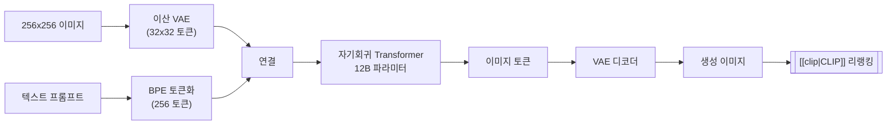

# DALL-E

## 개요

DALL-E는 OpenAI가 개발한 [[ai-image-generation|AI 이미지 생성]] 시스템 시리즈다. 2021년 1월 DALL-E 1 공개로 시작하여 DALL-E 2(2022), DALL-E 3(2023)로 발전했으며, 2025년 3월 GPT Image 1으로 후속 진화했다. 각 세대는 근본적으로 다른 아키텍처를 채택하며 생성 품질과 프롬프트 충실도를 크게 향상시켰다.

ChatGPT Plus/Enterprise에 통합되어 대화형 이미지 생성을 가능하게 한 것이 경쟁사 대비 핵심 차별점이며, Microsoft의 Bing Image Creator, Designer 앱 등을 통해 광범위한 사용자 기반을 확보했다.

## 버전 진화

### DALL-E 1 (2021.01)

DALL-E 1은 GPT-3를 변형한 자기회귀(autoregressive) 모델이다.

텍스트와 이미지 토큰을 하나의 시퀀스로 연결하고, 12B 파라미터 자기회귀 Transformer가 이미지 토큰을 순차 생성한 뒤 CLIP으로 최적 결과를 선별하는 구조다.

- **세 컴포넌트**: 이산 VAE(이미지를 32x32 토큰으로 압축), 12B 파라미터 자기회귀 Transformer, [[clip|CLIP]] 인코더 쌍
- **방식**: 텍스트 토큰(256개)과 이미지 토큰(1,024개)을 하나의 시퀀스로 연결하여 자기회귀적으로 생성
- **핵심 발견**: "개념, 속성, 스타일을 결합"하여 새로운 이미지를 생성할 수 있음을 입증

### DALL-E 2 (2022.04)

아키텍처를 자기회귀 Transformer에서 [[diffusion-models|확산 모델]]로 전환했다.

- **규모**: 3.5B 파라미터로 전작(12B) 대비 축소되었으나 품질은 대폭 향상
- **구조**: [[clip|CLIP]] 이미지 임베딩을 조건으로 받는 확산 모델. Prior 모델이 텍스트 임베딩에서 이미지 임베딩을 생성하고, Decoder가 이를 이미지로 변환
- **새 기능**: 인페인팅(inpainting), 아웃페인팅(outpainting), 이미지 변형(variations)
- **한계**: 색상 귀속 오류("빨간 큐브 위의 파란 공"에서 색이 뒤바뀜), 3개 이상 객체 처리 어려움, 텍스트 렌더링 부정확

### DALL-E 3 (2023.08)

프롬프트 충실도에 집중한 업그레이드다. 기술적 상세는 제한적으로 공개되었다.

- **핵심 개선**: "이전보다 훨씬 더 많은 뉘앙스와 디테일을 이해"하는 프롬프트 해석 능력
- **ChatGPT 통합**: ChatGPT Plus/Enterprise에 네이티브 통합. 대화 맥락에서 이미지 생성 및 반복 수정 가능
- **안전 조치**: 생존 아티스트 스타일 모방 차단, C2PA 메타데이터 워터마크(2024.02~), 공인 얼굴 생성 차단
- **배포**: ChatGPT Plus, Microsoft Copilot, Bing Image Creator, OpenAI API

### GPT Image 1 (2025.03): 후속 진화

DALL-E 시리즈의 후속으로, [[gpt-4o|GPT-4o]] 계열의 네이티브 멀티모달 아키텍처에 이미지 생성 능력을 통합한 모델이다. 별도의 이미지 생성 파이프라인이 아닌, 언어 모델 자체가 이미지를 생성하는 방향으로 패러다임이 전환되었다.

이 전환은 중요한 아키텍처적 시사점을 갖는다. DALL-E 1에서 3까지는 "텍스트를 이해하는 별도의 이미지 생성 모델"이었으나, GPT Image는 "이미지도 생성할 수 있는 언어 모델"이다. 대화 맥락을 유지하면서 이미지를 반복 수정하거나, 이전 대화에서 언급한 요소를 이미지에 반영하는 등 대화형 이미지 생성이 자연스럽게 가능해졌다. 이는 [[midjourney|Midjourney]]나 [[stable-diffusion|Stable Diffusion]]의 프롬프트 기반 단발성 생성과 근본적으로 다른 사용자 경험을 제공한다.

## 아키텍처 비교

| 항목 | DALL-E 1 | DALL-E 2 | DALL-E 3 |
|------|----------|----------|----------|
| 아키텍처 | 자기회귀 Transformer | 확산 모델 | 확산 모델 (상세 미공개) |
| 파라미터 | 12B | 3.5B | 미공개 |
| 해상도 | 256x256 | 1024x1024 | 1024x1024+ |
| 텍스트 인코더 | GPT 내장 | [[clip\|CLIP]] | 미공개 (개선된 캡션 이해) |
| 프롬프트 충실도 | 낮음 | 중간 | 높음 |
| 공개 수준 | 논문 공개 | 제한적 API | ChatGPT 통합 |

## 핵심 능력과 한계

**강점**:
- 다양한 스타일 생성 (사진, 회화, 이모지, 일러스트 등)
- 이미지 조작: 인페인팅, 아웃페인팅, 변형
- 문맥적 이해: 그림자, 반사, 질감의 자동 추론
- DALL-E 3의 복잡한 프롬프트 해석 능력
- 시각적 추론: Raven 점진적 행렬 테스트 해결 가능

**한계**:
- 텍스트/타이포그래피 생성 부정확 (DALL-E 3에서 개선)
- 3개 이상 객체의 정확한 배치 어려움
- 과도한 콘텐츠 필터링에 대한 사용자 불만
- 폐쇄형 모델로 커스터마이징 불가 (Stable Diffusion 대비)

## 경쟁 비교

| 측면 | DALL-E 3 | [[stable-diffusion\|Stable Diffusion]] | [[midjourney\|Midjourney]] |
|------|----------|-------|-----------|
| 접근성 | ChatGPT 통합, 최대 사용자 기반 | 로컬 설치, 무료 | Discord/웹, 구독제 |
| 커스터마이징 | 제한적 | ControlNet/LoRA 등 무제한 | 파라미터 조절, 스타일 참조 |
| 프롬프트 충실도 | 높음 (대화 맥락 활용) | 중간 (SD 3.x에서 향상) | 높음 (V6+) |
| 미적 품질 | 양호 | 파인튜닝 의존 | 업계 선도 |
| 오픈소스 | X | O | X |

## 안전과 윤리

- **콘텐츠 필터링**: 유해 콘텐츠, 공인 얼굴, 특정 아티스트 스타일 생성 차단
- **C2PA 워터마크**: 2024년 2월부터 보이지 않는 메타데이터 워터마크 삽입
- **편향 문제**: 남성, 백인, 젊은 여성의 과대 표현이 보고됨
- **저작권 논쟁**: 학습 데이터에 포함된 아티스트 작품의 무단 사용 이슈

## 참고 자료

- Ramesh, A. et al. (2021). [Zero-Shot Text-to-Image Generation](https://arxiv.org/abs/2102.12092). ICML 2021
- [DALL-E - Wikipedia](https://en.wikipedia.org/wiki/DALL-E)
- Ramesh, A. et al. (2022). [Hierarchical Text-Conditional Image Generation with CLIP Latents](https://arxiv.org/abs/2204.06125). (DALL-E 2)

## 관련 문서

- [[clip]] -- DALL-E 2의 핵심 조건 인코더
- [[diffusion-transformer]] -- DALL-E 3 이후의 생성 아키텍처 방향
- [[vision-transformer]] -- CLIP 이미지 인코더의 기반
