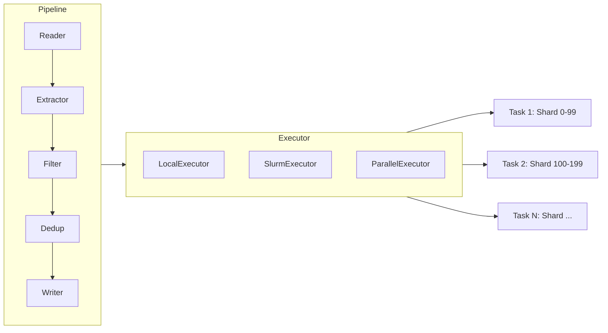
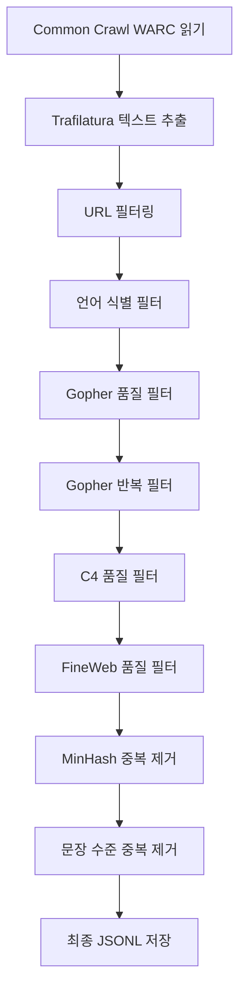

# DataTrove - 대규모 데이터 처리 라이브러리

## 개요

DataTrove는 HuggingFace가 개발한 대규모 텍스트 데이터 처리, 필터링, 중복 제거 라이브러리이다. "스크립팅 지옥에서 데이터 처리를 해방한다(Freeing data processing from scripting madness)"라는 슬로건 아래, 플랫폼에 구애받지 않는 커스터마이저블 파이프라인 처리 블록을 제공한다. 로컬 환경부터 Slurm 클러스터까지 동일한 코드로 실행 가능하며, 상대적으로 낮은 메모리 사용량과 다단계 설계 덕분에 LLM 학습 데이터 처리 같은 대규모 워크로드에 적합하다.

DataTrove는 FineWeb(15T 토큰 영어 웹 데이터셋)과 FineWeb-2(다국어 확장)의 처리 파이프라인을 구현하는 핵심 도구로 사용되었으며, [[pretraining-data-curation]]에서 다루는 데이터 큐레이션 전략을 실제로 구현할 수 있는 프레임워크이다.

## 핵심 아키텍처

DataTrove의 설계는 세 가지 핵심 개념을 중심으로 구성된다.

- **Pipeline**: 데이터 읽기, 필터링, 디스크 저장 등 순차적으로 실행할 처리 단계(step)의 목록
- **Executor**: 특정 파이프라인을 주어진 실행 환경(Slurm, 멀티 CPU 머신, 로컬 등)에서 구동하는 실행기
- **Task**: 하나의 작업(job)은 여러 태스크로 구성되며, 각 태스크는 데이터 샤드(shard) 하나를 처리하여 병렬화를 달성

DataTrove는 완료된 태스크를 추적하므로, 파이프라인을 다시 실행하면 미완료 태스크만 재실행한다. 이 장애 복구 메커니즘은 수일 걸리는 대규모 처리 작업에서 필수적이다.

## 파이프라인 처리 블록

### Reader (읽기)

다양한 포맷에서 데이터를 읽어 `Document` 객체를 생성한다. 지원 포맷으로는 WARC(웹 아카이브), JSONL, Parquet, CSV 등이 있으며, `fsspec`을 통해 로컬/원격/클라우드 파일시스템을 모두 지원한다.

### Extractor (추출)

HTML 같은 원시 포맷에서 텍스트 콘텐츠를 추출한다. 대표적으로 Trafilatura 기반 추출기가 웹페이지에서 본문 텍스트를 정확히 분리한다.

### Filter (필터)

파이프라인에서 가장 중요한 블록 중 하나이다. 각 `Document`를 받아 boolean 값을 반환하며(True: 유지, False: 제거), 제거된 문서는 다음 단계로 진행하지 않는다. 주요 내장 필터는 다음과 같다.

| 필터 | 역할 |
|---|---|
| GopherQualityFilter | 단어 수, 평균 단어 길이, 특수문자 비율 등 기본 품질 |
| GopherRepetitionFilter | 반복 n-gram, 중복 라인 탐지 |
| C4QualityFilter | C4 데이터셋 기준 품질 규칙 |
| FineWebQualityFilter | FineWeb 전용 고급 품질 규칙 |
| LanguageFilter | fastText 기반 언어 식별 |
| URLFilter | URL 블랙리스트/패턴 필터링 |

### Dedup (중복 제거)

중복 제거는 [[data-decontamination]]과 함께 데이터 품질의 핵심 축이다. DataTrove는 세 가지 수준의 중복 제거를 제공한다.

- **MinhashDedup**: MinHash + LSH(Locality-Sensitive Hashing)를 활용한 문서 수준 근사 중복 탐지. 대규모 코퍼스에서 유사 문서 쌍을 효율적으로 식별
- **SentenceDedup**: 문장 수준 정확 중복 제거. 3문장 스팬(span) 단위로 중복을 탐지하여 보일러플레이트 텍스트 제거
- **ExactSubstrings**: 부분 문자열 수준 정확 중복 제거. Suffix Array 기반

이러한 중복 제거 알고리즘은 [[text-dedup]]과 같은 전문 도구에서 더 독립적으로 제공되기도 한다.

### Writer (쓰기)

처리된 `Document`를 JSONL, Parquet 등 다양한 포맷으로 저장한다. HuggingFace Hub에 직접 푸시하는 것도 가능하다.

## FineWeb 파이프라인 사례

FineWeb 데이터셋 구축은 DataTrove의 대표적 활용 사례이다. 전체 워크플로우는 의존성이 있는 다수의 Slurm 파이프라인으로 구성된다.

각 단계는 `depends` 매개변수로 의존 관계를 설정하여 순차 실행을 보장하며, Slurm 스케줄러가 수백 개의 태스크를 병렬 관리한다.

## 확장성과 설계 철학

DataTrove의 설계 철학은 **조합 가능성(composability)**이다. 각 처리 블록은 독립적으로 동작하므로, 사용자는 기존 블록을 조합하거나 커스텀 블록을 추가하여 자신만의 파이프라인을 구성할 수 있다. 커스텀 필터는 `BaseFilter`를 상속하고 `filter` 메서드만 구현하면 된다.

성능 측면에서 DataTrove는 다음과 같은 전략을 사용한다.

- **샤드 기반 병렬화**: 데이터를 샤드로 분할하여 태스크 간 독립적으로 처리
- **체크포인팅**: 완료된 태스크를 추적하여 장애 시 재실행 범위를 최소화
- **스트리밍 처리**: 전체 데이터를 메모리에 올리지 않고 스트리밍으로 처리하여 메모리 효율 확보

## 관련 도구 비교

DataTrove는 [[pretraining-data-curation]] 생태계의 핵심 도구이며, 유사 목적의 도구들과 비교할 수 있다.

| 도구 | 특징 |
|---|---|
| DataTrove | 범용 파이프라인 프레임워크, 블록 조합, Slurm 지원 |
| [[text-dedup]] | 중복 제거 전문, MinHash/SimHash/SuffixArray/Bloom |
| DCLM-DataComp | 벤치마크 기반 데이터 큐레이션 프레임워크 |
| dolma | AI2의 OLMo 학습용 처리 도구 |

## 관련 페이지

- [[pretraining-data-curation]] - 데이터 큐레이션 전략 전반
- [[text-dedup]] - 중복 제거 전문 도구
- [[data-decontamination]] - 평가 데이터 오염 제거
- [[synthetic-data-training]] - 합성 데이터 생성 및 활용
