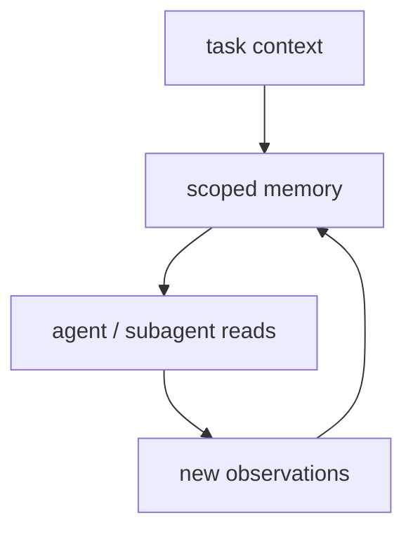

# Deep Agents Memory

Deep Agents의 memory 문서 요약이다. scoped memory와 long-running task 문맥에서 메모리를 어떻게 다룰지 설명한다.

## 구조도

Deep Agents의 memory는 단순 대화 기록 저장소보다, 어떤 범위(scope)에서 어떤 정보가 살아남을지 정하는 context engineering 장치다.

## 핵심 구조

- 문서는 memory를 “모든 것을 오래 보관하는 저장소”가 아니라, 어떻게 scoped memory를 설계할지의 문제로 다룬다.
- 이는 deep agent가 장기 작업을 하면서도 컨텍스트를 무한히 키우지 않기 위한 핵심 메커니즘이다.
- memory는 retrieval convenience보다 execution discipline에 가깝다.

## 왜 중요한가

- Deep Agents는 planning과 subagents만큼이나 memory 범위 설계가 중요하다. 잘못 설계하면 context isolation 이점이 사라진다.
- 따라서 memory는 recall 장치인 동시에 forgetting 정책이다.
- 이 점에서 [[context-engineering|Context Engineering (컨텍스트 엔지니어링)]]과 매우 가깝다.

## 실무 관점

- 메모리는 많이 저장하는 것보다, 누가 언제 무엇을 다시 볼 수 있는지 정하는 것이 중요하다.
- subagent마다 별도 scope를 둘지, shared memory를 얼마나 허용할지에 따라 행동 품질과 비용이 크게 달라진다.
- 장기 코딩/리서치 작업에서는 작업 요약, TODO, 핵심 사실만 남기고 세부 추론은 과감히 버리는 정책이 필요하다.

## 원문이 다루는 흐름

원문은 대체로 `Seed the memory file` → `Seed a skill` → `langgraph-docs` 순서로 전개된다. 따라서 `Deep Agents Memory` 페이지도 세부 API 목록보다 **입문 → 구조 이해 → 운영 확장**의 흐름으로 읽는 편이 좋다.

- 따라가야 할 순서: Seed the memory file, Seed a skill, langgraph-docs
- 위키에 남겨야 할 축: 입문 경로, 핵심 구조, 다음에 읽을 세부 문서

## source 메모

- **Memory - Docs by LangChain** — snapshot: `raw/recursive-sources/2026-04-10-pydantic-deepagents/deep-agents-memory.md` · source: https://docs.langchain.com/oss/python/deepagents/memory · 볼 섹션: Seed the memory file, Seed a skill, langgraph-docs

## 관련 문서

- [[deep-agents|Deep Agents]]
- [[deep-agents-subagents|Deep Agents Subagents]]
- [[agent-memory-systems|Agent Memory Systems]]
- [[context-engineering|Context Engineering (컨텍스트 엔지니어링)]]

이 보강 문장은 해당 문서의 source 경계를 유지하기 위한 최소 운영 메모다. 다음 수동 ingest에서는 원문 코드 예제와 최신 옵션명을 다시 확인한다.
