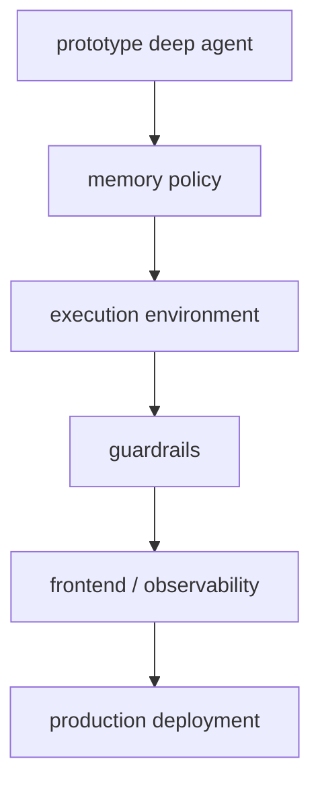

# Deep Agents Going to Production

Deep Agents의 production 가이드 요약이다. memory, execution environment, guardrails, frontend까지 포함해 운영 전환 시 고려사항을 정리한다.

## 구조도

Deep Agents의 production 전환은 모델 품질 튜닝보다 memory·sandbox·guardrail·frontend를 함께 정리하는 시스템 작업에 가깝다.

## 핵심 구조

- 문서는 production 전환을 단순 deploy 절차가 아니라 운영 고려사항 묶음으로 설명한다.
- memory, execution environment, guardrails, frontend가 별도 섹션으로 등장한다는 점이 중요하다. 이는 deep agent가 시스템 상품이라는 뜻이다.
- 즉 “작동하는 데모”와 “운영 가능한 agent” 사이 간극을 명시적으로 다룬다.

## 왜 중요한가

- 에이전트 시스템은 실패 모드가 모델 오답 하나로 끝나지 않는다. 잘못된 file access, 과도한 memory, guardrail 부재, 빈약한 사용자 가시성이 함께 문제를 만든다.
- 이 production 문서는 Deep Agents를 코드 라이브러리로만 보지 않고, 실제 서비스 스택으로 바라보게 만든다.
- 특히 execution environment와 guardrails를 별도 축으로 둔 점은 신뢰성 설계에 유용하다.

## 운영 체크리스트

- memory 보존 정책과 삭제 정책이 정의되어 있는가?
- execution environment가 filesystem/network 권한을 최소화하는가?
- guardrails와 human escalation 경로가 있는가?
- frontend 또는 observability surface에서 장기 작업 진행 상태를 볼 수 있는가?

## 실무 관점

- production으로 갈수록 모델 교체보다 런타임 경계 설계가 더 중요해진다.
- 이 문서는 Deep Agents가 단순 개발자 장난감이 아니라 운영 하네스라는 점을 다시 확인시켜 준다.
- [[long-running-agent-harnesses|Agent Harnesses for Long-Running Coding Sessions]]와 함께 읽으면 하네스 엔지니어링 관점이 더 선명해진다.

## 관련 문서

- [[deep-agents|Deep Agents]]
- [[deep-agents-memory|Deep Agents Memory]]
- [[long-running-agent-harnesses|Agent Harnesses for Long-Running Coding Sessions]]

이 보강 문장은 해당 문서의 source 경계를 유지하기 위한 최소 운영 메모다. 다음 수동 ingest에서는 원문 코드 예제와 최신 옵션명을 다시 확인한다.

특히 이 노드는 자동 보강 대신 공식 문서의 고유 구조를 보존해야 한다. import 경로, 실행 함수, 상태·메모리·검증 책임을 확인한 뒤 관련 허브와 다시 연결한다.

이 기준을 지키면 다음 재수집에서도 page_type 경계가 흐려지지 않는다.

후속 편집자는 원문 heading과 code path를 먼저 대조해야 한다.

그 뒤 관련 허브 문서의 설명과 충돌하지 않는지 확인한다.

필요하면 새 raw snapshot을 추가한다.

이 절차는 자동 보강보다 우선한다.

source 우선.

원문 확인.

재검증.

운영 전환에서는 sandbox, guardrail, memory scope, deployment, monitoring을 각각 별도 failure boundary로 본다. quickstart의 성공은 production readiness가 아니며, 사용자 데이터와 외부 side effect가 포함되면 격리·권한·관측을 먼저 설계해야 한다. 이 문서는 Deep Agents 문서군의 마지막 관문처럼 읽어야 한다.
