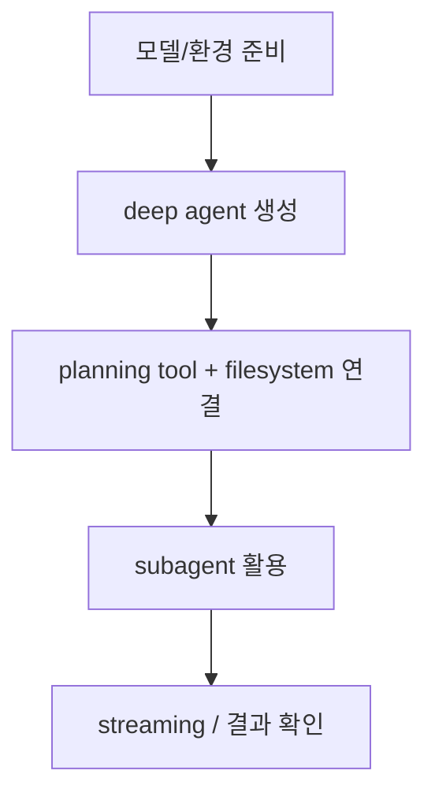

# Deep Agents Quickstart

Deep Agents의 공식 quickstart 요약이다. planning, filesystem, subagents가 결합된 deep agent를 가장 짧게 실행하는 흐름을 다룬다.

## 구조도

Deep Agents quickstart는 단순 챗봇 예제가 아니라, 복잡한 다단계 작업을 처리하는 harness를 빠르게 띄우는 입문 경로다.

## 핵심 구조

- quickstart는 Deep Agents가 일반 agent 프레임워크보다 더 무거운 기본값을 가진다는 사실을 바로 보여 준다. planning, filesystem, subagents가 기본 축이다.
- 즉 첫 실행부터 이미 “복잡한 장기 작업”을 전제로 한 runtime을 경험하게 한다.
- 문서는 how does it work와 examples를 통해 이 프레임워크가 단일 tool-call agent가 아니라 harness 중심 설계라는 점을 분명히 한다.

## 왜 중요한가

- Deep Agents는 context isolation과 planner 구조가 핵심인데, quickstart가 이를 초기 경험부터 노출한다는 점이 중요하다.
- 따라서 사용자는 처음부터 “에이전트 하나를 잘 프롬프트하자”보다 “하네스 구성을 어떻게 설계할까”를 고민하게 된다.
- 이는 Claude Code 류 코딩 agent 패턴을 프레임워크 차원에서 재현하려는 시도로 읽을 수 있다.

## 실무 관점

- quickstart를 따라 하면서 가장 먼저 확인해야 할 것은 모델 품질보다 sandbox/filesystem 경계다. 실제 운영 리스크가 여기서 먼저 드러난다.
- 또한 streaming 지원은 장기 작업 가시성을 높이므로, UI나 ops console과 연결할 여지가 크다.
- 이 문서는 이후 [[deep-agents-subagents|Deep Agents Subagents]], [[deep-agents-memory|Deep Agents Memory]], [[deep-agents-production|Deep Agents Going to Production]]으로 내려가기 위한 입문 경로다.

## 관련 문서

- [[deep-agents|Deep Agents]]
- [[deep-agents-subagents|Deep Agents Subagents]]
- [[deep-agents-memory|Deep Agents Memory]]
- [[deep-agents-production|Deep Agents Going to Production]]
