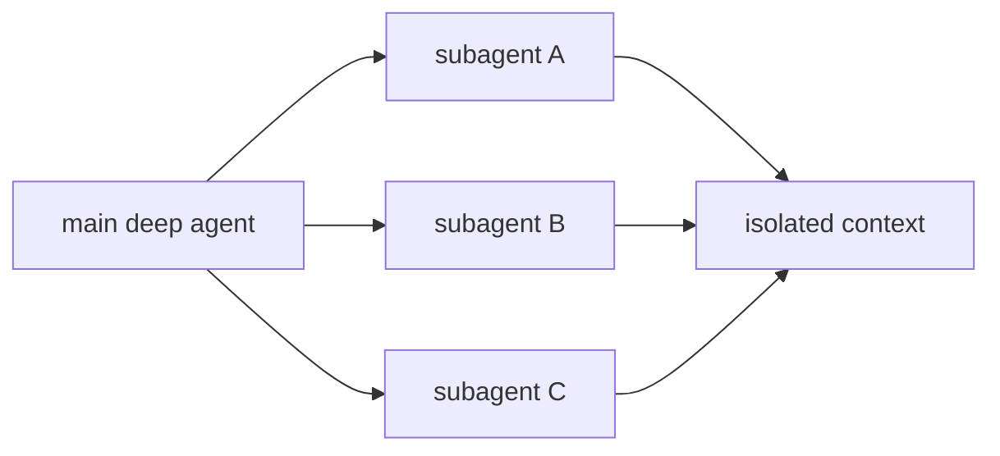

# Deep Agents Subagents

Deep Agents에서 subagent를 어떻게 설계하고 쓸지 설명하는 공식 문서 요약이다. context isolation, structured output, best practices가 중심이다.

## 구조도

Deep Agents의 subagent는 단순 helper가 아니라, 메인 agent의 컨텍스트 부담을 줄이기 위한 격리 장치다.

## 핵심 구조

- 문서는 subagent의 목적을 “전문화”만이 아니라 context management로 설명한다. 즉 역할 분리와 컨텍스트 절약이 함께 목적이다.
- SubAgent와 CompiledSubAgent를 구분해, 얼마나 고정된 실행 단위를 재사용할지 선택하게 한다.
- structured output과 best practices 섹션은 subagent가 자유 텍스트 helper가 아니라 계약 기반 worker가 되어야 함을 강조한다.

## 왜 중요한가

- 장기 작업에서 가장 흔한 실패는 메인 agent가 너무 많은 중간 상태를 떠안는 것이다. subagent는 이를 줄이는 전략이다.
- Deep Agents가 subagent를 1급 개념으로 다루는 이유도 여기에 있다. 이는 [[subagents|Subagents]] 개념 페이지의 실전 구현 사례로 읽을 수 있다.
- 결국 핵심은 “누가 무엇을 알고 있어야 하는가”를 구조로 강제하는 데 있다.

## 실무 패턴

| 패턴 | 유용한 상황 | 기대 효과 |
| --- | --- | --- |
| specialist subagent | 특정 조사/수정/분석 단위 | 메인 agent 부담 감소 |
| compiled subagent | 반복 호출되는 고정 task | 일관성·재사용성 강화 |
| structured output | 결과를 후속 단계에 넘길 때 | 파싱 실패 감소 |

## 실무 관점

- subagent를 늘리는 것 자체가 목적이 되면 안 된다. 메인 agent에서 떼어낼 때 더 나아지는 작업만 분리해야 한다.
- 또한 각 subagent에 넘기는 context를 최소화해야 isolation 효과가 난다.
- 이 문서는 multi-agent를 “더 똑똑한 협업”이 아니라 “컨텍스트 부하를 분산하는 시스템 설계”로 다시 보게 만든다.

## 관련 문서

- [[deep-agents|Deep Agents]]
- [[subagents|Subagents]]
- [[deep-agents-memory|Deep Agents Memory]]
