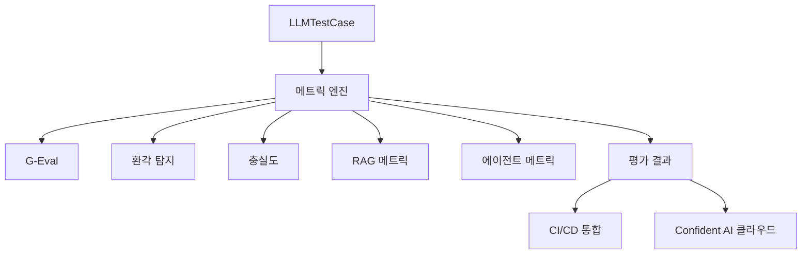

# DeepEval

## 개요

DeepEval은 Confident AI가 개발한 오픈소스 LLM 평가 프레임워크로, pytest 스타일로 LLM 애플리케이션의 단위 테스트를 작성하고 실행할 수 있다. 25개 이상의 내장 메트릭(G-Eval, [[hallucination|환각]] 탐지, 충실도, 답변 관련성 등)을 제공하며, 기존 CI/CD 파이프라인에 원활하게 통합된다.

기존 LLM 평가 방식이 수동 인간 검토나 단순 정확도 측정에 의존했던 것과 달리, DeepEval은 연구 기반 메트릭을 코드 테스트 프레임워크 형태로 제공하여 개발자 워크플로우에 자연스럽게 녹아든다. `@observe` 데코레이터를 통한 에이전트 트레이스 평가 기능으로 멀티 스텝 에이전트의 중첩 컴포넌트를 개별 평가할 수 있다. [[component-level-agent-evaluation|컴포넌트 수준 에이전트 평가]] 패턴의 실용적 구현체이며, [[error-analysis-for-evals|평가 에러 분석]] 방법론을 G-Eval/DAG/QAG 메트릭과 결합하면 오판 원인을 체계적으로 추적할 수 있다.

## 핵심 특징

### 메트릭 체계

**커스텀/범용 평가**
- G-Eval: 연구 기반 LLM-as-a-judge 메트릭. 기준 기반 사고 연쇄(CoT) 추론으로 주관적 평가 수행
- DAG: 트리 기반 유향 비순환 그래프(directed acyclic graph) 접근법. 객관적 다단계 조건부 평가
- QAG: 질문-답변 생성 기반 수식형 평가. 폐쇄형 질문으로 점수 산출

**RAG 메트릭**
- Faithfulness(충실도): 검색 맥락과의 사실적 일치도 측정
- Answer Relevancy(답변 관련성): 출력이 입력과 얼마나 관련 있는지 평가
- Contextual Recall/Precision/Relevancy: 검색 맥락의 품질 다차원 평가
- Hallucination(환각): 제공된 맥락에 대한 사실 정확성 검증
- RAGAS 통합 메트릭

**에이전트 메트릭**
- Task Completion: 에이전트의 태스크 완료율
- Tool Correctness: 도구 선택 및 사용 정확도
- Goal Accuracy: 목표 달성 정도
- Step Efficiency: 단계별 효율성
- Plan Adherence/Quality: 계획 준수 및 품질
- Tool Use / Argument Correctness: 도구 사용 패턴 및 인자 정확도

**멀티턴 메트릭**
- Knowledge Retention: 대화 간 지식 유지
- Conversation Completeness: 대화 완결성
- Turn Relevancy/Faithfulness: 턴별 관련성 및 충실도
- Role Adherence: 역할 준수

**MCP 메트릭**
- MCP Task Completion, MCP Use, Multi-Turn MCP Use

**멀티모달 메트릭**
- Text to Image, Image Editing, Image Coherence, Image Helpfulness, Image Reference

**기타**
- Summarization, Bias, Toxicity, JSON Correctness, Prompt Alignment

### pytest 통합

```python
from deepeval import assert_test
from deepeval.metrics import GEval
from deepeval.test_case import LLMTestCase, LLMTestCaseParams

# G-Eval: 사용자 정의 기준 기반 평가
correctness_metric = GEval(
    name="Correctness",
    criteria="Determine if the 'actual output' is correct based on the expected output",
    evaluation_params=[LLMTestCaseParams.ACTUAL_OUTPUT],
    threshold=0.5
)

test_case = LLMTestCase(
    input="What if these shoes don't fit?",
    actual_output="You have 30 days to get a full refund...",
    expected_output="We offer a 30-day full refund..."
)
assert_test(test_case, [correctness_metric])
```

### 에이전트 트레이스 평가 (`@observe`)

`@observe` 데코레이터를 사용하여 에이전트의 중첩 컴포넌트를 개별적으로 추적하고 평가한다. 도구 호출, 추론 단계, 최종 출력 각각에 대해 독립적인 메트릭을 적용할 수 있다.

```python
from deepeval.tracing import observe, update_current_span

@observe(metrics=[correctness_metric])
def inner_component():
    update_current_span(test_case=LLMTestCase(
        input="...",
        actual_output="..."
    ))
    return "result"
```

### 독립 메트릭 실행

pytest 없이 메트릭을 독립적으로 실행하여 점수와 이유(reason)를 확인할 수 있다:

```python
from deepeval.metrics import AnswerRelevancyMetric

metric = AnswerRelevancyMetric(threshold=0.7)
metric.measure(test_case)
print(metric.score)   # 0.85
print(metric.reason)  # "The output directly addresses..."
```

## 기술 상세

### 아키텍처



### 지원 프레임워크 및 LLM

| 카테고리 | 지원 목록 |
|----------|----------|
| LLM 프레임워크 | OpenAI, OpenAI Agents, LangChain, LangGraph, Pydantic AI, CrewAI, Anthropic Claude, AWS AgentCore, LlamaIndex |
| LLM 프로바이더 | 모든 LLM 지원 (커스텀 모델 포함) + 로컬 NLP 모델 |
| 벤치마크 데이터셋 | MMLU, HellaSwag, DROP, BIG-Bench Hard, TruthfulQA, HumanEval, GSM8K |

### 설치 및 설정

```bash
pip install -U deepeval      # Python >= 3.9
deepeval login               # Confident AI 플랫폼 연동 (선택)
```

`.env.local` -> `.env` 순서로 환경 변수를 자동 로드한다.

### Confident AI 플랫폼

클라우드 플랫폼과 MCP 서버를 지원하여 IDE에서 직접 데이터셋 관리, 실험 추적, 평가 결과 시각화가 가능하다. 주요 기능:

- 데이터셋 관리 및 버전 관리
- 애플리케이션 트레이싱
- 평가 실행 이력 관리
- 프로덕션 모니터링
- MCP 서버 통합 (IDE 워크플로우)
- 자동 프롬프트 최적화

### 추가 기능

- 합성 데이터 생성: 싱글턴/멀티턴 테스트 데이터 자동 생성
- 대화 시뮬레이션
- 멀티모달 지원: 텍스트, 이미지, 오디오
- 레드 팀 테스트

### 커뮤니티

- GitHub Stars: 14.8k+
- Forks: 1.4k+
- 커밋: 9,169+
- 라이선스: MIT
- Discord 커뮤니티 운영

## 경쟁 도구 대비 포지셔닝

| 항목 | DeepEval | Ragas | Braintrust | LangSmith |
|------|----------|-------|------------|-----------|
| 메트릭 수 | 50+ | RAG 중심 5-10 | 범용 | 범용 |
| pytest 네이티브 | 예 | 아니오 | 아니오 | 아니오 |
| 에이전트 평가 | 8개 전용 메트릭 | 제한적 | 제한적 | 트레이싱 중심 |
| MCP 메트릭 | 전용 3개 | 미지원 | 미지원 | 미지원 |
| 멀티모달 | 5개 전용 메트릭 | 미지원 | 제한적 | 제한적 |
| 합성 데이터 생성 | 내장 | 외부 연동 | 외부 연동 | 외부 연동 |
| 오픈소스 | MIT | Apache 2.0 | 상용 | 상용 |

DeepEval의 핵심 차별점은 "연구 기반 메트릭을 개발자 친화적인 pytest 프레임워크로 제공"하는 것이다. 기존 LLM 평가가 수동 인간 검토나 단순 정확도에 의존했던 것과 달리, G-Eval, DAG, QAG 등 학술적으로 검증된 메트릭을 `assert_test()` 한 줄로 실행할 수 있다. 이는 특히 CI/CD 파이프라인에서 LLM 출력 품질을 자동으로 게이트하는 데 실용적이다.

## 관련 문서

- [[ragas]] -- RAG 전용 평가 메트릭
- [[component-level-agent-evaluation]] -- 컴포넌트 수준 에이전트 평가
- [[swe-bench-pro]] -- 소프트웨어 엔지니어링 벤치마크
