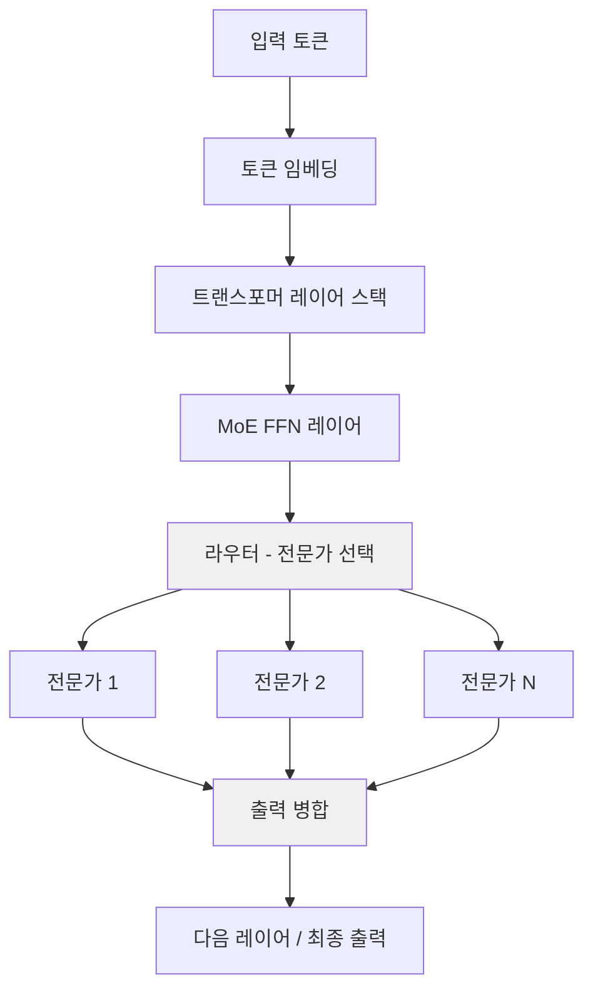
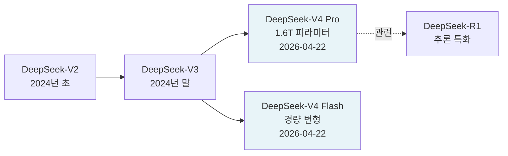

# DeepSeek V4 Pro - 1.6조 파라미터 오픈웨이트 MoE 플래그십

DeepSeek V4 Pro는 2026년 4월 22일 DeepSeek이 공개한 현재 최대 규모 오픈웨이트 LLM(대규모 언어 모델)이다. 전체 1.6조(1.6T) 파라미터에 490억(49B) 활성 파라미터를 갖는 MoE(Mixture of Experts) 구조를 채택하며, MIT 라이선스로 배포되어 상업적 활용이 자유롭다.

## 개요

| 항목 | 내용 |
|------|------|
| 출시일 | 2026년 4월 22일 |
| 전체 파라미터 | 1.6조 (1.6T) |
| 활성 파라미터 | 490억 (49B) |
| 아키텍처 | MoE (Mixture of Experts) |
| 컨텍스트 윈도우 | 100만 토큰 (1M context) |
| 라이선스 | MIT |
| 변형 모델 | V4-Pro, V4-Flash |
| 허깅페이스 | `deepseek-ai/DeepSeek-V4-Pro` |

## 아키텍처 개요



위 다이어그램은 MoE 레이어의 기본 흐름을 나타낸다. 전체 1.6T 파라미터 중 추론 시 49B만 활성화되므로 연산 비용 대비 모델 용량이 대폭 확장된다.

## 핵심 특징

### 1. 대규모 오픈웨이트 MoE

V4 Pro는 현재(2026년 4월 기준) 공개된 오픈웨이트 모델 중 최대 규모다. 동등한 성능을 내는 밀집(dense) 모델이라면 수백 배 이상의 연산이 필요하지만, MoE 구조 덕분에 입력당 49B 파라미터만 활성화된다. 이는 [[mixture-of-experts]] 패러다임의 효율성을 실증한다.

### 2. 100만 토큰 컨텍스트 윈도우

V4-Pro와 V4-Flash 모두 1M 컨텍스트를 지원한다. 전체 코드베이스, 장편 문서, 멀티턴 장기 대화를 단일 세션에서 처리할 수 있다. 롱 컨텍스트 처리는 [[rotary-positional-encoding]](RoPE) 또는 유사 기법으로 구현된 것으로 알려져 있으나, 내부 구현 상세는 공식 기술 보고서 참조 권장 [교차검증 필요].

### 3. V4-Flash 경량 변형

V4-Pro와 함께 공개된 V4-Flash는 더 빠른 추론 속도를 목표로 하는 경량 변형이다. 파라미터 규모와 성능 트레이드오프 상세는 공식 HuggingFace 모델 카드에서 확인 가능하다.

### 4. MIT 라이선스

DeepSeek 시리즈의 대표적 특징인 MIT 라이선스를 V4 Pro에도 적용했다. 학술 연구, 상업 서비스, 파생 모델 배포 모두 허용된다.

## 모델 계보



DeepSeek은 V2(2024년 초)에서 MoE + 희소 어텐션(Sparse Attention) 조합으로 주목받은 후, V3에서 성능을 대폭 끌어올렸고, V4 Pro에서 1.6T 파라미터로 오픈웨이트 최대 규모를 달성했다.

## 성능 포지셔닝

V4 Pro는 출시 당시 기준으로 GPT-5, Claude Opus 4와 같은 프론티어 독점 모델과의 격차를 크게 줄였다고 평가받는다. 구체적 벤치마크 수치는 공식 DeepSeek 기술 보고서 및 HuggingFace 모델 카드에서 확인 가능하다.

## 실무 활용 패턴

### vLLM / SGLang 서빙

```python
# vLLM을 이용한 DeepSeek-V4-Pro 서빙 예시 (개략)
from vllm import LLM, SamplingParams

llm = LLM(
    model="deepseek-ai/DeepSeek-V4-Pro",
    tensor_parallel_size=8,   # 고용량 GPU 클러스터 필요
    max_model_len=131072,      # 실제 1M context는 고메모리 필요
)

sampling_params = SamplingParams(temperature=0.7, max_tokens=2048)
outputs = llm.generate(["DeepSeek V4 Pro를 활용한 예시 쿼리"], sampling_params)
```

> 주의: 1.6T 파라미터 풀 모델 서빙은 대용량 GPU 클러스터를 요구한다. 일반 연구자는 V4-Flash 또는 양자화 버전 활용을 권장한다.

### 양자화(Quantization) 활용

오픈웨이트이므로 AWQ, GPTQ, GGUF 등 다양한 [[quantization]] 기법을 적용한 커뮤니티 버전이 공개될 것으로 예상된다.

## 관련 생태계 도구

- [[vllm]] - 서빙 프레임워크 (V4 시리즈 지원)
- [[sglang]] - 고성능 LLM 서빙
- [[llama-factory]] - 파인튜닝 지원

## 왜 중요한가

DeepSeek V4 Pro의 출시는 오픈웨이트 모델이 프론티어 독점 모델과 경쟁할 수 있는 규모에 도달했음을 보여주는 이정표다. 특히:

1. **오픈웨이트 + 상업 라이선스**: MIT 라이선스로 기업이 자체 인프라에서 실행 가능
2. **MoE 효율성**: 1.6T 파라미터임에도 49B만 활성화되어 경제적 서빙 가능
3. **1M 컨텍스트**: 장편 코드베이스, 문서 분석 등 실무 활용 범위 확장
4. **생태계 자극**: 커뮤니티 파인튜닝, 양자화, 응용 개발 촉진

## 관련 문서

- [[deepseek-v4]] - V4 시리즈 전반 개요
- [[mixture-of-experts]] - MoE 아키텍처 개념
- [[quantization]] - 대형 모델 경량화 기법
- [[vllm]] - 서빙 프레임워크
- [[kimi-k2-6]] - 동시기 경쟁 오픈웨이트 대형 MoE 모델
