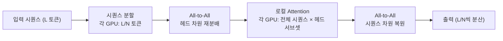
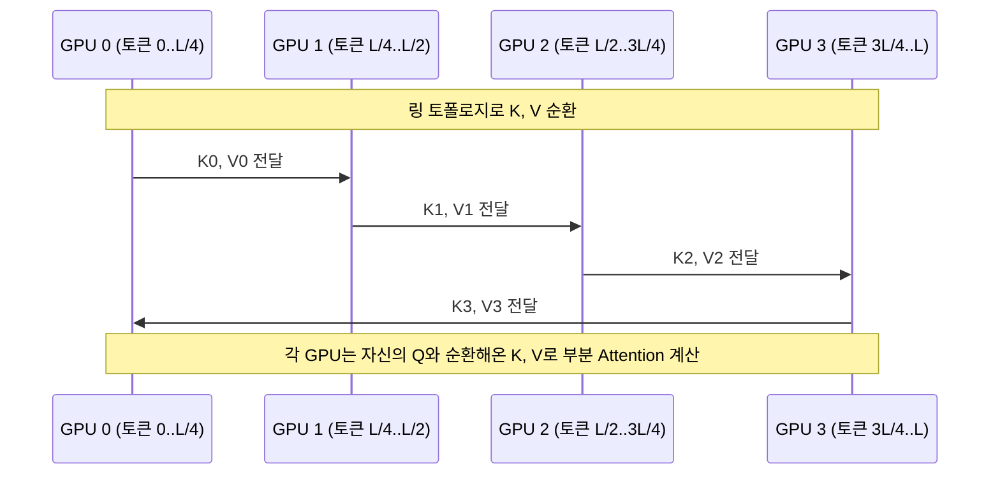
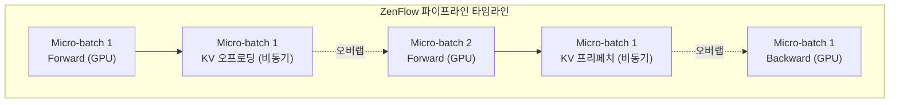

# DeepSpeed Arctic 장문 시퀀스 학습

DeepSpeed Arctic(Long-Term Support)은 멀티백만 토큰(multi-million token) 시퀀스 학습을 지원하기 위해 2025년 공개된 DeepSpeed의 확장 모듈이다. 기존 모델 학습에서 시퀀스 길이는 주로 GPU 메모리 용량으로 제한되었는데, Arctic은 시퀀스 차원에서의 병렬화와 비동기 오프로딩을 결합해 이 제약을 수백 배 이상 넘어설 수 있게 한다.

## 왜 장문 시퀀스 학습이 어려운가

Transformer의 Attention은 시퀀스 길이 $L$에 대해 $O(L^2)$ 메모리를 요구한다. 컨텍스트 길이가 2배 늘어나면 Attention 메모리는 4배가 된다. 128K 토큰 학습 시 단일 A100(80GB)에서 Attention만으로 수십~수백 GB를 소비하므로, 시퀀스를 여러 GPU에 분산시키는 "시퀀스 병렬화(Sequence Parallelism)"가 필수다.

## 핵심 기술 1: DeepSpeed-Ulysses



Ulysses 접근법에서 각 GPU는 시퀀스의 1/N을 보유하지만, Attention 계산 직전에 All-to-All 통신으로 헤드(head) 차원을 재분배한다. 이후 각 GPU는 적은 수의 헤드에 대해 전체 시퀀스를 처리하고, Attention 후 다시 All-to-All로 원래 시퀀스 분할 구조로 복원한다. 통신량은 Attention 파라미터 크기에 비례하며, 시퀀스 길이에 무관하다.

## 핵심 기술 2: Ring Attention



Ring Attention은 GPU를 링 구조로 배치하고 Key/Value 블록을 순환시킨다. 각 GPU는 자신의 Query 블록을 고정하고, 순환해오는 K/V 블록과의 Attention 스코어를 누적한다. 전체 시퀀스에 걸쳐 인과적(causal) 마스크를 올바르게 적용하려면 GPU 간 청크 인덱스 관계를 추적해야 한다. 통신량은 K/V 크기 × N-1회이며, 계산과 통신을 오버랩해 지연을 숨길 수 있다.

## ZenFlow 비동기 오프로딩

Arctic의 핵심 신기능인 ZenFlow는 Attention KV 캐시와 중간 활성화(activation)를 CPU/NVMe로 비동기 오프로딩하면서 GPU 계산과 데이터 이동을 파이프라이닝한다.



레이어별 KV를 Backward 패스 필요 시점에 맞춰 선제적으로 CPU → GPU로 프리페치하므로, GPU 대기 시간을 최소화한다. ZenFlow는 오프로딩 스케줄을 동적으로 조정해 GPU 활용률을 극대화한다.

## Ulysses vs Ring Attention 비교

| 항목 | DeepSpeed-Ulysses | Ring Attention |
|------|-------------------|----------------|
| 통신 패턴 | All-to-All (2회) | Point-to-Point 링 순환 |
| 통신량 | 헤드 수에 비례, 시퀀스 무관 | K/V 크기 × (N-1) |
| 인프라 요구 | 고대역폭 All-to-All 필요 | 링 토폴로지 최적 |
| 인과 마스킹 | 자연스럽게 지원 | 인덱스 추적 필요 |
| 최적 GPU 수 | 헤드 수의 약수일 때 효율적 | N 제한 없음 |

Arctic은 두 방식을 혼합(hybrid)해 사용할 수 있도록 설계되어, 클러스터 토폴로지에 따라 최적의 전략을 선택한다.

## 실용적 시퀀스 길이 확장 능력

Arctic의 공식 벤치마크에서는 A100 80개로 2M(2백만) 토큰 시퀀스 학습을 시연했다. ZenFlow를 추가하면 NVMe 기반으로 이론상 무한에 가까운 시퀀스 길이를 지원하나, NVMe 대역폭이 병목이 된다. 실용적인 목표는 128K~1M 토큰 범위에서 기존 플래시어텐션(FlashAttention) 대비 합리적인 학습 속도를 유지하는 것이다.

## 설정 예시

```python
# deepspeed config snippet
{
  "sequence_parallel": {
    "enabled": True,
    "type": "ulysses",          # 또는 "ring", "hybrid"
    "sequence_parallel_size": 8
  },
  "zenflow": {
    "enabled": True,
    "offload_kv": True,
    "prefetch_layers": 2
  }
}
```

## 관련 문서

- [[deepspeed-zero-internals]] - ZeRO 파라미터 분할로 모델 메모리 절감
- [[chain-of-thought-prompting]] - 장문 컨텍스트가 필요한 다단계 추론 유스케이스
- [[rag-original-paper]] - 장문 컨텍스트 vs 검색 증강 트레이드오프
