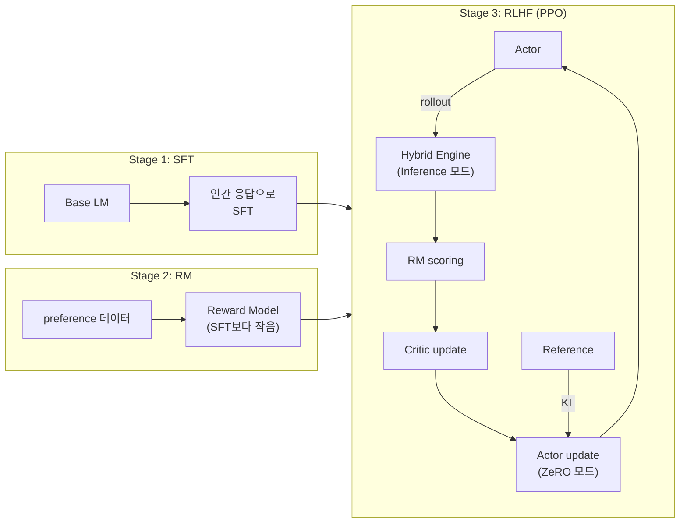

# DeepSpeed-Chat - InstructGPT 3-stage RLHF 오픈소스 구현

## 개요

DeepSpeed-Chat은 Microsoft가 2023년 4월 공개한 InstructGPT-style 3-stage RLHF의 reference 구현체이다. **Hybrid Engine** 패턴 — 한 process 안에서 ZeRO 학습 모드와 DeepSpeed-Inference rollout 모드를 in-place로 전환 — 을 처음 도입해 generation phase 가속을 달성했고, 이 패턴은 [[verl-bytedance]] / [[openrlhf]]에 직접 영향을 주었다.

- 공식 repo: [microsoft/DeepSpeedExamples/applications/DeepSpeed-Chat](https://github.com/microsoft/DeepSpeedExamples/tree/master/applications/DeepSpeed-Chat)
- 논문: [DeepSpeed-Chat: Easy, Fast and Affordable RLHF Training of ChatGPT-like Models at All Scales (2308.01320)](https://arxiv.org/abs/2308.01320)
- 저자: Zhewei Yao 외 18명 (Microsoft)
- 제출: 2023-08-02
- 출시: 2023-04 (DeepSpeed v0.9 stack)
- 의존: DeepSpeed (ZeRO + Inference)

## 핵심 기여

1. **InstructGPT-style 3-stage 파이프라인**의 오픈소스 reference 구현
2. **Hybrid Engine**: ZeRO 학습 + DeepSpeed-Inference rollout을 **하나의 process에서 모드 전환**
3. **단일 GPU에서 ChatGPT 수준 학습 가능** — 1.3B 모델을 A6000 1대에서 약 2.2시간
4. **200B+ 모델까지 scale**

## 3-stage 파이프라인

| Stage | 작업 | 모델 |
|-------|------|------|
| **1. SFT** | 인간 응답으로 SFT | base LM |
| **2. RM** | preference 데이터로 reward model 학습 | 보통 SFT보다 작음 |
| **3. RLHF (PPO)** | RM 보상으로 PPO 정책 최적화 | actor + critic + RM + ref |

## 분산 토폴로지

- **Hybrid Engine**: actor 모델이 학습 phase에서는 ZeRO Stage 3, rollout phase에서는 DeepSpeed-Inference로 전환
- **모드 전환**: 같은 process 내에서 in-place re-shard — checkpoint dump/load 없음
- 4-model 구성 (actor, critic, RM, ref)이 동일 클러스터에서 GPU 공유
- ZeRO offload (CPU/NVMe)로 VRAM 부족 시 swap

## 통신 패턴

- DeepSpeed ZeRO-3: NCCL allgather/reducescatter (parameter, optimizer state sharding)
- DeepSpeed-Inference: tensor parallelism with NCCL allreduce
- 모드 전환 시: in-process tensor reshape + NCCL p2p

## rollout vs policy update

- **동기 PPO**: rollout → reward → critic update → actor update
- Hybrid Engine이 generation phase 가속 — 핵심 SOTA contribution
- "Superior generation phase acceleration"이 기존 RLHF 시스템 대비 15x 빠른 핵심 이유

## 메모리 / 처리량 최적화

- ZeRO Stage 2 / 3 + CPU offload + NVMe offload
- DeepSpeed-Inference: tensor parallel, kernel fusion, KV cache
- LoRA 옵션
- Mixed precision (fp16/bf16)

## 처리량 / 비용

| 셋업 | 모델 | 시간 |
|------|------|------|
| 단일 A6000-48G | 1.3B | 약 2.2시간 |
| 8x A100-40G | 13B | 13.6시간 |
| 64x A100-80G | 66B | 9시간 |

- 단일 GPU에서 기존 시스템 대비 **10x throughput**
- multi-GPU 6~19x speedup
- 스케일 한계: **200B+ 파라미터**

## 핵심 인용

> "DeepSpeed-Chat ... a unified infrastructure, termed the DeepSpeed-RLHF system or 'Hybrid Engine,' integrating state-of-the-art training and inference optimizations specific to the RLHF paradigm." — paper §1

> "It enables 15X faster training over the existing RLHF systems, and can handle training of ChatGPT-like models with over 200 billion parameters." — paper §1

## 한계 / 후속

- single-controller 구조 — 노드 간 RPC 토폴로지가 OpenRLHF/verl보다 단순
- 비동기 rollout 미지원 (기본은 동기)
- 후속: [[openrlhf]], [[verl-bytedance]]가 multi-controller + Ray + vLLM으로 throughput 추월

## 운영 사례

- Microsoft 내부 ChatGPT-style 모델 학습
- LLaMA, OPT, Pythia 기반 커뮤니티 RLHF 파이프라인 다수
- HuggingFace [[trl-library]]가 DeepSpeed backend로 일부 활용

## 관련 문서

- [[deepspeed-zero]], [[deepspeed-internals]] - 기반 인프라
- [[openrlhf]], [[verl-bytedance]], [[nemo-aligner]] - 후속 RLHF 프레임워크
- [[rlhf]], [[rlhf-pipeline]] - 알고리즘
- [[rl-harness-frameworks-comparison]] - RL harness 통합 비교
