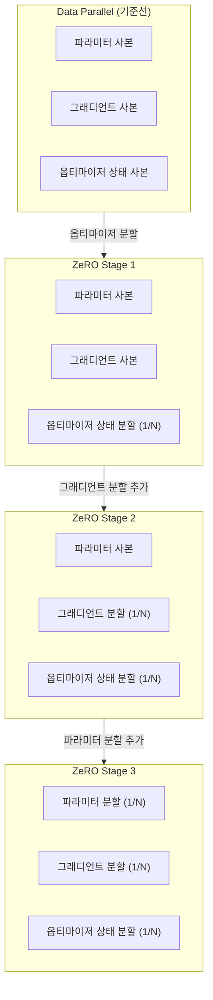
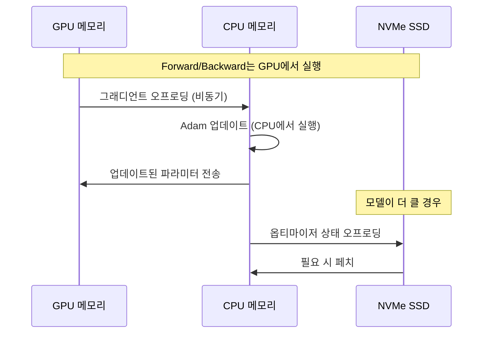

# DeepSpeed ZeRO 내부 구현

ZeRO(Zero Redundancy Optimizer)는 Microsoft DeepSpeed의 핵심 메모리 최적화 기술로, 대규모 모델 학습 시 GPU 메모리 낭비를 제거한다. 기존 데이터 병렬 학습(Data Parallelism)은 모든 GPU가 모델 전체 사본을 보유하는데, ZeRO는 이 중복(redundancy)을 단계적으로 제거해 메모리 효율을 수십 배 향상시킨다.

## 왜 ZeRO가 필요한가

170B 파라미터 모델을 fp16으로 학습하면 파라미터 저장에만 340GB가 필요하다. 여기에 옵티마이저 상태(Adam: 파라미터 2배), 그래디언트를 더하면 단일 GPU 학습은 불가능하다. 파이프라인/텐서 병렬(MP)은 모델 구조를 변경해야 하는 반면, ZeRO는 기존 데이터 병렬 코드를 거의 그대로 사용하면서 메모리를 줄인다는 점이 핵심 장점이다.

## ZeRO 세 가지 Stage

### Stage 1: 옵티마이저 상태 분할

Adam 옵티마이저의 경우 1차/2차 모멘트를 N개 GPU에 균등 분배한다. 각 GPU는 자신이 담당하는 파라미터 구간의 옵티마이저 상태만 보유한다. Backward 후 Reduce-Scatter로 그래디언트를 집계하면 각 GPU가 자신의 구간을 업데이트하고, All-Gather로 업데이트된 파라미터를 동기화한다. 옵티마이저 상태는 파라미터의 약 8배 메모리를 차지하므로, N=8이면 약 8x 메모리 절감이 가능하다.

### Stage 2: 그래디언트 분할 추가

그래디언트도 N분할한다. Backward 패스 중 각 레이어의 그래디언트를 Reduce-Scatter로 처리하면, 해당 파라미터 구간 담당 GPU에만 그래디언트가 누적된다. 나머지 GPU의 그래디언트 버퍼는 즉시 해제된다. Stage 2는 Stage 1 대비 그래디언트 메모리(파라미터와 동일 크기)를 추가로 1/N로 줄인다.

### Stage 3: 파라미터 분할 (완전 분할)

파라미터 자체도 분할한다. Forward 패스에서 레이어를 계산하기 직전 All-Gather로 해당 레이어 파라미터를 모든 GPU에 임시 수집하고, 계산이 끝나면 즉시 해제한다. Backward 패스에서도 동일한 패턴을 반복한다. 전체 모델 파라미터 메모리가 1/N로 줄지만, All-Gather 빈도가 높아져 통신량이 증가한다.

## 통신 패턴 분석

| Stage | Forward 통신 | Backward 통신 | 동기화 |
|-------|-------------|--------------|--------|
| 기준선 | 없음 | All-Reduce | 없음 |
| Stage 1 | 없음 | Reduce-Scatter | All-Gather (파라미터 업데이트 후) |
| Stage 2 | 없음 | Reduce-Scatter | All-Gather (파라미터 업데이트 후) |
| Stage 3 | All-Gather (레이어별) | Reduce-Scatter | 없음 (이미 분할 상태) |

Stage 1/2는 기존 All-Reduce를 Reduce-Scatter + All-Gather로 분해하므로 통신량은 동일하다. Stage 3는 레이어 수만큼 추가 All-Gather가 발생해 통신량이 1.5배로 증가한다.

## CPU/NVMe 오프로딩

ZeRO-Offload(Stage 2 기반)와 ZeRO-Infinity(Stage 3 기반)는 옵티마이저 상태와 그래디언트를 CPU 메모리 또는 NVMe SSD로 오프로딩한다.

CPU 오프로딩은 CPU-GPU 대역폭(PCIe ~32GB/s)이 병목이 되므로, GPU 연산 시간과 데이터 이동을 파이프라이닝해 오버랩시키는 것이 중요하다. NVMe 오프로딩은 PCIe NVMe의 경우 약 3-7GB/s 대역폭을 활용해 사실상 무한한 모델 크기를 지원한다.

## 그래디언트 누적 전략

마이크로배치(micro-batch) 그래디언트 누적 시 ZeRO Stage 3는 주의가 필요하다. 누적 중간에 All-Gather를 불필요하게 트리거하지 않도록 `no_sync()` 컨텍스트를 사용하거나, `gradient_accumulation_steps`를 명시해야 한다. 누적 완료 후에만 Reduce-Scatter를 수행해 통신 횟수를 줄인다.

## 실무 선택 가이드

- **Stage 1**: 옵티마이저 메모리가 병목일 때. 통신 오버헤드 없이 4-8x 메모리 절감
- **Stage 2**: 7B~30B 모델, 충분한 GPU 간 대역폭 있을 때
- **Stage 3**: 70B+ 모델, GPU당 메모리가 절대적으로 부족할 때. NVLink 권장
- **CPU 오프로딩**: GPU 메모리 부족하지만 CPU RAM이 충분할 때 (학습 속도 감소 감수)

## 관련 문서

- [[megatron-bridge-checkpoint]] - Megatron과 DeepSpeed 체크포인트 연동
- [[deepspeed-arctic-lts]] - DeepSpeed Arctic 장문 시퀀스 지원
- [[pruning-structured-unstructured]] - 모델 압축과 메모리 최적화 조합
