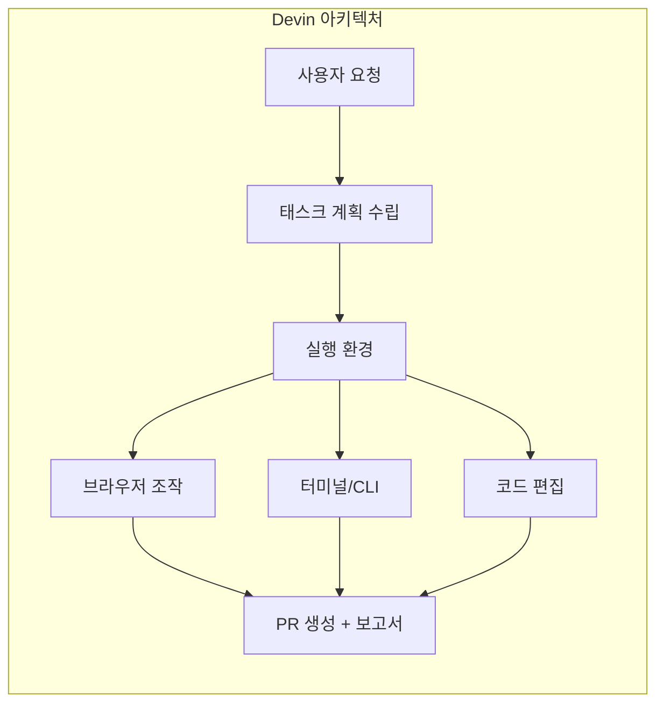
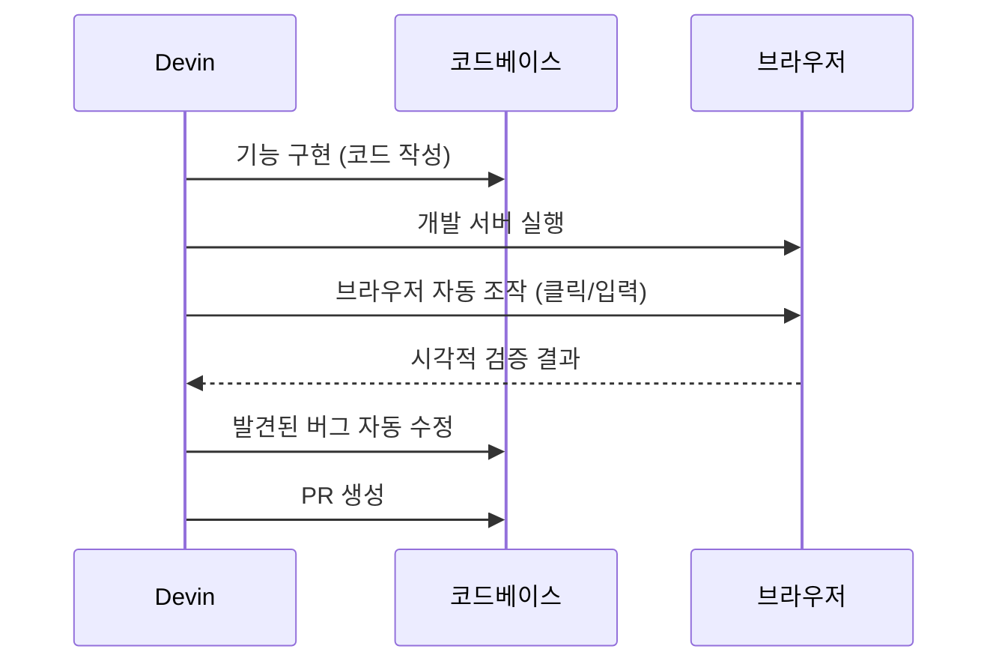
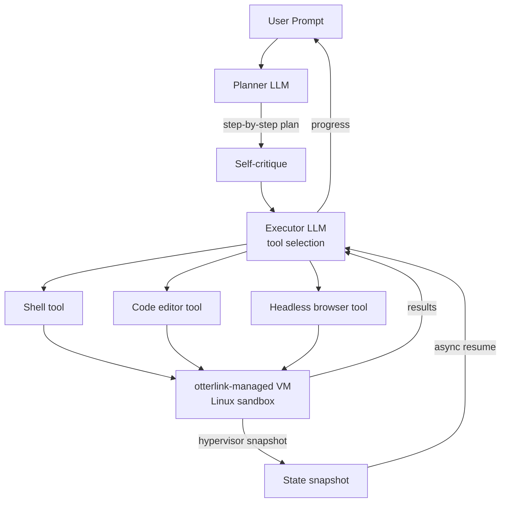

# Devin 2.0 - Cognition AI 자율 소프트웨어 엔지니어 2세대

## 제품 정체성

Devin은 Cognition AI가 개발한 자율 소프트웨어 엔지니어(autonomous software engineer) 에이전트다. 2024년 3월 처음 공개될 당시 SWE-Bench에서 13.86%를 기록하며 "최초의 자율 AI 소프트웨어 엔지니어"로 주목받았다. 2026년 4월 기준 Devin은 SWE-Bench Verified에서 51.5%를 달성하며 2년 만에 3.7배 성능 향상을 이루었다.

[[cognition-ai]] 엔티티에서 Cognition AI 회사 전반을 참조하라.



Devin의 핵심 설계 원칙은 **"사람처럼 작업한다"**는 것이다. 별도 플러그인 없이 브라우저, 터미널, 코드 에디터를 사람과 동일한 방식으로 조작하는 컴퓨터 사용(computer use) 기반 아키텍처를 채택한다.

## 성능 진화

| 버전 | 시기 | SWE-Bench Verified | 주요 특징 |
|------|------|---------------------|-----------|
| 초기 공개 | 2024-03 | 13.86% | 최초 자율 AI 엔지니어 발표 |
| v1.x | 2024-2025 | ~30-40% | 실무 배포, 기업 고객 확보 |
| v2.0 | 2026-04 | 51.5% | Fast Mode, v3 API, 엔드투엔드 테스팅 |

SWE-Bench 성능 해석 시 [[swe-bench-pro-contamination]] 문서의 맥락을 함께 고려해야 한다. Verified 데이터셋의 오염 문제로 인해 실제 실무 성능은 수치보다 낮을 수 있다.

## Devin 2.0 핵심 업데이트

### Fast Mode

기존 Standard Mode 대비 응답 속도 2배를 달성하는 모드. 대신 ACU(Agent Compute Unit) 소모량이 4배 증가한다. 빠른 피드백이 필요한 반복 개발 사이클에 적합하다.

| 모드 | 속도 | ACU 소모 | 추천 사용 케이스 |
|------|------|-----------|-----------------|
| Standard Mode | 기준 | 1x | 복잡한 기능 구현, 심층 디버깅 |
| Fast Mode | 2배 빠름 | 4x | 빠른 프로토타입, 간단한 버그 수정 |

### 컴퓨터 사용 기반 엔드투엔드 테스팅

Devin 2.0은 코드 작성 후 브라우저를 직접 조작해 UI 테스트를 수행한다. Playwright·Selenium 같은 별도 테스트 프레임워크 설정 없이, 실제 사용자처럼 클릭·입력·스크롤을 통해 검증한다.



### v3 API 정식 출시

Devin v3 API의 주요 엔드포인트:

```
POST /v3/sessions          # 새 Devin 세션 시작
GET  /v3/sessions/{id}     # 세션 상태 조회
POST /v3/sessions/{id}/messages  # 추가 지시 전송
GET  /v3/sessions/{id}/artifacts # 생성된 파일/PR 목록
```

v2 API 대비 변경점: 스트리밍 이벤트 지원, 아티팩트 관리 API 분리, 웹훅(webhook) 기반 비동기 완료 알림 추가.

### 실무 성능 지표 (2026-04 기준)

Cognition AI가 공개한 내부 지표:
- **실무 태스크 성공률**: 75% (실제 고객 태스크 기준)
- **PR 머지율**: 67% (생성된 PR 중 검토 후 머지된 비율)
- **SWE-Bench Verified**: 51.5%

이 수치들은 자사 보고 수치로, 독립적 검증이 필요하다.

## 기업가치 및 투자 현황

[[spacex-cursor-acquisition-option]]에서 언급하듯, Cognition AI는 2026년 4월 기준 250억 달러 밸류에이션의 신규 펀딩 라운드를 협상 중이다. 2024년 시리즈 B에서 21억 달러 밸류에이션을 달성한 것에 비해 약 12배 성장한 수치다.

주요 투자자: Founders Fund, Khosla Ventures, Patrick Collison, Stripe 등.

## Windsurf 2.0과의 통합

[[windsurf-2-0-release]]에서 상세히 다루듯, Windsurf 2.0은 Devin Cloud를 에디터 내에 내장 통합했다. 이 통합의 의미:

1. **배포 채널 확장**: Devin의 자율 에이전트 능력을 Windsurf 사용자 기반에 제공
2. **컨텍스트 공유**: Windsurf가 이미 분석한 코드베이스 이해를 Devin에게 전달
3. **워크플로우 통합**: IDE 내에서 Devin 실행 → 결과 확인 → 코드 수정의 루프 완결

## 경쟁 비교

| 제품 | 강점 | 약점 |
|------|------|------|
| Devin 2.0 | 완전 자율, 브라우저+터미널+코드 통합 | 높은 ACU 비용, 긴 실행 시간 |
| Cursor 3.2 | 개발자 제어권 유지, VS Code 생태계 | 반자율 (Human-in-the-loop 필수) |
| Windsurf 2.0 | 팀 협업, 에이전트 관리 UI | Devin 통합에 의존적 |
| GitHub Copilot | 기업 환경 보안, MS 생태계 | 에이전트 자율성 낮음 |

## 활용 사례

**적합한 태스크:**
- 잘 정의된 기능 구현 (명확한 요구사항 문서가 있는 경우)
- 버그 수정 (재현 가능하고 격리된 버그)
- 리팩토링 (기존 테스트 스위트가 있는 경우)
- 레거시 코드 문서화

**부적합한 태스크:**
- 모호한 요구사항의 창의적 설계
- 도메인 지식이 깊이 필요한 문제
- 실시간 협업이 필요한 작업
- 보안 민감 코드 (자율 에이전트의 신뢰성 제약)

## 왜 중요한가

Devin 2.0의 51.5% SWE-Bench Verified 달성은 자율 소프트웨어 엔지니어링의 실현 가능성을 증명하는 이정표다. 2년 전 13.86%에서 시작해 실무 PR 머지율 67%에 도달한 것은 "AI가 실제로 일한다"는 명제가 실험 단계를 넘어 생산 단계로 진입했음을 의미한다. 동시에 [[ai-labor-market-impact-2026-04]]에서 다루는 개발자 노동시장 변화의 핵심 촉매이기도 하다.

## otterlink — 자체 VM hypervisor

Cognition은 Devin과 SWE-1.5의 RL 환경을 동일하게 처리하기 위해 자체 hypervisor를 운영한다.

> "our VM hypervisor `otterlink`"

> "allows us to scale Devin to tens of thousands of concurrent machines"

### 핵심 비대칭 우위

> Devin과 SWE-1.5는 **동일한 VM hypervisor 인프라(otterlink)를 공유**. RL training과 production 모두에 동일하게 사용 — **실제 환경과 학습 환경 일치**.

### Hypervisor-level state snapshotting

VM 단위 격리가 컨테이너 대비 강한 격리를 제공하면서, **hypervisor-level snapshot**을 통해 비동기 엔지니어링 워크플로우 (suspend / resume)를 지원한다. (구체 구현 기반은 비공개; KVM/Firecracker 추정 [교차검증 필요])

## Multi-Devin parallelization

> "Spin up multiple parallel Devins, each equipped with its own interactive, cloud-based IDE."

→ 사용자가 단일 인터페이스에서 여러 Devin 인스턴스를 띄울 수 있음. 각 인스턴스는 독립 cloud IDE.

## DeepWiki — 자동 코드베이스 인덱싱

> "Devin now automatically indexes your repositories every couple hours, creating detailed wikis complete with comprehensive architecture diagrams, direct links to sources, documentation, and more."

### 능력

- 정기 인덱싱 (~2h 간격) + diagram 자동 생성
- "5M lines of COBOL or 500GB repos" 처리
- "explain with architecture diagrams, map dependencies, and flag any breaking changes"

### 효과 (2025 review)

> "massively better" 코드베이스 이해 → "doubled PR merge rate"

회사 내부 모놀리스 / 레거시 코드베이스 이해에 핵심.

## Devin Search

> "Devin Search enables you to ask questions directly about your codebase, and quickly get detailed answers with cited code."

→ 인덱스된 코드베이스에 대한 semantic search + source attribution.

## Planner-Executor 아키텍처



> "The prompt is handed to a planner LLM that expands the goal into a step-by-step plan and self-critiques each step before execution, with a lightweight executor then selecting the right tool for each step (shell, code editor, or headless browser), all running inside a tightly sandboxed workspace." [교차검증 필요]

## SWE-1.5 — 자체 모델

### 스케일

> "a frontier-size model with hundreds of billions of parameters"

> "post-training a strong open-source model as the base."

### Training: Cascade agent harness + RL

> "End-to-end reinforcement learning (RL) on real task environments using our custom Cascade agent harness"

> "variant of unbiased policy gradient"

### Custom environments — 3가지 grading

1. Classical tests
2. Rubrics for code quality
3. Agentic grading using browser automation

> "manually created a dataset that aims to mirror the wide distribution of real-world tasks & languages"

### Inference: Cerebras

> "we worked with Cerebras, the fastest inference provider, to deploy and optimize SWE-1.5"

> "training an optimized draft model for faster speculative decoding"

[[speculative-decoding]] 활용.

### 속도

| 모델 | tok/s | 배율 |
|---|---|---|
| **SWE-1.5** | **950** | 1x |
| Haiku 4.5 | ~158 | 6x 느림 |
| Sonnet 4.5 | ~73 | 13x 느림 |

설정 편집 task: 5초 미만 (기존 ~20초).

### 평가

> SWE-Bench Pro: "near-frontier performance, while completing tasks in a fraction of the time"

내부 dogfooding이 우선 검증.

## 2025 Performance Review (annual review)

### PR merge rate

> "67% of its PRs are now merged vs 34% last year"

→ 2배 향상.

### 운영 스케일

> "at thousands of companies, including Goldman Sachs, Santander, and Nubank"

> "merged hundreds of thousands of PRs"

### Sweet spot

> "tasks with clear, upfront requirements and verifiable outcomes that would take a junior engineer 4-8 hrs of work"

### 실패 모드 3종

#### 1. 모호함

> "Devin does best with clear requirements"

> "can't independently tackle an ambiguous coding project end-to-end like a senior engineer could."

#### 2. Mid-task 변경

> "Devin handles clear upfront scoping well, but not mid-task requirement changes. It usually performs worse when you keep telling it more after it starts the task."

#### 3. 검증 불가

> "When outcomes aren't straightforwardly verifiable, additional human review is necessary"

### Parallelization 강점

> "infinite capacity"
> "infinitely parallelizable and never sleeps"

> "Once it gets instructions on how to update each repo, a fleet of Devins can execute on every repo in parallel"

### 효율 데이터 (18개월)

| 메트릭 | 향상 |
|---|---|
| 문제 해결 속도 | **4배** |
| 자원 효율 | **2배** |
| 보안 vulnerability fix | 인간 30분 vs Devin 1.5분 (**~20배**) |
| ETL 마이그레이션 | 3-4h vs 30-40h (**10배**) |
| Java 버전 마이그레이션 | **14배** |

### 통합

> Devin이 "Slack, Teams, and Jira"에서 협업.
> "@" 멘션으로 자연어 요청

> "Engineers working with Devin have to adjust to learning how to 'manage' Devin effectively"

## 엔터프라이즈 / 프로덕션 매트릭스

| 차원 | Devin 특성 |
|---|---|
| 격리 | VM-level (otterlink hypervisor) |
| 스케일 | 수만 동시 머신 |
| Snapshot | hypervisor-level — async workflow 가능 |
| 추론 | Cerebras (950 tok/s) |
| 통합 | Slack/Teams/Jira |
| Sweet spot | 4-8h junior 작업, 명확한 사양 |
| 코드 이해 | DeepWiki (~2h 간격 인덱스) |
| Parallelism | Multi-Devin per user |
| 모델 | SWE-1.5 (frontier-size, MoE 가능성) |

## 다른 하네스와 차이

- **vs [[openhands|OpenHands]]**: OpenHands는 opt-in sandbox. Devin은 항상 VM-level 격리
- **vs [[claude-code|Claude Code]]**: Claude Code는 로컬 머신 + 표면별 최적화. Devin은 클라우드 IDE 우선
- **vs [[cursor|Cursor]]**: Cursor는 IDE 경험 강조. Devin은 비동기 fully-autonomous workflow

## 관련 문서

- [[cognition-ai]] - Cognition AI 회사 엔티티 허브
- [[windsurf-2-0-release]] - Devin Cloud 통합한 Windsurf 2.0
- [[cursor-3-2-release]] - 경쟁사 Cursor 3.2
- [[swe-bench-pro-contamination]] - SWE-Bench 벤치마크 신뢰성 문제
- [[spacex-cursor-acquisition-option]] - AI 코딩 도구 M&A 투자 동향
- [[ai-labor-market-impact-2026-04]] - AI가 개발자 노동시장에 미치는 영향
- [[openhands|OpenHands]] - 오픈소스 자율 SE 에이전트
- [[swe-agent|SWE-agent]] - ACI 표지석
- [[speculative-decoding]] - SWE-1.5의 inference 가속 기법
- [[cerebras-cloud-inference]] - SWE-1.5 inference provider
- [[plan-and-execute-pattern]] - Devin Planner-Executor 패턴
- [[coding-harness-comparison]] - 코딩 에이전트 하네스 횡단 비교
