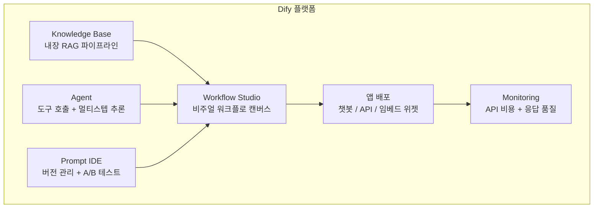
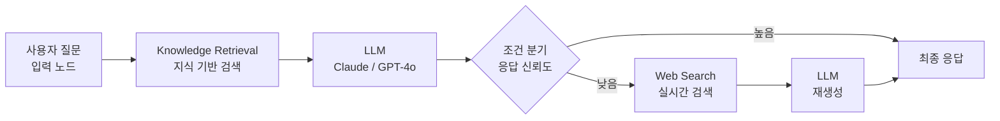
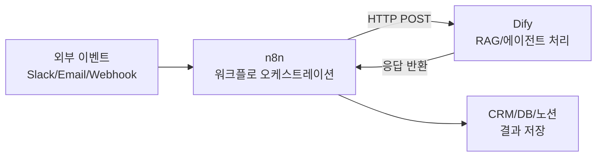

# Dify

LangGenius가 개발한 오픈소스 LLM 애플리케이션 개발 플랫폼. 비주얼 워크플로 캔버스, 내장 RAG 파이프라인, 에이전트 프레임워크, 프롬프트 관리 도구를 하나의 플랫폼으로 제공한다. 개발자와 비개발자 모두 코드 없이 AI 앱을 빌드·배포할 수 있도록 설계되었으며, GitHub 스타 10만+를 기록하는 가장 빠르게 성장하는 오픈소스 AI 플랫폼 중 하나다.

## 개요

| 항목 | 내용 |
|---|---|
| 이름 | Dify |
| 개발사 | LangGenius Inc. |
| 라이선스 | Apache 2.0 (커뮤니티) |
| 저장소 | github.com/langgenius/dify |
| 코어 스택 | Python (백엔드), Next.js (프론트엔드) |
| 지원 LLM | 100+ (OpenAI, Anthropic, Gemini, Ollama 등) |
| 배포 형태 | Docker, Kubernetes, Dify Cloud (관리형) |

## 핵심 구성요소



## Workflow Studio

Dify의 핵심 기능. LLM 노드, 조건 분기, HTTP 요청, 코드 실행, 지식 검색 등을 드래그 앤 드롭으로 연결해 AI 워크플로를 구성한다.



### 내장 노드 유형

| 노드 | 역할 |
|---|---|
| LLM | LLM 호출 (100+ 프로바이더) |
| Knowledge Retrieval | 벡터 스토어 검색 (내장 RAG) |
| Code | Python/JS 코드 실행 |
| HTTP Request | 외부 API 호출 |
| Question Classifier | LLM 기반 라우팅 |
| Template Transform | Jinja2 템플릿 처리 |
| Variable Aggregator | 분기 결과 합병 |
| Iteration | 배열 순회 처리 |

## Knowledge Base (내장 RAG)

Dify는 문서 수집부터 청킹, 임베딩, 벡터 저장, 검색까지 전체 RAG 파이프라인을 UI에서 관리한다.

```python
# Dify API로 지식 기반 검색 호출
import requests

response = requests.post(
    "https://api.dify.ai/v1/chat-messages",
    headers={"Authorization": "Bearer app-xxx"},
    json={
        "inputs": {},
        "query": "RAG 파이프라인 최적화 방법",
        "response_mode": "streaming",
        "conversation_id": "",
        "user": "user-123",
    },
)
```

지원 파일 형식: PDF, DOCX, TXT, MD, HTML, CSV, PPTX 등 일반 문서 포맷을 별도 전처리 없이 업로드하면 자동 청킹·임베딩한다.

## Dify vs LangChain

| 항목 | Dify | [[langchain|LangChain]] |
|---|---|---|
| 인터페이스 | 비주얼 UI + API | 코드 프레임워크 |
| 진입 장벽 | 낮음 (비개발자 사용 가능) | 높음 (Python 필요) |
| 유연성 | 중간 | 매우 높음 |
| RAG 내장 | 완전 내장 UI | 별도 구성 필요 |
| 프롬프트 관리 | 내장 버전 관리 | 없음 (별도 도구) |
| 배포 | 즉시 (챗봇/API) | 직접 구현 필요 |
| 모니터링 | 기본 내장 | 없음 (LangSmith 별도) |

## n8n + Dify 결합

[[n8n-dify|n8n + Dify]] 스택은 Dify의 AI 처리 능력과 n8n의 비즈니스 도구 통합을 결합한다.



n8n에서 Dify API를 HTTP 요청 노드로 호출하면, Dify의 RAG 에이전트와 n8n의 400+ 비즈니스 도구 통합이 결합된다.

## 배포 옵션

```bash
# Docker Compose로 로컬 설치
git clone https://github.com/langgenius/dify.git
cd dify/docker
cp .env.example .env
docker compose up -d
```

| 배포 방식 | 특징 |
|---|---|
| Dify Cloud | 관리형 SaaS, 즉시 사용 가능 |
| Docker Compose | 로컬/온프레미스 셀프호스팅 |
| Kubernetes | 엔터프라이즈 확장 배포 |
| AWS Marketplace | 원클릭 AWS 배포 |

## 실무 관점

Dify는 **RAG 챗봇과 LLM 워크플로를 코드 없이 빠르게 프로토타이핑**하려는 팀에게 최적이다. 비개발자도 UI로 지식 기반을 구성하고 AI 앱을 배포할 수 있어, AI 민주화 도구로서의 역할이 크다. 복잡한 커스텀 로직이 필요하다면 Code 노드에서 Python을 직접 실행할 수 있다. 프로덕션 대규모 시스템에서는 LangChain/LangGraph 같은 코드 기반 프레임워크가 유연성 면에서 유리하지만, 초기 검증 단계에서는 Dify로 빠르게 가설을 검증하고 후에 마이그레이션하는 전략도 유효하다.

## 관련 문서
- [[flowise]] -- Flowise (비주얼 LLM 빌더)

- [[n8n-dify|n8n + Dify]] - Dify와 n8n을 결합한 AI 자동화 스택
- [[langchain|LangChain]] - 코드 기반 LLM 애플리케이션 프레임워크
- [[rag-pipeline|RAG 파이프라인]] - Dify의 Knowledge Base가 구현하는 RAG 패턴
