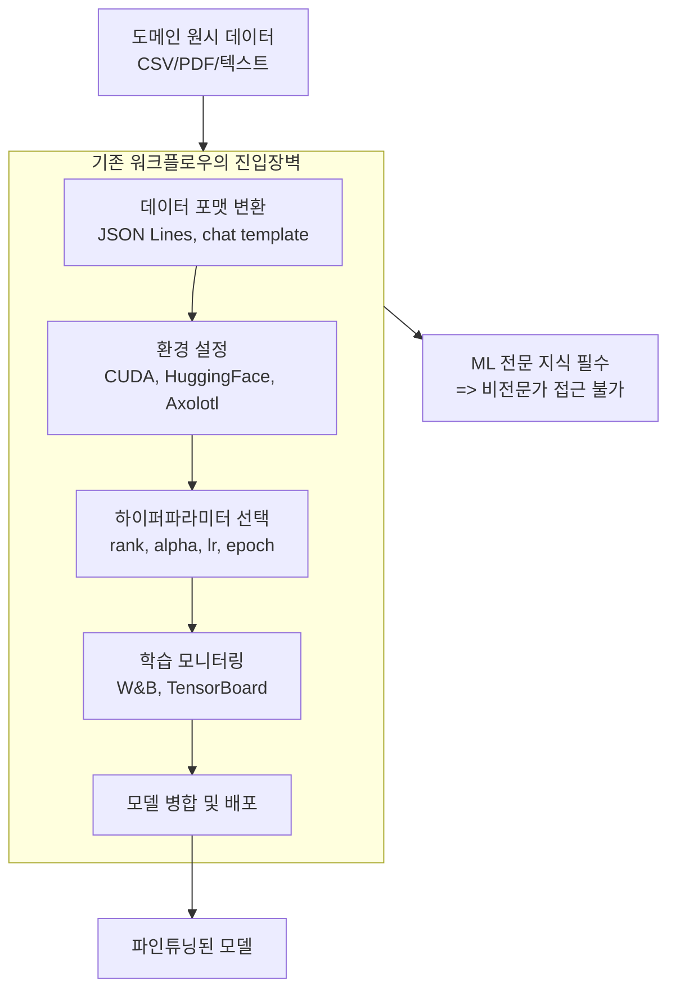
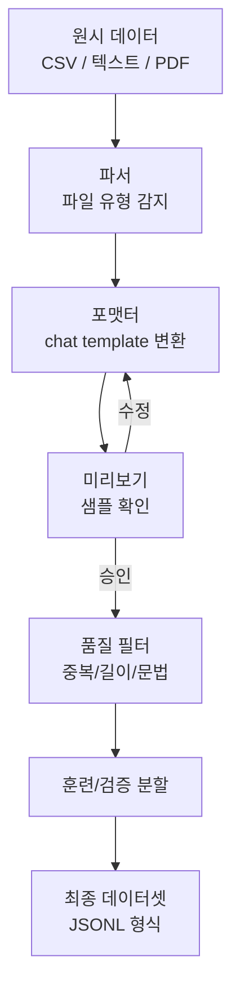
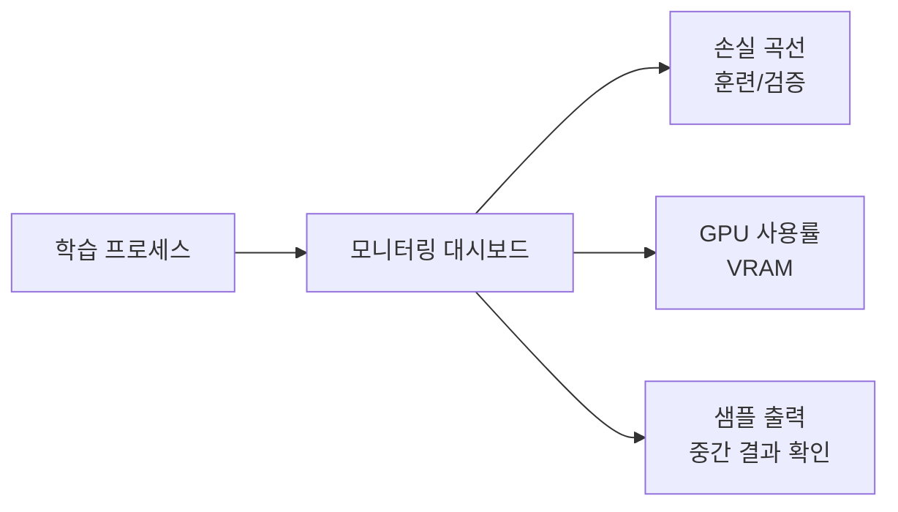
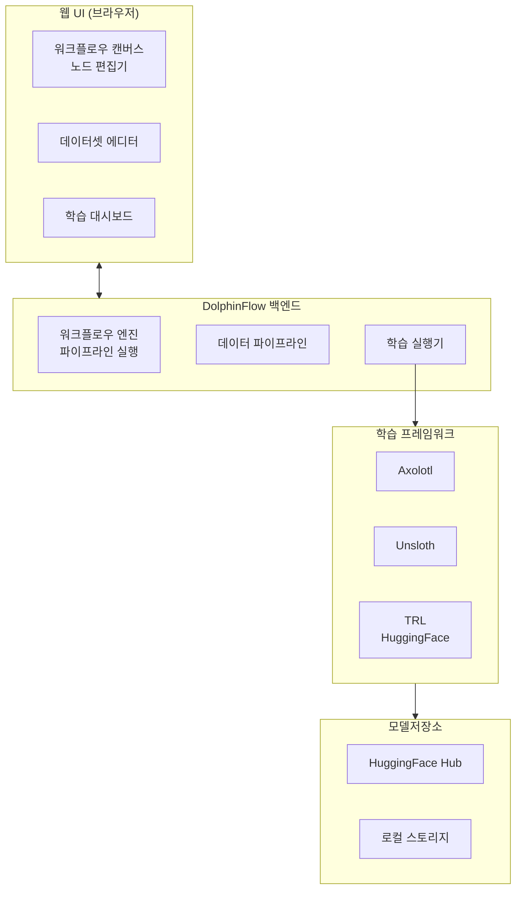
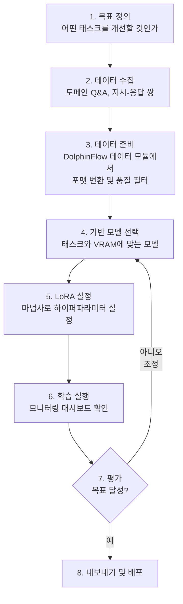

# DolphinFlow - 시각적 파인튜닝 워크플로우 도구

## 정체성

DolphinFlow는 LLM 파인튜닝(fine-tuning) 워크플로우를 시각적 UI로 구성할 수 있는 노코드/로우코드 도구다. 데이터셋 준비, LoRA(Low-Rank Adaptation) 설정, 학습 실행, 모델 평가까지의 전체 파이프라인을 코드 작성 없이 그래픽 인터페이스에서 다룰 수 있게 설계되었다. ML 엔지니어가 아닌 도메인 전문가(법률, 의료, 금융 등)도 사용할 수 있는 민주화 도구를 지향한다.

> **주의**: DolphinFlow는 2026년 기준 활발히 개발 중인 초기 단계 도구다. 공식 문서가 제한적이므로 아래 내용 중 일부는 [교차검증 필요] 태그로 표시한다.

| 속성 | 값 |
|------|-----|
| 목표 사용자 | ML 비전문가, 도메인 전문가 |
| 핵심 기능 | 시각적 파인튜닝 워크플로우 |
| 지원 기법 | [[lora|LoRA]], QLoRA 등 PEFT 계열 |
| UI 방식 | 그래프/노드 기반 또는 단계별 위자드 |
| 가격 | [교차검증 필요] |
| 오픈소스 여부 | [교차검증 필요] |

---

## 핵심 문제: 파인튜닝의 진입장벽

기존 파인튜닝 도구들의 문제:

DolphinFlow는 이 파이프라인을 시각적으로 구성하고 각 단계의 복잡도를 숨긴다.

---

## 핵심 기능

### 시각적 워크플로우 빌더

노드와 엣지로 파인튜닝 파이프라인을 시각적으로 구성한다. 각 노드는 특정 작업(데이터 로드, 전처리, 학습 등)을 담당하며 드래그 앤 드롭으로 연결한다.

### 데이터셋 준비 모듈

데이터셋 준비는 파인튜닝에서 가장 시간이 많이 걸리는 단계다. DolphinFlow는 다음 기능을 UI로 제공한다:

- **포맷 변환**: CSV, PDF, TXT, JSON 등을 chat template 형식으로 자동 변환
- **품질 필터링**: 중복 제거, 너무 짧은/긴 샘플 제거
- **데이터 증강**: Instruction 다양화, 언어 스타일 변형 [교차검증 필요]
- **미리보기**: 변환된 샘플 확인 후 조정

### LoRA 설정 마법사

LoRA 하이퍼파라미터를 슬라이더와 설명 텍스트로 구성된 마법사 UI로 설정한다. 각 파라미터의 영향을 직관적으로 설명한다.

| 파라미터 | 설명 | 초보자 권장값 |
|----------|------|-------------|
| `r` (rank) | LoRA 행렬의 랭크. 클수록 표현력 증가, 메모리 증가 | 16-64 |
| `alpha` | 학습률 스케일링. 보통 `r`의 2배 | `2 * r` |
| `target_modules` | 적용할 레이어. 기본은 어텐션 QKV | attention |
| `dropout` | 과적합 방지 드롭아웃 비율 | 0.05-0.1 |
| `learning_rate` | 학습률. 작은 값이 안전 | 2e-4 ~ 1e-4 |
| `num_epochs` | 학습 에포크 수 | 3-5 |

[[lora|LoRA]] 상세 원리는 해당 페이지 참조.

### 학습 모니터링

학습 중 실시간으로 손실 곡선, 검증 성능, GPU 사용률을 대시보드로 표시한다.

---

## 아키텍처 하이레벨

내부적으로는 Axolotl, Unsloth, HuggingFace TRL 같은 기존 파인튜닝 프레임워크를 래핑하는 구조로 추정된다 [교차검증 필요]. UI는 이들 도구의 설정 파일(YAML/Python)을 생성하고 실행을 관리하는 오케스트레이터 역할을 한다.

---

## 지원 모델 및 기법

### 지원 기반 모델 [교차검증 필요]

- LLaMA 계열 (Meta)
- Qwen 계열 (Alibaba)
- Mistral / Mixtral
- Gemma (Google)
- HuggingFace Hub의 기타 모델

### 지원 학습 기법

| 기법 | 설명 | VRAM 요구량 |
|------|------|------------|
| [[lora|LoRA]] | 저랭크 어댑터. 기본 파인튜닝 | 중간 |
| QLoRA | 4비트 양자화 + LoRA. 메모리 절약 | 낮음 |
| 전체 파인튜닝 | 모든 파라미터 업데이트 | 매우 높음 |
| Instruction Tuning | 지시 형식 데이터로 파인튜닝 | 기법마다 다름 |

---

## 경쟁 도구 비교

| 도구 | 접근법 | 난이도 | 특징 |
|------|--------|--------|------|
| **DolphinFlow** | 시각적 UI | 낮음 | 비기술자 대상, 워크플로우 빌더 |
| Axolotl | YAML 설정 | 중간 | 유연성, CLI 중심 |
| Unsloth | Python 코드 | 중간 | 속도 최적화 (2배 빠른 학습) |
| LLaMA-Factory | 웹 UI + CLI | 낮음-중간 | 풍부한 기능, 안정적 |
| HuggingFace AutoTrain | 웹 UI | 낮음 | SaaS, 간단하지만 제한적 |

DolphinFlow와 가장 가까운 오픈소스 대안은 **LLaMA-Factory**다. LLaMA-Factory는 WebUI를 제공하고 더 많은 기능을 갖추었으며 커뮤니티도 크다.

---

## 실무 사용 가이드

### 일반적인 파인튜닝 워크플로우

### 데이터 품질 원칙

파인튜닝 성능은 데이터 품질에 가장 크게 좌우된다. DolphinFlow 사용 여부와 무관한 원칙:

1. **양보다 질**: 1,000개의 고품질 예시 > 10,000개의 저품질 예시
2. **분포 다양성**: 다양한 난이도, 스타일, 길이의 샘플
3. **일관성**: 응답 형식, 어조, 수준이 일관해야 함
4. **부정 예시 포함**: 잘못된 응답의 수정 쌍 포함 권장

### GPU 요구사항 (참고)

| 모델 크기 | QLoRA VRAM | LoRA VRAM |
|-----------|-----------|----------|
| 7B | ~8GB | ~16GB |
| 13B | ~12GB | ~28GB |
| 70B | ~48GB | 불가 (단일 GPU) |

---

## 한계 / 트레이드오프

### 초기 단계의 불확실성

DolphinFlow는 성숙한 도구가 아니다. 기능이 빠르게 변하고 버그가 많을 수 있다. 프로덕션 환경보다는 실험/프로토타입에 적합하다.

### LLaMA-Factory와의 비교

LLaMA-Factory는 더 안정적이고 기능이 풍부하며 커뮤니티가 크다. DolphinFlow가 더 나은 이유를 찾기 어려울 수 있다. 비기술자 UX에 특화된 차별점이 명확하지 않으면 선택 근거가 약하다.

### 커스터마이징 한계

시각적 UI는 간단한 워크플로우에 적합하지만, 복잡한 커스터마이징(커스텀 손실 함수, 특수 데이터 증강, 멀티 GPU 설정)은 코드 수준에서 해야 한다. 전문 ML 엔지니어에게는 Axolotl/Unsloth가 더 적합하다.

---

## 왜 중요한가

[[fine-tuning|파인튜닝]] 민주화는 LLM 생태계의 중요한 과제다. DolphinFlow가 지향하는 방향 자체는 의미 있다:

1. **도메인 전문가 직접 참여**: 법률사 데이터로 법률 LLM, 의사 데이터로 의료 LLM을 ML 엔지니어 없이 만들 수 있다면 도메인 지식이 직접 모델에 반영된다.
2. **반복 속도 향상**: UI로 하이퍼파라미터를 빠르게 바꾸고 재실험하는 사이클이 빨라진다.
3. **온보딩 단순화**: 팀에 새로운 연구자가 합류했을 때 파인튜닝 인프라 학습 비용이 낮아진다.

---

## 관련 문서

- [[lora]] - LoRA (Low-Rank Adaptation) 파인튜닝 기법 원리
- [[fine-tuning]] - 파인튜닝 전반 개념
- [[dataset-preparation]] - 파인튜닝용 데이터셋 준비 가이드
- [[xinference-multi-model]] - 파인튜닝 결과 모델을 서빙할 때
- [[modal-com-runtime]] - 클라우드 GPU에서 파인튜닝 실행
