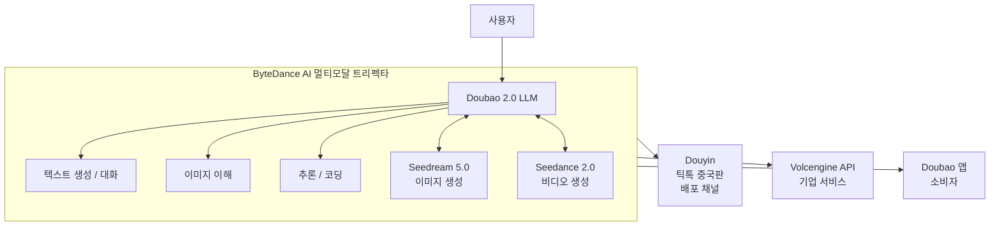

# ByteDance Doubao 2.0 - 멀티모달 트리펙타 생태계

ByteDance(바이트댄스)의 Doubao(豆包) 2.0은 중국 AI 챗봇 시장 1위를 유지하는 LLM 기반 대화 플랫폼이다. 2026년 1분기 1억 명의 신규 사용자를 추가해 3월 MAU(월간 활성 사용자)가 3억 4,500만 명에 달했다. 단순 챗봇을 넘어 Seedream 5.0(이미지 생성), Seedance 2.0(비디오 생성)과 함께 멀티모달 트리펙타(trifecta) 생태계를 구성한다.

## Doubao 생태계 아키텍처



세 모델(Doubao + Seedream + Seedance)이 단일 사용자 경험으로 통합되어, 텍스트 → 이미지 → 비디오 생성 흐름을 원스톱으로 제공한다.

## 핵심 구성 모델

### Doubao 2.0 (언어 모델)

Doubao 2.0 LLM의 상세 파라미터나 아키텍처는 공개되지 않았다. 알려진 특징:

- **멀티모달 이해**: 텍스트, 이미지, 오디오 입력 처리
- **추론 특화**: 수학, 코딩, 논리 추론 능력 강화 (Doubao-Thinking 변형)
- **긴 컨텍스트**: 최대 128K 토큰 컨텍스트 윈도우 (API 기준)
- **중국어 우선**: 중국어 처리 품질 최우선 최적화

API를 통해 Volcengine(화산엔진)에서 제공되며, 파라미터 규모는 [교차검증 필요: 공개된 정확한 수치 없음].

```python
# Volcengine SDK를 통한 Doubao API 접근
import volcenginesdkarkruntime as ark

client = ark.ArkClient(api_key="your-api-key")

response = client.chat.completions.create(
    model="doubao-pro-256k",   # 256K 컨텍스트 모델
    messages=[
        {"role": "user", "content": "Python으로 퀵소트를 구현해줘"},
    ],
)
print(response.choices[0].message.content)
```

### Seedream 5.0 (이미지 생성)

ByteDance의 텍스트-이미지 생성 모델 다섯 번째 버전이다.

| 특징 | 내용 |
|------|------|
| 해상도 | 최대 4K (4096x4096) |
| 스타일 범위 | 사진, 일러스트, 애니메이션, 3D 렌더 등 |
| 언어 | 중국어/영어 프롬프트 모두 지원 |
| 레이턴시 | ~3초 (1024x1024 기준) |

Stable Diffusion이나 DALL-E 3와의 직접 비교 벤치마크는 공개되지 않았으나, 중국어 프롬프트 이해도에서 강점이 보고됐다.

### Seedance 2.0 (비디오 생성)

텍스트 또는 이미지를 비디오로 변환하는 생성 모델이다.

- **최대 길이**: 최대 60초 (이전 세대 대비 2배)
- **해상도**: 최대 1080p
- **물리 시뮬레이션**: 유체, 천 등의 물리적 자연스러움 개선
- **캐릭터 일관성**: 멀티 씬에서 동일 캐릭터 외모 유지

Sora, Runway Gen-4 계열과 경쟁하는 포지션이다.

## 시장 지표

### 사용자 규모

```
2025년 12월 MAU: ~2억 4,500만
2026년 3월 MAU: ~3억 4,500만 (+1억 명 / 3개월)
```

WeChat(위챗)이 월 13억 명, TikTok이 글로벌 15억 명임을 감안하면, 3억 4,500만은 중국 내 AI 애플리케이션 중 압도적 1위다. 2위 Kimi(Moonshot AI, 약 6,000만)와 격차가 크다.

### Douyin 수직 통합의 의미

Doubao가 경쟁사(Kimi, DeepSeek, Baidu Ernie) 대비 갖는 결정적 강점은 **Douyin(틱톡 중국판) 배포 채널과의 수직 통합**이다.

- Douyin 앱에서 Doubao AI 기능 직접 제공 (별도 앱 설치 불필요)
- 숏폼 비디오 편집에 Seedream/Seedance 직접 통합
- 8억+ Douyin 월간 사용자 기반을 Doubao 사용자로 전환 용이

이는 [[meta-llama]]가 Facebook/Instagram 플랫폼과 통합되는 것과 유사한 전략이다 — 기존 거대 플랫폼에 AI를 내재화해 분리된 채택(adoption) 장벽을 없애는 방식.

## 기술 스택 (공개 정보 기준)

ByteDance는 모델 아키텍처를 대부분 비공개로 유지하나, 알려진 정보:

- **학습 인프라**: 자체 GPU 클러스터 (Huawei Ascend 포함, NVIDIA 제재 대응)
- **서빙 인프라**: Volcengine 자체 인프라, 글로벌 CDN
- **포스트 트레이닝**: RLHF + DPO 혼용 정렬 전략 (공식 확인되지 않음, [교차검증 필요])

## OpenAI / Anthropic와의 포지셔닝 비교

| 항목 | Doubao (ByteDance) | ChatGPT (OpenAI) | Claude (Anthropic) |
|------|-------------------|------------------|--------------------|
| 주력 시장 | 중국 | 글로벌 | 글로벌 |
| 배포 채널 | Douyin 수직 통합 | 웹/API/앱 | 웹/API/앱 |
| 멀티모달 | 텍스트+이미지+비디오 | 텍스트+이미지 | 텍스트+이미지 |
| 오픈소스 | 비공개 | 비공개 | 비공개 |
| MAU (2026.3) | 3억 4,500만 | ~4억 (추정) | 미공개 |

글로벌 기준으로는 ChatGPT가 앞서지만, 중국 내 시장에서는 Doubao가 독보적이다.

## 실무 활용 관점

중국 시장을 대상으로 하는 AI 서비스 개발 시:

1. **API 접근**: Volcengine API를 통해 Doubao, Seedream, Seedance 세 모델을 단일 계정으로 접근 가능
2. **중국어 성능**: 중국어 문서 처리, 고객 응대 자동화에서 GPT-4/Claude 대비 중국어 뉘앙스 이해 강점
3. **비디오 크리에이티브**: Seedance 2.0은 Douyin 크리에이터 도구로서의 용도가 주력

## 관련 문서

- [[meta-llama]] — Meta의 오픈소스 LLM 전략 (플랫폼 통합 비교)
- [[seedream]] — Seedream 이미지 생성 모델 상세 [교차검증 필요: 별도 페이지 생성 필요]
- [[chinese-ai-models]] — 중국 AI 모델 생태계 개요 [교차검증 필요: 별도 페이지 생성 필요]
- [[multimodal-trifecta]] — 텍스트+이미지+비디오 통합 멀티모달 전략 패턴
