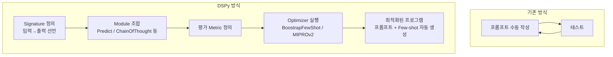
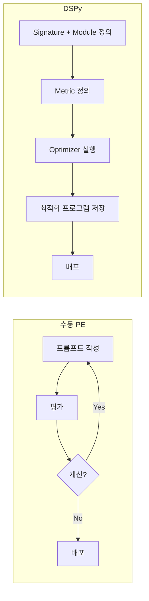

# DSPy

Stanford NLP 그룹(Omar Khattab 외)이 개발한 LLM 파이프라인 프레임워크. "Declarative Self-improving Python"의 약자로, 수동 프롬프트 엔지니어링 대신 **코드로 파이프라인을 정의하고 자동으로 최적화**하는 접근법을 취한다.

## 개요

| 항목 | 내용 |
|---|---|
| 이름 | DSPy |
| 개발 | Stanford NLP (Omar Khattab, Chris Potts 외) |
| 라이선스 | MIT |
| 저장소 | github.com/stanfordnlp/dspy |
| 언어 | Python |
| 핵심 논문 | DSPy: Compiling Declarative Language Model Calls (2023) |

## 핵심 철학: 프롬프트 컴파일러

DSPy의 근본적인 주장은 "프롬프트는 하이퍼파라미터다"는 것이다. 사람이 수동으로 프롬프트를 작성하고 튜닝하는 대신, 프로그램의 구조와 평가 지표(metric)를 정의하면 **최적화기(Optimizer)가 자동으로 최적 프롬프트를 탐색**한다.



## 핵심 구성 요소

### 1. Signature (서명)

입출력의 의미론적 선언. 자연어로 필드 설명을 붙인다.

```python
import dspy

class SentimentClassifier(dspy.Signature):
    """주어진 텍스트의 감성을 분류합니다."""
    text: str = dspy.InputField(desc="분류할 텍스트")
    sentiment: str = dspy.OutputField(desc="positive, negative, neutral 중 하나")
```

### 2. Module (모듈)

Signature를 실제 LLM 호출로 연결하는 단위.

| 모듈 | 동작 방식 |
|---|---|
| `dspy.Predict` | 단순 Signature 실행 |
| `dspy.ChainOfThought` | 중간 추론 단계(rationale) 포함 |
| `dspy.ReAct` | Reason + Act 루프 (도구 사용) |
| `dspy.ProgramOfThought` | 코드 생성 후 실행 |
| `dspy.MultiChainComparison` | 여러 추론 경로 비교 |

```python
class RAGQnA(dspy.Module):
    def __init__(self):
        self.retrieve = dspy.Retrieve(k=3)
        self.generate = dspy.ChainOfThought("context, question -> answer")

    def forward(self, question):
        context = self.retrieve(question).passages
        return self.generate(context=context, question=question)
```

### 3. Optimizer (최적화기)

Few-shot 예시와 프롬프트 지시문을 자동 탐색한다.

```python
from dspy.teleprompt import BootstrapFewShot, MIPROv2

# 기본 최적화: 정답 예시에서 Few-shot 자동 생성
teleprompter = BootstrapFewShot(metric=exact_match_metric, max_bootstrapped_demos=4)
optimized_rag = teleprompter.compile(RAGQnA(), trainset=train_data)

# 고급 최적화: 프롬프트 지시문 + Few-shot 동시 탐색
optimizer = MIPROv2(metric=exact_match_metric, auto="medium")
optimized = optimizer.compile(RAGQnA(), trainset=train_data)
```

## DSPy vs 수동 프롬프트 엔지니어링



| 측면 | 수동 프롬프트 | DSPy |
|---|---|---|
| 재현성 | 낮음 (사람 의존) | 높음 (코드화) |
| 모델 교체 | 재프롬프팅 필요 | Optimizer 재실행 |
| 최적화 | 직관 의존 | 자동 탐색 |
| 학습 곡선 | 낮음 | 중간~높음 |
| 복잡 파이프라인 | 관리 어려움 | 모듈로 구조화 |

## [[langchain|LangChain]]과의 비교

LangChain이 LLM 호출 체인의 **조립**에 집중한다면, DSPy는 파이프라인의 **자동 최적화**에 집중한다. 두 프레임워크는 상호 보완적이며, LangChain으로 구성한 파이프라인을 DSPy로 최적화하는 조합도 가능하다.

## 활용 사례

- **복잡한 RAG 파이프라인 최적화**: 청킹 전략, 재순위화 파라미터, 프롬프트를 동시에 탐색
- **분류·추출 파이프라인**: 레이블이 부족한 상황에서 Few-shot 자동 생성
- **멀티홉 추론**: 여러 단계로 구성된 질의응답 파이프라인 최적화
- **모델 마이그레이션**: GPT-4 → Claude 교체 시 Optimizer 재실행으로 성능 유지

## 실무 관점

DSPy는 **[[prompt-engineering|프롬프트 엔지니어링]]의 반복 작업을 자동화**하고 싶을 때, 또는 복잡한 멀티스텝 파이프라인의 최적화 포인트가 많을 때 가장 효과적이다. 다만 Optimizer 실행에 상당한 LLM API 비용과 시간이 소요되므로, 명확한 평가 지표(metric)를 사전에 정의하는 것이 중요하다. 프로덕션 초기에는 수동 프롬프트로 시작하고, 파이프라인이 안정화된 이후 DSPy로 최적화하는 순서를 권장한다.

## 관련 문서

- [[prompt-engineering|프롬프트 엔지니어링]]
- [[langchain|LangChain]]
- [[rag-pipeline|RAG 파이프라인]]
- [[dspy-gepa|DSPy + GEPA optimize_anything]]
