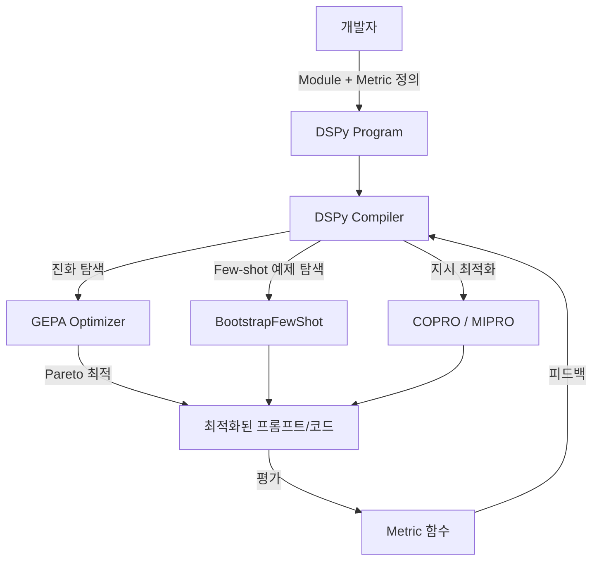

# DSPy + GEPA optimize_anything

프롬프트·코드·에이전트 아키텍처를 선언적으로 최적화하는 [[prompt-engineering|Stanford NLP]] 프레임워크.

## 핵심 개념

DSPy(Declarative Self-improving Python)는 "프롬프트 엔지니어링 대신 프로그래밍"이라는 패러다임을 구체화한다. 개발자는 **모듈(Module)**을 정의하고 **최적화 목표(metric)**를 지정하면, 프레임워크가 프롬프트나 가중치를 자동으로 최적화한다.

GEPA(Generalized Evolutionary Prompt Architecture)는 이 최적화를 유전 알고리즘 기반으로 확장한 별도 라이브러리로, 2026년 2월 공개된 `optimize_anything` API와 결합하면 프롬프트를 넘어 코드 구조·에이전트 아키텍처까지 최적화 대상으로 삼을 수 있다.

## 아키텍처 흐름



위 다이어그램은 DSPy 컴파일러가 여러 최적화 전략을 선택·조합하는 구조를 나타낸다.

## 주요 컴포넌트

| 컴포넌트 | 역할 |
|---|---|
| `dspy.Module` | LLM 호출 단위. `dspy.Predict`, `dspy.ChainOfThought`, `dspy.ReAct` 등을 상속 |
| `dspy.Signature` | 입력/출력 타입 선언. 프롬프트 내용보다 **계약(contract)**을 명시 |
| `dspy.Optimizer` | BootstrapFewShot, COPRO, MIPRO, GEPA 등 최적화 전략 |
| `optimize_anything` | 임의 텍스트 파라미터(코드 스니펫, 에이전트 설정값)를 최적화 대상으로 확장 |
| `dspy.Evaluate` | 메트릭 기반 자동 평가 루프 |

## GEPA의 차별점

기존 DSPy 옵티마이저(MIPRO 등)가 **지시(instruction) 문자열** 수준에서만 탐색했다면, GEPA는 다음을 추가한다:

- **Pareto 최적화**: 정확도 vs. 토큰 비용을 동시에 최적화
- **진화 연산자**: 돌연변이(mutation) + 교차(crossover)로 후보 풀 생성
- **Reflective Scoring**: 최적화 후보가 자기 자신을 평가하는 메타 루프
- **`optimize_anything` 인터페이스**: 프롬프트가 아닌 임의 문자열 파라미터(함수 구현체, 에이전트 계획 템플릿 등)까지 최적화 범위 확장

## 사용 예시 (개념)

```python
import dspy

# 1. 서명 정의
class QA(dspy.Signature):
    question: str = dspy.InputField()
    answer: str = dspy.OutputField()

# 2. 모듈 정의
class SimpleQA(dspy.Module):
    def __init__(self):
        self.predict = dspy.Predict(QA)

    def forward(self, question):
        return self.predict(question=question)

# 3. 최적화
optimizer = dspy.MIPROv2(metric=my_metric)
optimized = optimizer.compile(SimpleQA(), trainset=train_data)
```

## 경쟁 제품 비교

| 프레임워크 | 최적화 방식 | 타입 안전 | 대상 |
|---|---|---|---|
| DSPy + GEPA | 자동 컴파일(프롬프트/가중치) | 선언적 Signature | 프롬프트·코드·아키텍처 |
| [[pydantic-ai|Pydantic AI]] | 수동 프롬프트 + 타입 계약 | 강함 | 런타임 타입 검증 |
| LangChain | 수동 체인 조합 | 약함 | 도구 연결 |
| PromptFoo | 평가·회귀 테스트 | 없음 | 프롬프트 품질 측정 |

## 왜 지금 중요한가

2026년 2월 `optimize_anything` API 공개로 GEPA(Genetic-Pareto) 최적화가 프롬프트를 넘어 코드·에이전트 구조까지 확장됐고, 관련 논문이 ICLR 2026 oral에 채택되며 "[[prompt-engineering|프롬프트가 아닌 프로그래밍]]" 패러다임의 구심점이 됐다.

## 대표 레퍼런스

- [DSPy Official Docs](https://dspy.ai/)
- [dspy.GEPA: Reflective Prompt Optimizer](https://dspy.ai/api/optimizers/GEPA/overview/)
- [stanfordnlp/dspy GitHub](https://github.com/stanfordnlp/dspy)
- [optimize_anything: Universal API for Optimizing any Text Parameter](https://gepa-ai.github.io/gepa/blog/2026/02/18/introducing-optimize-anything/)
- [gepa-ai/gepa GitHub](https://github.com/gepa-ai/gepa)

## 관련 문서

- [[ai-hot-topics-2026-04|2026년 4월 AI 개발 핫토픽 100선]]
- [[pydantic-ai|Pydantic AI (Type-Safe Python Agent Framework)]]
- [[prompt-engineering|프롬프트 엔지니어링]]
