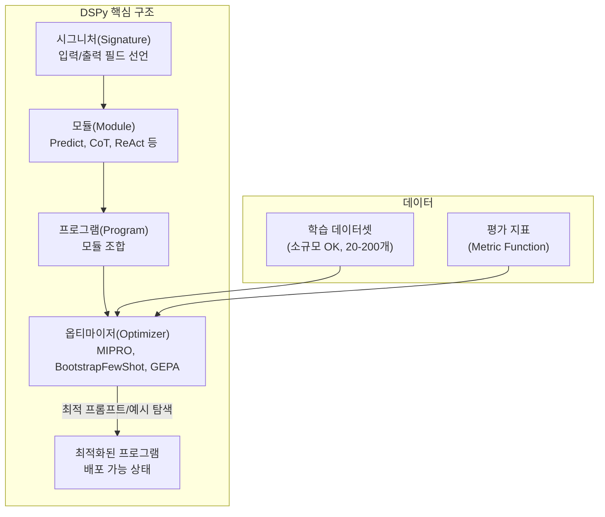
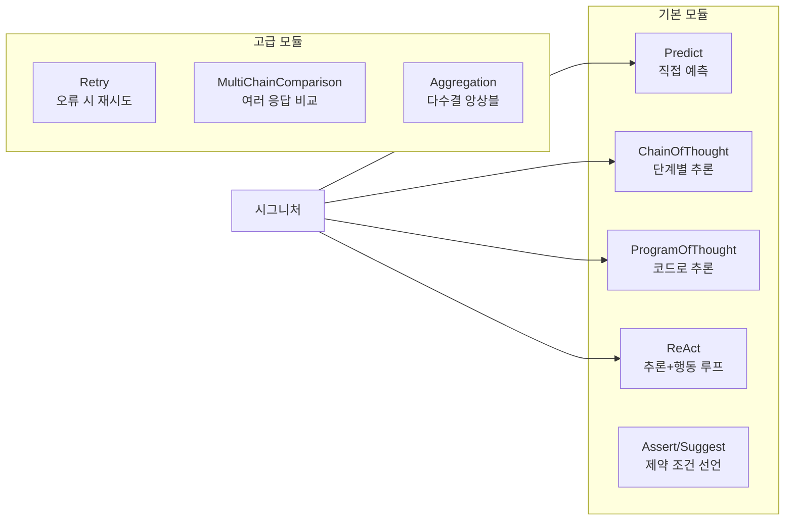
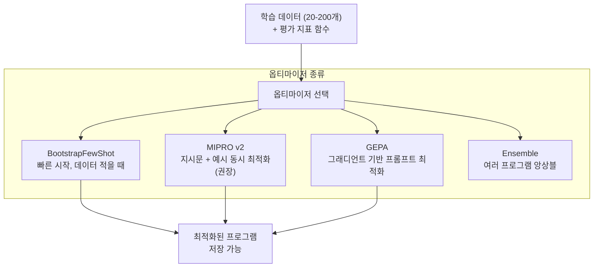

# DSPy - 프로그래밍 방식 LLM 최적화 프레임워크

DSPy(Declarative Self-improving Language Programs in Python)는 Stanford NLP 그룹이 개발한 LLM 파이프라인 구축 프레임워크다. 기존의 수동 프롬프트 엔지니어링 대신 **프로그램 구조를 선언하면 DSPy 옵티마이저가 자동으로 프롬프트와 퓨샷 예시를 최적화**한다.

> "DSPy는 LLM 프로그래밍을 위한 PyTorch다 — 수동으로 그래디언트를 쓰지 않듯, 수동으로 프롬프트를 쓰지 않는다."

핵심 철학: **프롬프트는 최적화의 대상이지, 직접 설계하는 것이 아니다**.

## 핵심 개념 맵



---

## 시그니처 (Signature)

시그니처는 DSPy 프로그램의 **인터페이스 선언**이다. 입력 필드와 출력 필드를 정의하며, DSPy가 이를 실제 프롬프트로 변환한다.

```python
import dspy

# 방법 1: 인라인 문자열 시그니처 (빠른 프로토타입)
classify = dspy.Predict("sentence -> sentiment: bool, confidence: float")

# 방법 2: 클래스 기반 시그니처 (명확한 문서화)
class SentimentClassifier(dspy.Signature):
    """한국어 리뷰 문장에서 감성을 분류합니다."""
    
    review: str = dspy.InputField(desc="분석할 리뷰 텍스트")
    
    sentiment: str = dspy.OutputField(
        desc="긍정(positive), 부정(negative), 중립(neutral) 중 하나"
    )
    confidence: float = dspy.OutputField(
        desc="0.0~1.0 사이의 확신도"
    )
    key_phrases: list[str] = dspy.OutputField(
        desc="감성 결정에 핵심적인 구절 목록"
    )
```

시그니처의 docstring과 필드 description이 자동으로 프롬프트에 반영된다. 옵티마이저는 이를 더욱 개선한다.

---

## 핵심 모듈 (Built-in Modules)



```python
# ChainOfThought - 단계별 추론을 자동으로 프롬프트에 추가
cot_classifier = dspy.ChainOfThought(SentimentClassifier)

# ReAct - 도구를 사용하는 추론-행동 루프
react_agent = dspy.ReAct(
    "question -> answer",
    tools=[search, calculator]
)

# ProgramOfThought - 수학/데이터 분석에 강점
pot_solver = dspy.ProgramOfThought("math_problem -> solution: float")
```

---

## 프로그램 조합

여러 모듈을 `dspy.Module`로 조합해 복잡한 파이프라인을 구성한다.

```python
class RAGPipeline(dspy.Module):
    """검색 증강 생성(RAG) 파이프라인."""
    
    def __init__(self, retriever, k: int = 3):
        super().__init__()
        self.retrieve = retriever
        self.k = k
        self.generate = dspy.ChainOfThought("context, question -> answer")
    
    def forward(self, question: str) -> dspy.Prediction:
        # 1. 관련 문서 검색
        passages = self.retrieve(question, k=self.k)
        context = "\n".join([p.long_text for p in passages])
        
        # 2. 컨텍스트 기반 답변 생성
        prediction = self.generate(context=context, question=question)
        return prediction

# 설정
lm = dspy.LM("openai/gpt-4o")
dspy.configure(lm=lm)

rag = RAGPipeline(retriever=my_retriever)
result = rag("DSPy의 핵심 개념은 무엇인가?")
print(result.answer)
```

---

## 옵티마이저 (Optimizers)

DSPy의 핵심 가치는 옵티마이저에 있다. 소수의 학습 예시와 평가 지표만 제공하면 자동으로 최적의 프롬프트와 퓨샷 예시를 탐색한다.



### BootstrapFewShot - 기본 옵티마이저

```python
from dspy.teleprompt import BootstrapFewShot

# 평가 지표 정의
def sentiment_metric(example, prediction, trace=None) -> bool:
    return example.sentiment == prediction.sentiment

# 학습 데이터 준비
trainset = [
    dspy.Example(review="음식이 정말 맛있어요!", sentiment="positive").with_inputs("review"),
    dspy.Example(review="서비스가 너무 느려요.", sentiment="negative").with_inputs("review"),
    # ... 20-50개 예시
]

# 옵티마이저 설정 및 실행
optimizer = BootstrapFewShot(
    metric=sentiment_metric,
    max_bootstrapped_demos=4,   # 최대 퓨샷 예시 수
    max_labeled_demos=16,
)

optimized_program = optimizer.compile(
    student=dspy.ChainOfThought(SentimentClassifier),
    trainset=trainset,
)

# 최적화된 프로그램 저장
optimized_program.save("optimized_sentiment.json")
```

### MIPRO v2 - 지시문과 예시 동시 최적화

MIPRO (Multi-prompt Instruction PRoposal Optimizer)는 BootstrapFewShot보다 강력하다. 퓨샷 예시뿐 아니라 시그니처의 지시문(instruction) 자체도 자동 생성하고 최적화한다.

```python
from dspy.teleprompt import MIPROv2

optimizer = MIPROv2(
    metric=sentiment_metric,
    auto="medium",          # "light" | "medium" | "heavy"
    num_candidates=10,      # 후보 지시문 수
    init_temperature=1.0,
)

optimized_program = optimizer.compile(
    student=rag_pipeline,
    trainset=trainset,
    valset=valset,          # 검증 셋 (선택)
    num_trials=20,          # 베이지안 최적화 시도 수
    requires_permission_to_run=False,
)
```

---

## GEPA (Gradient-based Prompt Optimization) 상세

[[dspy-gepa]]에서 상세히 다루는 GEPA는 DSPy의 가장 강력한 옵티마이저로, 텍스트 공간에서 "그래디언트" 개념을 적용한다.

동작 원리:
1. 현재 프롬프트로 예측 → 오류 분석
2. LLM을 "옵티마이저"로 사용해 "이 오류를 줄이려면 프롬프트를 어떻게 바꿔야 하는가?" 질의
3. 제안된 프롬프트 후보 평가
4. 최상 후보로 업데이트 반복

```python
from dspy.teleprompt import COPRO  # GEPA 기반 옵티마이저

optimizer = COPRO(
    metric=eval_metric,
    depth=3,            # 최적화 깊이
    breadth=10,         # 후보 폭
    init_temperature=1.4,
)
```

---

## 평가와 검증

```python
from dspy.evaluate import Evaluate

# 데이터셋 분할
import random
random.seed(42)
dataset = trainset + valset
random.shuffle(dataset)

split = int(0.8 * len(dataset))
train, devtest = dataset[:split], dataset[split:]
dev, test = devtest[:len(devtest)//2], devtest[len(devtest)//2:]

# 체계적 평가
evaluator = Evaluate(
    devset=test,
    num_threads=4,       # 병렬 평가
    display_progress=True,
    display_table=5,     # 샘플 5개 출력
)

# 원본 vs 최적화 비교
original_score = evaluator(module=rag_pipeline, metric=sentiment_metric)
optimized_score = evaluator(module=optimized_program, metric=sentiment_metric)

print(f"원본: {original_score:.1f}%")
print(f"최적화: {optimized_score:.1f}%")
print(f"개선: +{optimized_score - original_score:.1f}%")
```

---

## Assert와 Suggest - 선언적 제약

DSPy는 출력에 대한 제약 조건을 코드로 선언하는 `Assert`와 `Suggest`를 제공한다.

```python
class ConstrainedSummarizer(dspy.Module):
    """길이와 형식 제약이 있는 요약기."""
    
    def __init__(self):
        super().__init__()
        self.summarize = dspy.ChainOfThought("document -> summary, key_points: list[str]")
    
    def forward(self, document: str) -> dspy.Prediction:
        result = self.summarize(document=document)
        
        # 강제 제약 (위반 시 재시도)
        dspy.Assert(
            len(result.summary) <= 500,
            "요약이 500자를 초과했습니다. 더 간결하게 요약하세요."
        )
        dspy.Assert(
            len(result.key_points) >= 3,
            "핵심 포인트가 3개 미만입니다."
        )
        
        # 권고 제약 (위반해도 경고만, 재시도는 학습에 활용)
        dspy.Suggest(
            not any(p.startswith("-") for p in result.key_points),
            "핵심 포인트에 불릿 기호를 사용하지 마세요."
        )
        
        return result
```

---

## 프로덕션 배포 패턴

```python
# 최적화 후 저장 및 로드
optimized_program.save("models/rag_v2.json")

# 나중에 로드
loaded_program = RAGPipeline(retriever=my_retriever)
loaded_program.load("models/rag_v2.json")

# LM 교체 (학습은 GPT-4로, 서빙은 GPT-4o-mini로)
dspy.configure(lm=dspy.LM("openai/gpt-4o-mini"))
result = loaded_program("질문")
```

### 멀티 LM 설정

```python
# 강력한 모델로 최적화, 경량 모델로 서빙
teacher_lm = dspy.LM("openai/gpt-4o", temperature=0.7)
student_lm = dspy.LM("openai/gpt-4o-mini", temperature=0.0)

optimizer = BootstrapFewShot(metric=my_metric)
optimized = optimizer.compile(
    student=my_module.deepcopy(),
    teacher=dspy.settings.context(lm=teacher_lm),
    trainset=trainset,
)

# 경량 모델로 서빙
dspy.configure(lm=student_lm)
result = optimized(question="...")
```

---

## [[dspy-framework]]와의 관계

이 페이지는 DSPy의 entity 허브 문서다. 구현 상세는 다음 페이지에서 다룬다:

| 하위 주제 | 페이지 |
|-----------|--------|
| 프레임워크 아키텍처 상세 | [[dspy-framework]] |
| GEPA 옵티마이저 원리 | [[dspy-gepa]] |
| 프롬프트를 프로그램으로 보는 관점 | [[prompt-as-program]] |
| 프롬프트 템플릿 라이브러리 비교 | [[prompt-template-libraries]] |

---

## DSPy vs 대안 비교

| 기준 | DSPy | LangChain | LlamaIndex | 직접 구현 |
|------|------|-----------|------------|-----------|
| 프롬프트 최적화 | 자동 | 수동 | 수동 | 수동 |
| 학습 곡선 | 중간 | 낮음 | 낮음 | 낮음 |
| 프로덕션 성숙도 | 중간 | 높음 | 높음 | 높음 |
| 소규모 데이터 효율 | 높음 | 낮음 | 낮음 | 낮음 |
| 유연성 | 높음 | 높음 | 중간 | 최고 |
| 에코시스템 | 성장 중 | 매우 크다 | 크다 | 없음 |

DSPy는 **프롬프트를 자주 반복 개선**해야 하거나, **수백 개 평가 예시**로 체계적 최적화가 필요한 경우에 가장 유리하다.

---

## 설치 및 빠른 시작

```bash
pip install dspy-ai
# 또는
pip install dspy
```

```python
import dspy

# LM 설정
lm = dspy.LM("openai/gpt-4o-mini", api_key="sk-...")
dspy.configure(lm=lm)

# 가장 간단한 예시
qa = dspy.ChainOfThought("question -> answer")
result = qa(question="DSPy란 무엇인가?")
print(result.answer)
print(result.reasoning)  # CoT 추론 과정
```

---

## 관련 문서

- [[dspy-framework]] - DSPy 프레임워크 아키텍처 상세 분석
- [[dspy-gepa]] - GEPA 그래디언트 기반 프롬프트 최적화 원리
- [[prompt-as-program]] - 프롬프트를 프로그램으로 보는 철학
- [[prompt-template-libraries]] - LangChain, LlamaIndex 등 대안 프레임워크 비교
